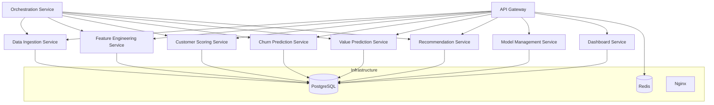

# absa-foundry-backend# Customer Lifecycle Prediction System

An enterprise-grade AI platform for banking Customer Lifecycle Prediction, Churn Analysis, Customer Value Prediction, and Next Best Action (NBA) recommendations for Relationship Managers.

> **Phase:** Project Scaffolding — No business logic implemented yet.

---

## Architecture Overview



## Tech Stack

| Component          | Technology                          |
| ------------------ | ----------------------------------- |
| Language           | Python 3.12+                        |
| Framework          | FastAPI                             |
| Database           | PostgreSQL 16                       |
| ORM                | SQLAlchemy 2.0+                     |
| Data Validation    | Pydantic v2                         |
| Migrations         | Alembic                             |
| Cache              | Redis 7                             |
| ML Libraries       | Scikit-Learn, XGBoost, LightGBM     |
| Containerization   | Docker, Docker Compose              |
| API Gateway        | FastAPI (custom gateway)            |

## Project Structure

```
customer-lifecycle-ai/
├── services/                          # Microservices
│   ├── data-ingestion-service/        # ETL & data acquisition
│   ├── feature-engineering-service/   # Feature computation & storage
│   ├── customer-scoring-service/      # Lifecycle scoring & segmentation
│   ├── churn-prediction-service/      # Churn probability prediction
│   ├── value-prediction-service/      # Customer Lifetime Value (CLV)
│   ├── recommendation-service/        # Next Best Action (NBA) engine
│   ├── model-management-service/      # ML model registry & deployment
│   ├── dashboard-service/             # Analytics & dashboard data
│   └── orchestration-service/         # Workflow orchestration
├── shared/                            # Shared libraries & utilities
│   ├── auth/                          # Authentication & authorization
│   ├── config/                        # Shared configuration
│   ├── database/                      # Database base, session, postgres
│   ├── logging/                       # Structured logging
│   ├── exceptions/                    # Exception hierarchy
│   ├── utils/                         # Common utilities
│   ├── ml/                            # Shared ML components
│   └── schemas/                       # Shared Pydantic schemas
├── gateway/                           # API Gateway
│   ├── app/                           # Gateway application
│   ├── routes/                        # Proxy & health routes
│   ├── middleware/                     # Auth, rate-limit, logging, CORS
│   └── config/                        # Gateway configuration
├── infrastructure/                    # Deployment infrastructure
│   ├── nginx/                         # Reverse proxy config
│   ├── monitoring/                    # Prometheus/Grafana (future)
│   ├── terraform/                     # IaC (future)
│   ├── kubernetes/                    # K8s manifests (future)
│   ├── helm/                          # Helm charts (future)
│   ├── postgres/                      # DB initialization scripts
│   └── redis/                         # Redis config (future)
├── models/                            # Central ML model registry
│   ├── customer-score/
│   ├── churn/
│   ├── customer-value/
│   ├── recommendation/
│   └── registry.json
├── datasets/                          # Data storage
│   ├── raw/                           # Raw ingested data
│   ├── processed/                     # Processed/feature data
│   ├── external/                      # External data sources
│   └── synthetic/                     # Synthetic test data
├── notebooks/                         # Jupyter analysis notebooks
├── scripts/                           # Utility scripts
├── docs/                              # Documentation
│   ├── architecture/
│   ├── api/
│   ├── deployment/
│   ├── ml/
│   └── business/
├── docker/                            # Docker configs (production)
├── .env.example                       # Environment variables template
├── docker-compose.yml                 # Local development orchestration
└── README.md                          # This file
```

## Each Microservice Structure

```
<service-name>/
├── app/
│   ├── __init__.py
│   ├── api/                 # Route definitions & dependencies
│   │   ├── __init__.py
│   │   ├── routes.py
│   │   └── dependencies.py
│   ├── services/            # Business logic layer
│   │   ├── __init__.py
│   │   └── service.py
│   ├── repository/          # Data access / Repository pattern
│   │   ├── __init__.py
│   │   └── repository.py
│   ├── models/              # SQLAlchemy ORM models
│   │   ├── __init__.py
│   │   └── models.py
│   ├── schemas/             # Pydantic v2 schemas
│   │   ├── __init__.py
│   │   └── schemas.py
│   └── config/              # Service configuration
│       ├── __init__.py
│       ├── settings.py
│       └── logging.py
├── tests/
│   ├── __init__.py
│   ├── conftest.py
│   ├── unit/
│   ├── integration/
│   └── fixtures/
├── Dockerfile
├── requirements.txt
└── main.py
```

## Quick Start

### Prerequisites

- Docker & Docker Compose
- Python 3.12+
- PostgreSQL 16 (if running outside Docker)

### Local Development

1. **Clone and navigate:**
   ```bash
   cd customer-lifecycle-ai
   ```

2. **Copy environment variables:**
   ```bash
   cp .env.example .env
   ```

3. **Start all services:**
   ```bash
   docker-compose up -d
   ```

4. **Verify services:**
   ```bash
   docker-compose ps
   ```

5. **Stop all services:**
   ```bash
   docker-compose down
   ```

### Service Ports

| Service                     | Port |
| --------------------------- | ---- |
| API Gateway                 | 8080 |
| Data Ingestion Service      | 8001 |
| Feature Engineering Service | 8002 |
| Customer Scoring Service    | 8003 |
| Churn Prediction Service    | 8004 |
| Value Prediction Service    | 8005 |
| Recommendation Service      | 8006 |
| Model Management Service    | 8007 |
| Dashboard Service           | 8008 |
| Orchestration Service       | 8009 |

## Design Principles

- **Clean Architecture** — Separation of concerns with distinct layers
- **SOLID Principles** — Single responsibility, dependency inversion
- **Domain-Driven Design** — Bounded contexts around banking domains
- **Microservices** — Independently deployable, loosely coupled services
- **Repository Pattern** — Abstracted data access behind interfaces
- **Environment-Based Config** — All configuration via environment variables

## Roadmap

- [x] Project scaffolding & folder structure
- [x] Docker Compose local development setup
- [x] Shared module skeleton
- [ ] Implement database models & Alembic migrations
- [ ] Implement API endpoints for each service
- [ ] Implement business logic & service layer
- [ ] Implement ML model training pipelines
- [ ] Implement model serving & inference
- [ ] Implement API Gateway routing & auth
- [ ] Add monitoring & observability
- [ ] Kubernetes deployment manifests
- [ ] CI/CD pipelines
- [ ] Production hardening & security audit

## Security Considerations

This platform is designed for deployment inside a bank's internal infrastructure. The following must be addressed before production:

- All secrets managed via a secrets manager (HashiCorp Vault, Azure Key Vault, etc.)
- Network segmentation and firewall rules
- TLS/SSL for all inter-service communication
- Audit logging for all data access
- Data encryption at rest and in transit
- Role-Based Access Control (RBAC)
- Regular security scanning and penetration testing

## License

Proprietary — All rights reserved.
