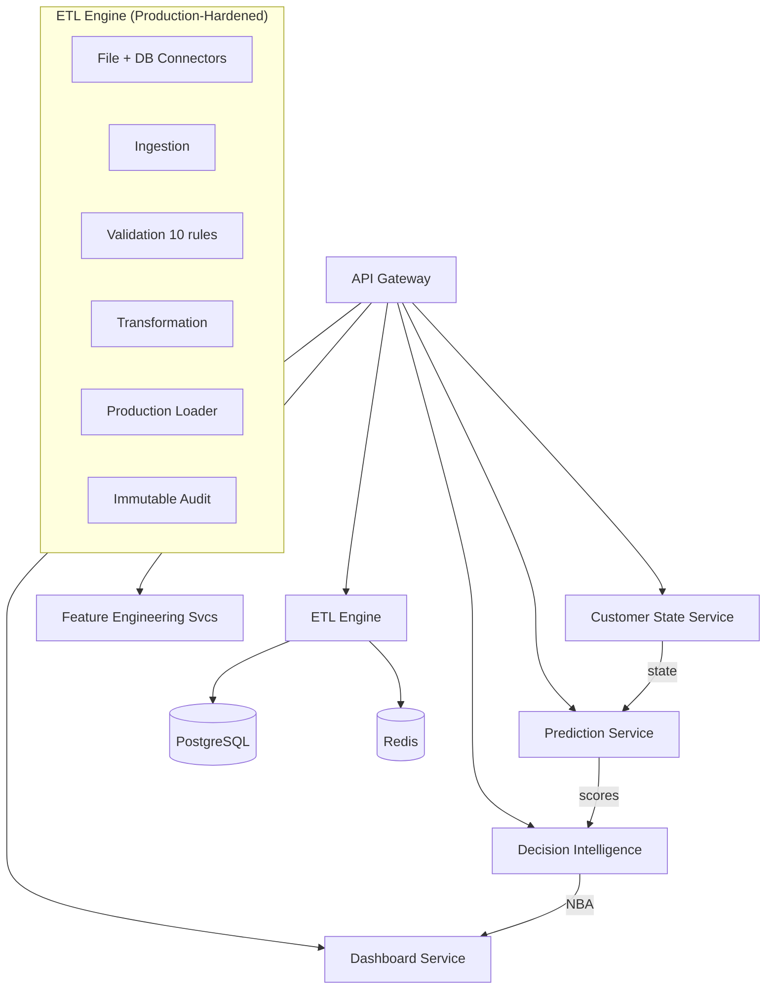

# Customer Lifecycle Prediction System

An enterprise-grade AI platform for banking Customer Lifecycle Prediction, Churn Analysis, Customer Value Prediction, and Next Best Action (NBA) recommendations for Relationship Managers.

> **Phase:** PoC (90-day) — ETL Engine production-hardened. Feature Engineering + minimal 3-Layer AI in progress.
> **Reference:** Full 8-service target architecture preserved on `architecture-target-full` branch.
> **Strategy:** See [ARCHITECTURE.md](./ARCHITECTURE.md) for branch strategy and recovery instructions.

---

## Architecture Overview



### Data Flow

```
Bank Core Systems
  → ETL Engine (Extract → Validate → Transform → Load)
  → Feature Store
  → Behaviour Intelligence (Markov State Classification)
  → Prediction Intelligence (XGBoost / LightGBM)
  → Decision Intelligence (NBA Recommendations)
  → Dashboard (Relationship Manager View)
```

---

## Project Structure

```
customer-lifecycle-ai/
├── etl/                    # Enterprise ETL Engine (NEW - 15 modules)
│   ├── connectors/         # 12 data source connectors
│   ├── ingestion/          # Data reception & routing
│   ├── landing/            # Immutable raw storage (Parquet)
│   ├── validation/         # 5-stage validation engine
│   ├── transformation/     # 3-stage transform pipeline
│   ├── staging/            # Temporary staging tables
│   ├── loading/            # Production upsert loader
│   ├── orchestration/      # DAG-based pipeline execution
│   ├── checkpoint/         # Resumable processing
│   ├── monitoring/         # Real-time observability
│   ├── logging/            # 7-stream structured JSON
│   ├── audit/              # Immutable compliance trail
│   ├── config/             # Centralized env+YAML config
│   ├── pipelines/          # Assembled pipeline runner
│   ├── models/             # 17 SQLAlchemy 2.0 ORM models
│   └── schemas/            # 12 Pydantic v2 schema modules
├── services/               # AI microservices
│   ├── customer-state-service/    # Layer 1: Behaviour Intelligence
│   ├── prediction-service/        # Layer 2: Prediction Intelligence
│   ├── decision-intelligence-service/  # Layer 3: Decision Intelligence
│   ├── feature-engineering-service/    # Feature Store
│   ├── model-management-service/      # Model Registry
│   ├── dashboard-service/             # Dashboards
│   ├── data-ingestion-service/        # Data Ingestion (deprecated by ETL)
│   └── orchestration-service/         # Pipeline Scheduling
├── gateway/                # API Gateway (FastAPI)
├── shared/                 # Shared libraries
├── database/               # Database schemas (17 schemas)
├── models/                 # ML model registry
├── docs/                   # Documentation
└── tests/                  # Test suites
```

---

## ETL Engine

The **Enterprise ETL Engine** is the data integration backbone of the system. It ingests banking data from diverse source systems, validates and transforms it, and loads it into the tiered database architecture.

| Feature | Description |
|---------|-------------|
| **6 Connectors (PoC)** | PostgreSQL, SQL Server, Oracle, MySQL, CSV, Core Banking (REST/SOAP/Kafka available on `architecture-target-full`) |
| **5 Validators** | Schema, Mandatory Fields, Business Rules, Duplicate Detection, Referential Integrity |
| **10 Validation Rules** | All verified against ground truth (currency, channel, date, future-date, amount, duplicates, mandatory fields) |
| **3 Transforms** | Field Mapping, Value Standardization, Data Enrichment |
| **Batch Bulk Insert** | `execute_values` with 5K-row chunks — ~17K rows/s on 70K-row test file |
| **Schema Drift Detection** | Strict mode — fails loudly on missing/reordered columns (configurable) |
| **Idempotency Guard** | SHA-256 file hash dedup — refuses to reload without `--force` |
| **Immutable Audit** | 24-column `etl.etl_audit` — compliance-grade, append-only, 7-year retention |
| **Per-Row Rejection** | Every rejected row carries its specific failed rule ID(s) |
| **Invariant Checks** | Conservation, no-silent-skips, reason coverage, quality floor — every batch |
| **Structured Logging** | INFO/WARNING/ERROR with timestamps, UTF-8 output |

### Quick Usage

```bash
python run_etl.py                           # run against default fixture CSV
python run_etl.py --csv data.csv            # custom input
python run_etl.py --dry-run                 # validate only, no DB writes
python run_etl.py --csv data.csv --force    # re-process already-loaded file
pytest tests/test_validation_ground_truth.py -v   # fixture regression test (6/6)
python verify.py --verbose                  # ground-truth comparison
```

See [ETL README](etl/README.md) and [ETL Architecture](docs/architecture/etl/README.md) for details.

---

## Services Status (PoC)

| Service | Status | Notes |
|---|---|---|
| **ETL Engine** | ✅ Production-hardened | 10/10 validation categories verified, 6/6 regression tests |
| **Feature Engineering** | 🔨 Month 1 priority | Next deliverable — Feature Store implementation |
| **Customer State (L1)** | 📋 Scaffolded | Markov engine only; HMM deferred to `architecture-target-full` |
| **Prediction (L2)** | 📋 Scaffolded | Minimal XGBoost/LightGBM; champion/challenger deferred |
| **Decision Intelligence (L3)** | 📋 Scaffolded | Rule engine only; RL deferred to `architecture-target-full` |
| **Dashboard** | 📋 Scaffolded | Functional, not polished |
| **Model Management** | 📋 Scaffolded | Registry structure ready |
| **Orchestration** | ⏸️ Deferred | Commented out in compose; restore from `architecture-target-full` |

> **Full architecture reference:** `git checkout architecture-target-full` — includes HMM, RL, Kafka/Debezium, REST/SOAP connectors, and hardened gateway middleware. See [ARCHITECTURE.md](./ARCHITECTURE.md).

---

## AI Architecture: Three Layers

### Layer 1 — Behaviour Intelligence (`customer-state-service`)
Markov Chain based customer state engine tracking behavioral state transitions.

| Component | Description |
|-----------|-------------|
| Markov Engine | Transition matrix computation from customer journey data |
| Behaviour Profiler | Customer behavior pattern extraction and state classification |

**Outputs:** Customer state labels (Active, At Risk, Dormant, etc.), transition probabilities, behavioural features

### Layer 2 — Prediction Intelligence (`prediction-service`)

Unified prediction engine supporting multiple ML backends.

| Model | Framework | Purpose |
|-------|-----------|---------|
| Churn Model | XGBoost / LightGBM | Predict probability of customer churn |
| CLV Model | XGBoost / LightGBM | Estimate Customer Lifetime Value |
| Health Score | Fusion | Composite score from churn + CLV + behavioural state |

**Outputs:** Churn probability, CLV estimate, Customer Health Score

### Layer 3 — Decision Intelligence (`decision-intelligence-service`)

Rule engine and Next Best Action recommendation system for Relationship Managers.

| Component | Description |
|-----------|-------------|
| Rule Engine | Business rule evaluation and action triggering |
| NBA Generator | Next Best Action ranking and recommendation |

**Outputs:** Ranked NBA recommendations, customer treatment strategies

---

## Tech Stack

| Component          | Technology                          |
| ------------------ | ----------------------------------- |
| Language           | Python 3.12+                        |
| Framework          | FastAPI                             |
| Database           | PostgreSQL 16                       |
| ORM                | SQLAlchemy 2.0+                     |
| Data Validation    | Pydantic v2                         |
| Migrations         | Alembic                             |
| Cache              | Redis 7                             |
| ML Libraries       | Scikit-Learn, XGBoost, LightGBM     |
| Containerization   | Docker, Docker Compose              |
| API Gateway        | FastAPI (custom gateway)            |
| Markov Models      | NumPy, SciPy                        |
| Deployment Target  | Ubuntu Server (single/small cluster)|

## Project Structure

```
customer-lifecycle-ai/
├── services/                                    # Independent microservices
│   ├── data-ingestion-service/                  # ETL & data acquisition
│   ├── feature-engineering-service/             # Central Feature Store
│   │   └── app/features/                        # Domain feature generators
│   │       ├── customer/                        # Customer profile features
│   │       ├── transactions/                    # Transactional features
│   │       ├── products/                        # Product holding features
│   │       ├── loans/                           # Loan-related features
│   │       ├── cards/                           # Card usage features
│   │       ├── digital/                         # Digital banking features
│   │       ├── behaviour/                       # Behavioural features
│   │       └── clv/                             # CLV-related features
│   ├── customer-state-service/                  # Layer 1: Behaviour Intelligence
│   │   └── app/engines/
│   │       ├── markov/                          # Markov Chain engine
│   │       └── hmm/                             # Hidden Markov Model (future)
│   ├── prediction-service/                      # Layer 2: Prediction Intelligence
│   │   └── app/
│   │       ├── models/xgboost/                  # XGBoost churn & CLV models
│   │       ├── models/lightgbm/                 # LightGBM churn & CLV models
│   │       ├── training/                        # Model training pipelines
│   │       ├── evaluation/                      # Model evaluation & metrics
│   │       └── explainability/shap/             # SHAP-based explanations
│   ├── decision-intelligence-service/           # Layer 3: Decision Intelligence
│   │   └── app/
│   │       ├── rule_engine/                     # Business rule engine
│   │       ├── nba/                             # Next Best Action generator
│   │       └── reinforcement_learning/          # RL (future)
│   ├── model-management-service/                # Model registry & lifecycle
│   │   └── app/
│   │       ├── registry/                        # Model registry
│   │       ├── versioning/                      # Version tracking
│   │       ├── champion_challenger/             # A/B model evaluation
│   │       ├── training/                        # Training orchestration
│   │       ├── evaluation/                      # Performance metrics
│   │       ├── monitoring/                      # Drift monitoring
│   │       └── metadata/                        # Model metadata
│   ├── dashboard-service/                       # Analytics & dashboard data
│   └── orchestration-service/                   # Workflow orchestration
├── shared/                                      # Shared libraries & utilities
│   ├── auth/                                    # Authentication & authorization
│   ├── config/                                  # Shared configuration
│   ├── database/                                # Database base, session, postgres
│   ├── logging/                                 # Structured logging
│   ├── exceptions/                              # Exception hierarchy
│   ├── utils/                                   # Common utilities
│   ├── ml/                                      # Shared ML components
│   ├── schemas/                                 # Shared Pydantic schemas
│   ├── security/                                # Security utilities
│   ├── constants/                               # Project-wide constants
│   └── validators/                              # Data validators
├── gateway/                           # API Gateway
│   ├── app/                           # Gateway application
│   ├── routes/                        # Proxy & health routes
│   ├── middleware/                     # Auth, rate-limit, logging, CORS
│   └── config/                        # Gateway configuration
├── infrastructure/                    # Deployment infrastructure
│   ├── nginx/                         # Reverse proxy config
│   ├── monitoring/                    # Prometheus/Grafana (future)
│   ├── postgres/                      # DB initialization scripts
│   ├── redis/                         # Redis config
│   ├── docker/                        # Production Docker configs
│   ├── backup/                        # Backup procedures
│   └── security/                      # Infrastructure security
├── models/                            # Central ML model registry
│   ├── champion/                      # Active champion models
│   │   ├── customer_state/
│   │   ├── churn_prediction/
│   │   ├── clv_prediction/
│   │   ├── health_score/
│   │   └── nba/
│   ├── challenger/                    # Models under evaluation
│   ├── archive/                       # Archived previous models
│   ├── feature_metadata/              # Feature definitions & drift stats
│   ├── training_history/              # Training logs & lineage
│   └── registry.json
├── datasets/                          # Data storage
│   ├── raw/                           # Raw ingested data
│   ├── processed/                     # Processed/feature data
│   ├── external/                      # External data sources
│   └── synthetic/                     # Synthetic test data
├── research/                          # Jupyter notebooks & experimentation
│   ├── 01_data_exploration/
│   ├── 02_feature_engineering/
│   ├── 03_behaviour_modeling/
│   ├── 04_markov_chain/
│   ├── 05_xgboost/
│   ├── 06_lightgbm/
│   ├── 07_model_comparison/
│   ├── 08_clv_prediction/
│   ├── 09_decision_engine/
│   └── 10_business_value/
├── scripts/                           # Utility scripts
├── docs/                              # Documentation
│   ├── architecture/
│   ├── api/
│   ├── database/
│   ├── deployment/
│   ├── ml/
│   ├── business/
│   ├── security/
│   └── operations/
├── docker/                            # Docker configs (production)
├── .env.example                       # Environment variables template
├── docker-compose.yml                 # Local development orchestration
└── README.md                          # This file
```

## Each Microservice Structure

```
<service-name>/
├── app/
│   ├── __init__.py
│   ├── api/                 # Route definitions & dependencies
│   │   ├── __init__.py
│   │   ├── routes.py
│   │   └── dependencies.py
│   ├── services/            # Business logic layer
│   │   ├── __init__.py
│   │   └── service.py
│   ├── repository/          # Data access / Repository pattern
│   │   ├── __init__.py
│   │   └── repository.py
│   ├── models/              # SQLAlchemy ORM models
│   │   ├── __init__.py
│   │   └── models.py
│   ├── schemas/             # Pydantic v2 schemas
│   │   ├── __init__.py
│   │   └── schemas.py
│   └── config/              # Service configuration
│       ├── __init__.py
│       ├── settings.py
│       └── logging.py
├── tests/
│   ├── __init__.py
│   ├── conftest.py
│   ├── unit/
│   ├── integration/
│   ├── performance/
│   ├── security/
│   └── fixtures/
├── Dockerfile
├── requirements.txt
└── main.py
```

## Quick Start

### Prerequisites

- Docker & Docker Compose
- Python 3.12+
- PostgreSQL 16 (if running outside Docker)

### Local Development

1. **Clone and navigate:**
   ```bash
   cd customer-lifecycle-ai
   ```

2. **Copy environment variables:**
   ```bash
   cp .env.example .env
   ```

3. **Start all services:**
   ```bash
   docker-compose up -d
   ```

4. **Verify services:**
   ```bash
   docker-compose ps
   ```

5. **Stop all services:**
   ```bash
   docker-compose down
   ```

### Service Ports

| Service                     | Port | Layer  |
| --------------------------- | ---- | ------ |
| API Gateway                 | 8080 | —      |
| Data Ingestion Service      | 8001 | —      |
| Feature Engineering Service | 8002 | —      |
| Customer State Service      | 8003 | 1      |
| Prediction Service          | 8004 | 2      |
| Decision Intelligence Svc   | 8005 | 3      |
| Model Management Service    | 8006 | —      |
| Dashboard Service           | 8007 | —      |
| Orchestration Service       | 8008 | —      |

## Design Principles

- **3-Layer AI Architecture** — Behaviour → Prediction → Decision pipeline
- **Clean Architecture** — Separation of concerns with distinct layers
- **SOLID Principles** — Single responsibility, dependency inversion
- **Domain-Driven Design** — Bounded contexts around banking domains
- **Microservices** — Independently deployable, loosely coupled services
- **Repository Pattern** — Abstracted data access behind interfaces
- **Champion/Challenger** — Safe model deployment with A/B evaluation
- **Environment-Based Config** — All configuration via environment variables
- **Multi-Model Support** — XGBoost and LightGBM with configurable model selection
- **SHAP Explainability** — Model predictions are interpretable for banking compliance

## Roadmap

- [x] Project scaffolding & folder structure
- [x] Docker Compose local development setup
- [x] Shared module skeleton
- [x] 3-Layer AI architecture with champion/challenger
- [ ] Implement database models & Alembic migrations
- [ ] Implement API endpoints for each service
- [ ] Implement Markov Chain customer state engine
- [ ] Implement XGBoost & LightGBM prediction models
- [ ] Implement SHAP explainability
- [ ] Implement rule engine & NBA generator
- [ ] Implement champion/challenger model evaluation
- [ ] Implement API Gateway routing & auth
- [ ] Add monitoring & observability
- [ ] CI/CD pipelines
- [ ] Production hardening & security audit

## Deployment Target

This solution is designed for deployment on **one or a small number of Ubuntu servers** using Docker Compose. It does NOT use Kubernetes, Helm, or Terraform.

## Security Considerations

This platform is designed for deployment inside a bank's internal infrastructure. The following must be addressed before production:

- All secrets managed via a secrets manager (HashiCorp Vault, Azure Key Vault, etc.)
- Network segmentation and firewall rules
- TLS/SSL for all inter-service communication
- Audit logging for all data access
- Data encryption at rest and in transit
- Role-Based Access Control (RBAC)
- Regular security scanning and penetration testing

## License

Proprietary — All rights reserved.
