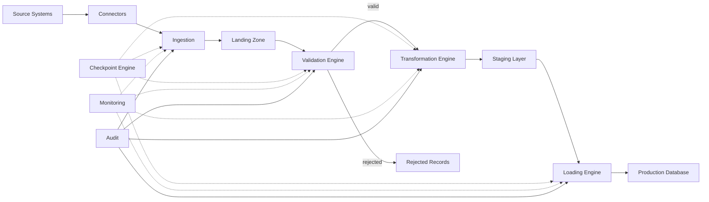

# Enterprise ETL Engine — Architecture Documentation

**Customer Lifecycle Prediction System**
**Date:** 2026-07-16
**Status:** Phase 2 — Implementation Complete

---

## 1. Overview

The ETL Engine is the data integration backbone of the Customer Lifecycle Prediction System. It ingests banking data from diverse source systems, validates and transforms it, and loads it into the tiered database architecture defined in the [Database Design Specification v2.0](../database/database-design-specification-v2.md).

### Position in the Architecture

```
Bank Core Systems / External Sources
        │
        ▼
┌───────────────────────────────┐
│       ETL ENGINE              │
│  ┌─────────────────────────┐  │
│  │  Connectors             │  │  Database, API, File, Streaming
│  └───────────┬─────────────┘  │
│              ▼                │
│  ┌─────────────────────────┐  │
│  │  Ingestion              │  │  Batch ID, Checksum, Metadata
│  └───────────┬─────────────┘  │
│              ▼                │
│  ┌─────────────────────────┐  │
│  │  Landing Zone           │  │  Immutable raw storage
│  └───────────┬─────────────┘  │
│              ▼                │
│  ┌─────────────────────────┐  │
│  │  Validation Engine      │  │  Schema, Business Rules, Dedup
│  └───────────┬─────────────┘  │
│              ▼                │
│  ┌─────────────────────────┐  │
│  │  Transformation Engine  │  │  Mapping, Standardization, Enrich
│  └───────────┬─────────────┘  │
│              ▼                │
│  ┌─────────────────────────┐  │
│  │  Staging Layer          │  │  Temporary validated data
│  └───────────┬─────────────┘  │
│              ▼                │
│  ┌─────────────────────────┐  │
│  │  Loading Engine         │  │  Ordered production load
│  └───────────┬─────────────┘  │
│              ▼                │
│  ┌─────────────────────────┐  │
│  │  Orchestration Engine   │  │  DAG-based pipeline execution
│  └─────────────────────────┘  │
│                                │
│  Cross-cutting:                │
│  ┌─────────────────────────┐  │
│  │  Checkpoint | Monitor    │  │
│  │  Logging   | Audit       │  │
│  │  Config                  │  │
│  └─────────────────────────┘  │
└───────────────┬───────────────┘
                │
                ▼
┌───────────────────────────────┐
│  Tiered Database Architecture │
│  raw.* → staging.* → clean.*  │
│  → feature_store.* → ...      │
└───────────────────────────────┘
```

---

## 2. Module Directory Structure

```
etl/
├── connectors/          # Data source abstraction
│   ├── database/        # PostgreSQL, SQL Server, Oracle, MySQL
│   ├── api/             # REST, SOAP
│   ├── files/           # CSV, Excel, JSON, XML
│   ├── streaming/       # Kafka, Debezium, CDC (future)
│   └── banking/         # Core banking system adapters
├── ingestion/           # Data reception & routing
├── landing/             # Immutable raw storage
├── validation/          # Data quality validation
│   ├── rules/           # Configurable rule definitions
│   └── validators/      # Rule execution engines
├── transformation/      # Data transformation
│   ├── mappers/         # Field mapping
│   ├── enrichers/       # Derived fields & enrichment
│   └── standardizers/   # Value normalization
├── staging/             # Temporary staging tables
├── loading/             # Production database loading
├── orchestration/       # DAG-based pipeline orchestration
├── checkpoint/          # Resumable processing
├── monitoring/          # Real-time observability
├── logging/             # Structured JSON logging
├── audit/               # Compliance audit trail
├── config/              # Centralized configuration
├── pipelines/           # Assembled ETL pipelines
├── repositories/        # Data access layer
├── services/            # Business logic layer
├── models/              # SQLAlchemy ORM models
├── schemas/             # Pydantic v2 schemas
└── utils/               # Helper utilities
```

---

## 3. Design Principles

1. **Domain-Driven Design (DDD):** Each module maps to a bounded context within the ETL domain.
2. **Clean Architecture:** Dependencies point inward — connectors → services → repositories → models.
3. **Event-Driven Architecture:** Pipeline steps emit events consumed by monitoring, logging, and audit.
4. **SOLID:** Single responsibility per class; open for extension, closed for modification.
5. **Repository Pattern:** All data access through repositories; no raw SQL in services.
6. **Dependency Injection:** Services receive their dependencies via constructor injection.
7. **Immutable Raw Data:** Landing zone files are never modified after initial write.
8. **Configurable Everything:** No hardcoded values — all rules, thresholds, and settings in config.

---

## 4. Data Flow



---

## 5. Integration Points

The ETL Engine integrates with the following existing services:

| ETL Component | Integrates With |
|---------------|----------------|
| Loading Engine | `data-ingestion-service` (raw DB writes) |
| Loading Engine | `feature-engineering-service` (trigger recompute) |
| Orchestration | `orchestration-service` (pipeline scheduling) |
| Loading Engine | `prediction-service` (trigger batch prediction) |
| Loading Engine | `decision-intelligence-service` (trigger NBA generation) |
| Loading Engine | `dashboard-service` (trigger materialized view refresh) |

---

## 6. Technology Stack

- **Language:** Python 3.12+
- **Framework:** FastAPI (health/trigger endpoints)
- **ORM:** SQLAlchemy 2.0 (async)
- **Validation:** Pydantic v2
- **Database:** PostgreSQL 16
- **Cache:** Redis 7
- **Containerization:** Docker Compose
- **Testing:** pytest + pytest-asyncio

---

## 7. Compliance & Audit

As a banking system, the ETL Engine maintains:

- **Full audit trail:** Every batch, every record, every transformation logged.
- **Immutable raw data:** Landing zone preserves original source data forever.
- **Lineage tracking:** feature_lineage references clean.* tables and transformation hashes.
- **Quality scoring:** Every batch receives a quality score based on validation results.
- **Operator attribution:** All actions attributable to a service or operator identity.
