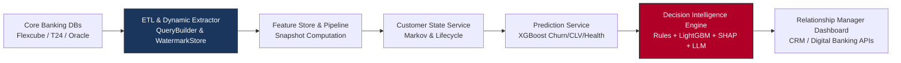

# System Synthesis: Banking Automation Problems Solved

**Platform:** ABSA Customer Lifecycle AI & Decision Intelligence System  
**Scope:** Full Stack Architecture (ETL & Dynamic Extractor, Feature Store, Customer State Service, Prediction Service, Decision Intelligence Engine)  
**Date:** August 8, 2026  
**Auditor/Architect:** Antigravity AI  

---

## Executive Overview

Commercial banks traditionally suffer from **manual data engineering, operational fragmentation, reactive customer retention, blanket marketing spams, and unexplainable gut-feel decisions** by branch staff. 

The **ABSA Customer Lifecycle AI & Decision Intelligence Platform** transitions the bank from **legacy descriptive reporting** to an **automated, closed-loop decision ecosystem**.

---

## Full-Stack Banking Automation Problems Solved

### 1. Manual SQL Scripting & Data Pipeline Overhead (ETL & Dynamic Extractor Automation)
* **The Traditional Problem:** Data engineering teams write hundreds of brittle, vendor-specific SQL scripts for every core banking extract. Updating feature definitions requires rewriting SQL queries, risking syntax bugs and database performance degradation.
* **How the System Solves It:**
  * **`DynamicQueryBuilder`:** Reads declarative, JSON/YAML extraction specifications (`ExtractionConfigSpec`) and dynamically compiles parameterized, vendor-agnostic SQLAlchemy queries supporting multi-table JOINs, 22 filter operators, and pre-aggregations.
  * **`WatermarkStore`:** Automates incremental ingestion with dynamic lookback windows, eliminating duplicate extracts and data loss.
  * **`trusted_config` Security Barrier:** Enforces strict sandboxing on dynamic queries, completely preventing SQL injection risks.
  * **`ExtractionExecutor`:** Stream-extracts multi-gigabyte transaction datasets in chunked memory blocks to prevent container OOM failures.

---

### 2. The "500 Customer Portfolio Dilemma" (RM Productivity Automation)
* **The Traditional Problem:** A Relationship Manager (RM) oversees 500–1,000 corporate/retail accounts. Every morning, they manually open spreadsheet reports or legacy CRM screens, guessing which 15–20 customers to call. High-value customers slipping away are missed until balances drop to zero.
* **How the System Solves It:**
  * The **Priority Engine** automatically computes a dynamic composite score for every customer daily:
    $$\text{Priority Score} = \text{Business Value} \times \text{Urgency} \times P(\text{Acceptance}) \times \text{Retention Impact}$$
  * RMs receive a daily, auto-sorted task queue ranking the top 20 customers requiring immediate outreach, complete with the exact action to execute.

---

### 3. Silent Churn Interception (Stochastic & Behavioral State Automation)
* **The Traditional Problem:** Banks usually detect churn **after** a customer closes their account or transfers their salary out ("Post-Mortem Churn"). By then, win-back efforts fail or cost $5\times$ more.
* **How the System Solves It:**
  * **Customer State Service (Layer 1):** Automatically monitors subtle behavioral decay (e.g., transaction frequency drops, digital login gaps, declining average 30/60/90-day balances) and reclassifies customers from `ACTIVE` to `AT_RISK` or `DORMANT`.
  * **Markov Engine:** Uses discrete-time Markov chains ($4 \times 4$ probability matrices) to project the stochastic probability of a customer transitioning into `CHURNED` over a 30/60/90-day horizon, enabling proactive intervention weeks before churn occurs.

---

### 4. Blanket Marketing Spam vs. Policy-Governed Next Best Actions (NBA)
* **The Traditional Problem:** Marketing departments blast mass SMS/email campaigns for personal loans to all customers, leading to customer fatigue, high opt-out rates, and severe regulatory compliance violations (e.g., offering credit to delinquent/indebted customers).
* **How the System Solves It:**
  * **Recommendation Engine:** Generates hyper-personalized candidate actions (Loan Upgrade, Mortgage, Savings, Retention Call, No Action).
  * **Business Rules Engine (Deterministic Governance):** Evaluates strict banking policies **before** ranking (e.g., age $<18$ rejection, existing credit card suppression, dormancy reactivation rules, debt-to-income limits).
  * **Ranking Engine (LightGBM):** Ranks remaining eligible candidates to pick the single highest-value action for that specific customer context.

---

### 5. The "Black Box AI" & Relationship Manager Distrust Problem
* **The Traditional Problem:** Relationship managers reject AI system outputs if they don't understand *why* a customer was flagged or *why* a loan is being offered. Furthermore, compliance/audit teams prohibit automated decisions that lack clear reason codes.
* **How the System Solves It:**
  * **SHAP Mathematical Factor Extraction:** Extracts precise SHAP values for top predictive drivers (e.g., `"Stable salary inflow for 12 months"`, `"Average balance > $50k"`, `"No existing lending product"`).
  * **LLM Explanation Advisor (Qwen / DeepSeek):** Converts mathematical SHAP weights into fluent, natural language narratives tailored for RMs. The LLM acts as an **advisor, not a decision-maker**, ensuring zero non-deterministic hallucinations in banking logic.

---

### 6. Governance Overstep & Unauthorized Financial Commitments
* **The Traditional Problem:** Front-line staff either lack authorization to offer incentives (e.g., fee waivers, interest rate discounts) or execute high-risk offers without management approval, creating credit and financial loss exposures.
* **How the System Solves It:**
  * **Approval & Routing Engine (`ApprovalResult`):** Automatically routes recommendations based on decision risk:
    * *Standard actions* (e.g., Digital Campaign, RM Call) $\to$ **AUTO_APPROVED**.
    * *High-risk/financial actions* (e.g., Fee Waiver $> \$500$, Credit Limit Increase, Custom Rate Discount) $\to$ **PENDING_APPROVAL**.
  * Enforces multi-tier escalation hierarchies:
    $$\text{Relationship Manager} \longrightarrow \text{Branch Manager} \longrightarrow \text{Regional Credit Manager}$$

---

### 7. Fragmented Data Silos to Unified Customer State & Feature Store
* **The Traditional Problem:** Customer transaction history lives in Core Banking (Flexcube/T24), digital logins live in Mobile App logs, complaints live in CRM (Salesforce), and risk scores live in credit bureau databases. Joining these manually takes days.
* **How the System Solves It:**
  * **Feature Engineering Service (Layer 0):** Continuously aggregates raw transactional streams, balance histories, channel metrics, and CRM tags into standardized `FeatureSnapshot` objects, making holistic customer features instant to consume across all engines via Redis/PostgreSQL.

---

## Full Stack Automation Architecture Summary

| Layer | Subsystem / Engine | Primary Banking Automation Solved |
| :--- | :--- | :--- |
| **Data Ingestion** | **ETL & Dynamic Extractor** (`etl/extraction`) | Eliminates manual SQL writing; automates incremental zero-data-loss extraction with `WatermarkStore` and `DynamicQueryBuilder`. |
| **Layer 0** | **Feature Store** (`feature-engineering-service`) | Unified customer feature snapshotting across Core Banking, Digital, and CRM data silos. |
| **Layer 1** | **Customer State Service** (`customer-state-service`) | Stochastic Markov state modeling ($4 \times 4$ probability matrix) & behavioral lifecycle tracking. |
| **Layer 2** | **Prediction Service** (`prediction-service`) | ML model inference for Churn Probability (XGBoost), CLV, Offer Acceptance, and Health Scores. |
| **Layer 3** | **Decision Intelligence Service** (`decision-intelligence-service`) | Policy-governed Next Best Actions (Rules Engine + LightGBM Ranking + SHAP/LLM Explanation + Approval Workflows). |
