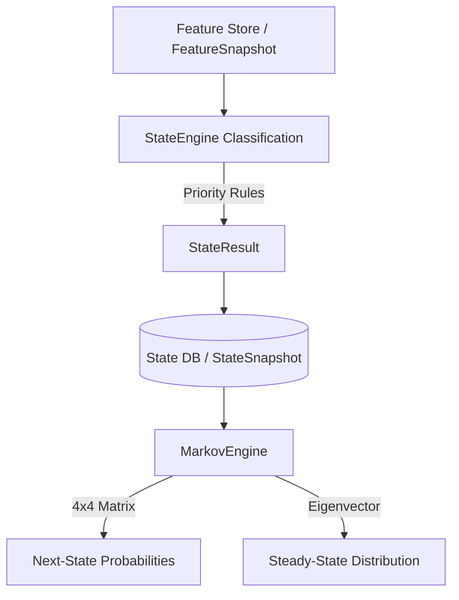
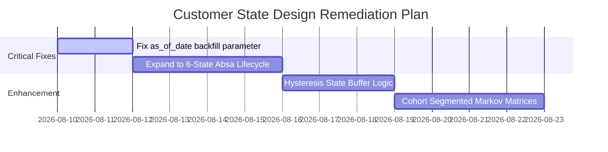

# Architectural & Technical Audit Report: Customer State Design

**Project:** ABSA Foundry Backend — Customer Lifecycle AI Platform  
**Target Component:** Customer State Service (`services/customer-state-service`) & State Schema Design  
**Audit Date:** August 8, 2026  
**Auditor:** Antigravity AI (Lead Systems Architect)

---

## Executive Summary

The **Customer State Service** serves as **Layer 1** of the Customer Lifecycle AI platform. It is responsible for deterministic customer classification, state transition tracking, state snapshotting, and stochastic next-state probability modeling using a 4-state discrete-time Markov chain.

### Audit Scorecard

| Domain | Rating | Summary |
| :--- | :---: | :--- |
| **State Topology & Logic** | **B+ (86%)** | Well-structured priority rule evaluation (`CHURNED` > `DORMANT` > `AT_RISK` > `ACTIVE`). Clean decoupling of continuous ML health scores from deterministic state definitions. |
| **Markov Stochastic Engine** | **A- (90%)** | Robust $4 \times 4$ probability matrix with absorbing state handling (`CHURNED` $\to$ `CHURNED` = 1.0) and cold-start fallback masking (`min_transitions = 50`). |
| **Absa Business Alignment** | **B- (78%)** | **Gap Identified:** The current state machine only models 4 states, whereas Absa's operational classification includes 6 key stages (`NEW`, `ACTIVE`, `GROWING`, `AT_RISK`, `DORMANT`, `CHURNED`). |
| **Code Precision & Point-in-Time Integrity** | **B (82%)** | Clean Pydantic schemas. Found hardcoded `date.today()` override in `StateEngine.classify()` that risks breaking backfilling/historical ETL pipeline runs. |

---

## 1. Core Architecture & Design Analysis



### 1.1 Key Architectural Strengths

1. **Strict Decoupling of State vs. Health Score (Layer 1 vs. Layer 2)**
   * *Finding:* `StateEngine` explicitly excludes `health_score` from state classification rules (`system-design.md §8` compliance).
   * *Why this is good:* Prevents circular dependency loops between state definitions and downstream continuous ML risk models. State classification relies exclusively on observable behavioral features (inactivity days, transaction velocity, account status).

2. **Absorbing-State Markov Property**
   * *Finding:* In `MarkovEngine.fit()`, the `CHURNED` state is enforced as a mathematical absorbing state:
     $$P(\text{CHURNED} \to \text{CHURNED}) = 1.0$$
   * *Why this is good:* Aligns with banking math standards. Closed or permanently churned accounts cannot transition back without a re-boarding event (`NEW` state creation).

3. **Cold-Start Data Masking**
   * *Finding:* If a transition pair has fewer than 50 observations (`min_transitions`), the matrix row is masked (`NaN` converted to `None` in API outputs) rather than producing noisy estimates.

---

## 2. Critical Audit Findings & Gaps

### 🚨 Gap 1: State Topology Mismatch with Absa Operating Model
* **Code Implementation:** `_STATES = ["ACTIVE", "AT_RISK", "DORMANT", "CHURNED"]` ([engine.py](file:///c:/Users/ADMIN/Desktop/uniplexity-ai/ABSA/absa-foundry-backend/customer-lifecycle-ai/services/customer-state-service/app/engines/markov/engine.py#L16))
* **Absa Discovery Requirement:** Section 1 of the Absa Discovery Document explicitly queries:
  > *1. How do you currently classify customers throughout their lifecycle? (New, Active, Growing, At Risk, Dormant, Churned)*
* **Risk:** The engine currently lacks states for **`NEW`** (onboarding window $<90$ days) and **`GROWING`** (expanding balance/product holding velocity). Consequently, relationship managers cannot target growing customers for cross-sell recommendations within the state transition pipeline.
* **Remediation:** Expand state enumeration to 6 states: `["NEW", "ACTIVE", "GROWING", "AT_RISK", "DORMANT", "CHURNED"]`.

---

### ⚠️ Finding 2: Point-in-Time Backfilling Bug in `StateEngine.classify()`
* **File:** [state_engine.py](file:///c:/Users/ADMIN/Desktop/uniplexity-ai/ABSA/absa-foundry-backend/customer-lifecycle-ai/services/customer-state-service/app/services/state_engine.py#L101)
* **Code Issue:**
  ```python
  return StateResult(
      customer_id=features.get("customer_id", "unknown"),
      as_of_date=date.today(),  # <--- HARDCODED
      state=state,
      ...
  )
  ```
* **Risk:** When backfilling historical state timelines for training data, the engine sets `as_of_date` to `date.today()`, causing point-in-time evaluation leakage and corrupting historical transition records in PostgreSQL.
* **Remediation:** Accept `as_of_date: date` as an explicit argument in `StateEngine.classify(features, previous_state, as_of_date)`.

---

### ⚠️ Finding 3: Vulnerability to Boundary "Fluttering"
* **Issue:** `StateEngine` evaluates rigid cutoffs (e.g., `days_since_last_txn > 90` $\to$ `DORMANT`).
* **Risk:** A customer inactive for 91 days becomes `DORMANT`. If they make a single automated $1 fee transaction, `days_since_last_txn` drops to 0, triggering an instant transition to `ACTIVE`, only to lapse back to `DORMANT` 90 days later. This generates false transition events and downstream alert fatigue for relationship managers.
* **Remediation:** Introduce a **Hysteresis Buffer** or Minimum State Residence Window (e.g., customer must perform $\ge 2$ non-fee transactions within 30 days to transition back from `DORMANT` to `ACTIVE`).

---

### 💡 Finding 4: Global Markov Stationarity Assumption
* **Issue:** The `MarkovEngine` calculates a single global matrix across all customers for a 180-day window.
* **Risk:** High-net-worth (VIP) customers exhibit vastly different transition probabilities compared to mass-market retail accounts. Aggregating them distorts steady-state forecasts.
* **Remediation:** Support cohort-segmented Markov matrices (e.g., segment matrix by `segment` or `branch_code`).

---

## 3. Recommended Remediation Plan



### Phase 1: Core Code Corrections (Immediate)
1. **Fix `as_of_date` Parameter:** Modify `StateEngine.classify` signature to accept `as_of_date: date` passed from the caller/snapshot ETL pipeline.
2. **Support `NEW` and `GROWING` States:**
   * `NEW`: `tenure_days <= 90`
   * `GROWING`: `active` + `balance_growth_30d > 15%` OR `new_product_added_60d`

### Phase 2: Banking Robustness (Medium Term)
1. **State Transition Hysteresis:** Require verified transaction velocity thresholds to clear `DORMANT` / `AT_RISK` states.
2. **Segmented Markov Matrices:** Update `MarkovEngine` to generate transition matrices per customer segment (`Mass Retail`, `Preferred Banking`, `VIP/HNW`).

---

## Conclusion

The **Customer State Design** provides a mathematically clean foundation (deterministic rule priority + discrete Markov chain modeling). Expanding the state machine from 4 to 6 states (`NEW`, `GROWING`) and fixing the `as_of_date` backfill leak will ensure full alignment with Absa's commercial operations and point-in-time feature integrity.
