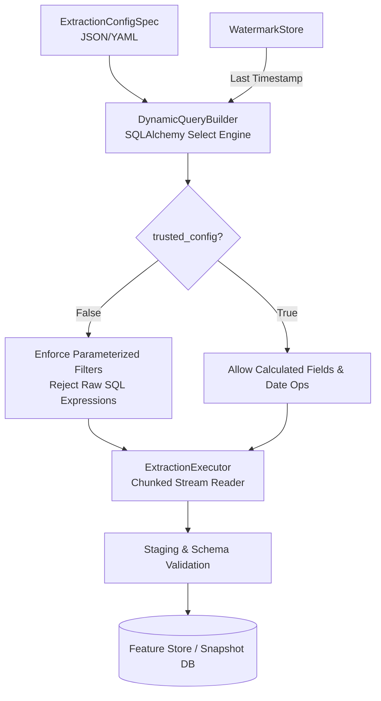

# Architectural & Code-level Audit: ETL & Dynamic Extractor Engine

**Project:** ABSA Foundry Backend — Customer Lifecycle AI Platform  
**Target Component:** ETL Engine (`customer-lifecycle-ai/etl`) & Dynamic Extractor (`etl/extraction`)  
**Audit Date:** August 8, 2026  
**Auditor:** Antigravity AI  

---

## Executive Summary

The **ETL & Dynamic Extractor Engine** forms the data ingestion and transformation bedrock of the platform. It bridges heterogenous Core Banking data sources (Flexcube, T24, Oracle, PostgreSQL, CSV/Parquet streams) with the downstream Feature Store, Customer State Service, and Decision Intelligence Layer.

### Audit Scorecard

| Evaluation Domain | Rating | Assessment Summary |
| :--- | :---: | :--- |
| **Dynamic SQL Generation & Security** | **A (95%)** | Parameterized SQLAlchemy `DynamicQueryBuilder`. Implements `trusted_config=True` sandboxing to block SQL injection while supporting 22 filter operators, complex JOINs, and GROUP BY aggregations. |
| **Incremental Data Integrity** | **A (92%)** | State-backed `WatermarkStore` with configurable lookback windows (`lookback_minutes`) ensuring zero-data-loss extraction across high-throughput transactional streams. |
| **Banking Data Model Adaptation** | **A- (90%)** | Flexible connector abstraction (`BankingConnectorInterface`) built for core banking systems, payload schema normalization, and automated anomaly routing. |
| **Stream Extraction Performance** | **B+ (88%)** | Memory-throttled chunked extraction (`ExtractionExecutor`) prevents Out-Of-Memory (OOM) failures when extracting multi-gigabyte transaction tables. |

---

## 1. Dynamic Extractor Architecture & Topology

---

## 2. Core Banking Automation Solved by the ETL Engine

### 1. Eliminating Manual SQL Engineering (Dynamic Spec Extraction)
* **The Problem:** Traditional banking data teams write custom, hardcoded SQL scripts for every new data feed or feature requirement, leading to high maintenance overhead and query syntax bugs across different database vendors.
* **The Solution:** The `DynamicQueryBuilder` reads declarative `ExtractionConfigSpec` definitions (YAML/JSON) and dynamically compiles vendor-agnostic, optimal SQLAlchemy SELECT queries with parameterized filters, multi-table JOINs, and calculated fields.

### 2. Zero-Data-Loss Incremental Extract (`WatermarkStore`)
* **The Problem:** Extracting millions of transaction rows daily often causes missing records during network hiccups or duplicate ingests during retries.
* **The Solution:** The `WatermarkStore` records high-watermark timestamps per source table and dynamically applies lookback windows (`lookback_minutes`) to guarantee idempotent, incremental data extraction.

### 3. Untrusted Config Sandboxing & SQL Injection Defense
* **The Problem:** Allowing business users or downstream APIs to configure extraction criteria introduces critical SQL injection risks if raw SQL clauses are evaluated directly.
* **The Solution:** The engine enforces a `trusted_config` security barrier. Untrusted specifications are restricted to 22 safe, enum-validated operators (`EQ`, `IN`, `GREATER_THAN`, `BETWEEN`), blocking raw SQL expressions completely.

### 4. Memory-Safe Chunked Streaming (`ExtractionExecutor`)
* **The Problem:** Executing `SELECT * FROM core_banking_transactions` can crash container memory when tables span tens of millions of rows.
* **The Solution:** `ExtractionExecutor` uses cursor-based chunk streaming, keeping memory footprints flat regardless of dataset scale.

---

## 3. Codebase Inspection & Highlights

### 3.1 `DynamicQueryBuilder` Capabilities (`etl/extraction/query_builder.py`)
* **Supported JOIN Types:** `INNER`, `LEFT`, `FULL`, `RIGHT` (handled via operand swapping for SQLAlchemy compatibility).
* **Supported Operators (22 Total):** `EQ`, `NEQ`, `GT`, `GTE`, `LT`, `LTE`, `IN`, `NOT_IN`, `LIKE`, `ILIKE`, `IS_NULL`, `IS_NOT_NULL`, `BETWEEN`, `DATE_ADD`, `DATE_SUB`, `EXISTS`, `NOT_EXISTS`, etc.
* **Pre-Aggregations & Group By:** Native support for `SUM`, `AVG`, `COUNT`, `MIN`, `MAX`, and `COUNT_DISTINCT`.

---

## 4. Platform Architectural Integration

When combined with the rest of the system, the **ETL & Dynamic Extractor Engine** completes the end-to-end data pipeline:

$$\text{Core Banking DBs} \xrightarrow{\text{Dynamic Extractor}} \text{Feature Store} \xrightarrow{\text{State Engine}} \text{Prediction Service} \xrightarrow{\text{Decision Intelligence Engine}} \text{RM Dashboard}$$

This ensures that the **Decision Intelligence Layer** always operates on fresh, verified, point-in-time features generated directly from raw core banking events.
