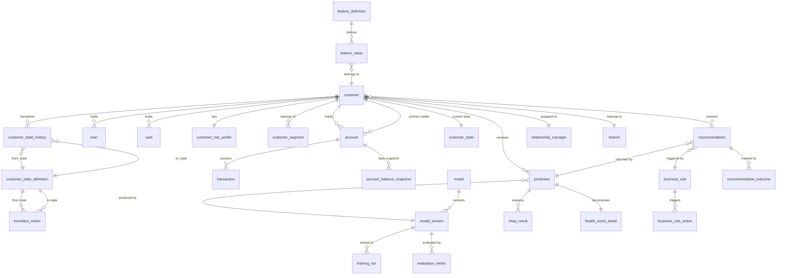

# Database Design Specification — Version 1.0

**Customer Lifecycle Prediction System**
**Date:** 2026-07-15
**Author:** Enterprise Data Architecture Team
**Status:** Draft — Ready for developer implementation

---

## 1. Executive Summary

### Purpose

This document defines the complete database architecture for the Customer Lifecycle Prediction System — an enterprise AI platform deployed inside a bank's internal infrastructure. The database serves as the single source of truth for:

- **Banking customer data** — profiles, accounts, transactions, products, loans, cards, digital activity
- **Customer behaviour** — lifecycle states, state transitions, Markov chain transition matrices
- **AI predictions** — churn probability, Customer Lifetime Value (CLV), Health Score
- **Decision intelligence** — business rules, Next Best Action (NBA) recommendations, campaign outcomes
- **Model management** — champion/challenger registry, training history, evaluation metrics, SHAP results
- **Feature store** — raw and engineered features with lineage and versioning
- **Analytics & dashboards** — executive, RM, branch, and customer-level views
- **Audit & compliance** — full audit trail for every prediction, recommendation, and configuration change
- **Security** — role-based access, PII encryption, data access logging

### How It Supports the AI Platform

The database is the backbone of the 3-layer AI pipeline:

```
Banking Data → Feature Store → Customer State (Markov) → Predictions (XGBoost/LightGBM) → Decisions (NBA) → Dashboard
```

Each layer reads from and writes to its owned schema, ensuring clean separation of concerns. The database is designed for a **single PostgreSQL 16 instance** deployed on Ubuntu Server via Docker Compose — no distributed databases, no cloud-native services.

---

## 2. Design Principles

### Normalization
- **3NF (Third Normal Form)** for all transactional (OLTP) tables
- Intentional denormalization only in analytical summary tables and materialized views where query performance demands it
- Every denormalization decision documented with justification

### Scalability
- **Declarative partitioning** on date columns for high-volume tables (transactions, predictions, audit logs)
- Surrogate `BIGINT` primary keys with `UUID` business keys for horizontal scalability
- Composite indexes designed for the most common query patterns (customer-centric access)

### Auditability
- Every business table includes `created_at`, `updated_at`, `created_by`, `updated_by`
- Hard deletes are forbidden on business tables — use `is_deleted` soft-delete or `record_status`
- Dedicated audit schema for immutable event logs (append-only)
- Every prediction and recommendation carries model version, timestamp, and confidence metadata

### Security
- PII fields identified and tagged for encryption (column-level or application-level)
- Schema-level ownership — each microservice's schema accessible only to that service's database role
- `audit.user_activity` for all data access by human users
- No direct database access from outside the Docker network — all access through API Gateway

### Performance
- Index strategy driven by query patterns, not guesswork
- Materialized views for dashboard aggregations (refreshed on schedule)
- Partition pruning for time-range queries on large tables
- Connection pooling via SQLAlchemy with PgBouncer for production

### Extensibility
- JSONB columns for semi-structured data (model hyperparameters, feature metadata, rule conditions)
- Enum-like values stored in lookup tables, not PostgreSQL ENUM types (allows adding values without DDL)
- Schema designed to accommodate HMM, RL, and multi-tenant scenarios without redesign

---

## 3. Domain Model

The system is organized into 14 business domains, each mapped to a PostgreSQL schema:

| # | Domain | Schema Name | Owning Service | Description |
|---|--------|-------------|----------------|-------------|
| 1 | Customer Master | `customer_master` | data-ingestion-service | Core customer profiles, demographics, KYC |
| 2 | Accounts | `accounts` | data-ingestion-service | Bank accounts, balances, interest rates |
| 3 | Transactions | `transactions` | data-ingestion-service | Financial transactions, categorizations |
| 4 | Products | `products` | data-ingestion-service | Product catalog, holdings, cross-sell |
| 5 | Loans | `loans` | data-ingestion-service | Loan accounts, repayment schedules |
| 6 | Cards | `cards` | data-ingestion-service | Credit/debit cards, utilization |
| 7 | Channels | `channels` | data-ingestion-service | Branches, digital banking, ATMs, RM assignments |
| 8 | Feature Store | `feature_store` | feature-engineering-service | Raw & engineered features, metadata, lineage |
| 9 | Customer Behaviour | `customer_behaviour` | customer-state-service | States, transitions, Markov matrices, timelines |
| 10 | Predictions | `predictions` | prediction-service | Churn, CLV, Health Score, confidence scores |
| 11 | Decisions | `decisions` | decision-intelligence-service | Rules, NBA recommendations, outcomes |
| 12 | Model Registry | `model_registry` | model-management-service | Models, versions, champion/challenger, training |
| 13 | Dashboard | `dashboard` | dashboard-service | Materialized views, summary tables, metrics |
| 14 | Audit & Config | `audit` | gateway + all services | Audit logs, system configuration, security |

---

## 4. Logical Data Model

### 4.1 Customer Master (`customer_master`)

#### `customer`
**Purpose:** Core customer identity and profile. The central anchor entity that all other domains reference.

**Business Rules:**
- Each customer has exactly one active profile at any time
- `customer_id` (business key) is immutable once assigned
- `customer_ref` is the bank's internal customer reference number
- Risk classification is recalculated periodically, not on every transaction
- PII fields (name, email, phone, national_id, address) must be encrypted at rest

**Relationships:**
- One-to-many with `accounts`, `loans`, `cards`
- One-to-many with `customer_state_history`
- One-to-one with `customer_risk_profile`
- Many-to-one with `relationship_manager`
- Many-to-one with `branch`

**Ownership:** `data-ingestion-service` (read/write), all other services (read)

**Lifecycle:** Created during customer onboarding. Never hard-deleted. Soft-deleted on account closure (retained for regulatory period — typically 7 years).

---

#### `customer_risk_profile`
**Purpose:** Risk classification and KYC/CDD status.

**Business Rules:**
- `risk_category`: LOW, MEDIUM, HIGH, PEP (Politically Exposed Person)
- `kyc_status`: PENDING, VERIFIED, EXPIRED, REJECTED
- CDD (Customer Due Diligence) review date tracked for periodic review cycles
- Changes to risk category are audit-logged

**Relationships:** One-to-one with `customer`

**Ownership:** `data-ingestion-service`

---

#### `customer_segment`
**Purpose:** Customer segmentation for targeting and analytics.

**Business Rules:**
- Segments: MASS_MARKET, MASS_AFFLUENT, AFFLUENT, HIGH_NET_WORTH, PRIVATE_BANKING, SME, CORPORATE
- A customer may belong to multiple segments over time
- `effective_from` / `effective_to` for temporal accuracy

**Relationships:** Many-to-one with `customer`

**Ownership:** `data-ingestion-service`

---

#### `relationship_manager`
**Purpose:** RM assignment and portfolio tracking.

**Business Rules:**
- Each customer assigned to exactly one active RM
- RM reassignment creates a new record (history preserved)
- `portfolio_size` is a derived/cached value updated by orchestration

**Relationships:** One-to-many with `customer`

**Ownership:** `data-ingestion-service`

---

#### `branch`
**Purpose:** Branch master data.

**Business Rules:** Branches may be active, inactive, or closed. Branch code is unique.

**Ownership:** `data-ingestion-service`

---

### 4.2 Accounts (`accounts`)

#### `account`
**Purpose:** Bank account master — savings, current, fixed deposit, etc.

**Business Rules:**
- `account_type`: SAVINGS, CURRENT, FIXED_DEPOSIT, RECURRING_DEPOSIT, OVERDRAFT
- `account_status`: ACTIVE, DORMANT, FROZEN, CLOSED
- `currency_code`: ISO 4217 (USD, EUR, GBP, KES, etc.)
- Joint accounts reference multiple customers via `account_holder` junction

**Relationships:** Many-to-one with `customer` (primary holder), many-to-many via `account_holder`

**Ownership:** `data-ingestion-service`

---

#### `account_holder`
**Purpose:** Junction for joint account ownership.

**Business Rules:** `holder_type`: PRIMARY, JOINT, GUARANTOR. `ownership_pct` sums to 100% for each account.

**Ownership:** `data-ingestion-service`

---

#### `account_balance_snapshot`
**Purpose:** Daily balance snapshots for trend analysis.

**Business Rules:** One row per account per day. Populated by nightly ETL. Retained for 5 years for analytics, then aggregated.

**Ownership:** `data-ingestion-service`

---

### 4.3 Transactions (`transactions`)

#### `transaction`
**Purpose:** All financial transactions — credits, debits, transfers, fees, interest.

**Business Rules:**
- `transaction_type`: CREDIT, DEBIT, TRANSFER, FEE, INTEREST, REVERSAL
- `channel`: BRANCH, ATM, MOBILE, INTERNET, POS, AGENT, SWIFT
- `category`: SALARY, UTILITY, SHOPPING, TRANSFER, LOAN_REPAYMENT, INVESTMENT, etc. (configurable lookup)
- Partitioned by `transaction_date` (monthly)

**Relationships:** Many-to-one with `account`

**Ownership:** `data-ingestion-service`

**Growth:** High — potentially millions per month. Partition by month, archive beyond 3 years.

---

#### `transaction_category`
**Purpose:** Configurable transaction category lookup.

**Ownership:** `data-ingestion-service`

---

### 4.4 Products (`products`)

#### `product`
**Purpose:** Product catalog — all bank products.

**Business Rules:** `product_type`: ACCOUNT, LOAN, CARD, INSURANCE, INVESTMENT, FOREX. `is_active` for product lifecycle.

**Ownership:** `data-ingestion-service`

---

#### `customer_product_holding`
**Purpose:** Which products each customer holds, with dates.

**Business Rules:** `status`: ACTIVE, CLOSED, SUSPENDED. Used for cross-sell feature engineering.

**Relationships:** Many-to-one with `customer`, many-to-one with `product`

**Ownership:** `data-ingestion-service`

---

### 4.5 Loans (`loans`)

#### `loan`
**Purpose:** Loan accounts — personal, mortgage, auto, business, overdraft.

**Business Rules:**
- `loan_type`: PERSONAL, MORTGAGE, AUTO, BUSINESS, OVERDRAFT, CREDIT_LINE
- `loan_status`: ACTIVE, SETTLED, DEFAULTED, RESTRUCTURED, WRITTEN_OFF
- `interest_rate_type`: FIXED, VARIABLE
- `delinquency_days`: computed field tracking payment delinquency

**Relationships:** Many-to-one with `customer`

**Ownership:** `data-ingestion-service`

---

#### `loan_repayment`
**Purpose:** Scheduled and actual repayments.

**Business Rules:** Tracks `due_date`, `paid_date`, `amount_due`, `amount_paid`, `is_on_time`

**Ownership:** `data-ingestion-service`

---

### 4.6 Cards (`cards`)

#### `card`
**Purpose:** Credit and debit cards.

**Business Rules:** `card_type`: DEBIT, CREDIT, PREPAID. `card_status`: ACTIVE, BLOCKED, EXPIRED, CANCELLED.

**Ownership:** `data-ingestion-service`

---

#### `card_transaction`
**Purpose:** Card-specific transactions with merchant data.

**Business Rules:** `merchant_category_code` (MCC), `is_online`, `is_international`. Links to `transaction` where applicable.

**Ownership:** `data-ingestion-service`

---

### 4.7 Channels (`channels`)

#### `digital_activity`
**Purpose:** Digital banking login and activity tracking.

**Business Rules:** `activity_type`: LOGIN, BALANCE_CHECK, TRANSFER, BILL_PAY, PROFILE_UPDATE. Used by customer-state-service for behaviour modeling.

**Ownership:** `data-ingestion-service` (write), `customer-state-service` (read)

---

#### `channel_preference`
**Purpose:** Customer channel preferences and adoption.

**Business Rules:** Tracks which channels a customer uses and their primary preference.

**Ownership:** `data-ingestion-service`

---

### 4.8 Customer Behaviour (`customer_behaviour`)

#### `customer_state`
**Purpose:** Current lifecycle state for each customer.

**Business Rules:**
- States defined in `customer_state_definition` configuration table
- Default states: ACTIVE, EARLY_WARNING, INACTIVE, PRE_DORMANT, DORMANT
- `days_since_last_activity` drives state classification
- State transitions computed by Markov Chain engine in `customer-state-service`

**Relationships:** One-to-one with `customer`, references `customer_state_definition`

**Ownership:** `customer-state-service`

---

#### `customer_state_definition`
**Purpose:** Configurable state definitions and thresholds.

**Business Rules:**
| State | Days Since Last Activity |
|-------|--------------------------|
| ACTIVE | < 60 |
| EARLY_WARNING | 60–90 |
| INACTIVE | 90–180 |
| PRE_DORMANT | 180–365 |
| DORMANT | > 365 |

These thresholds are data-driven — stored in this table, NOT hard-coded.

**Ownership:** `customer-state-service`

---

#### `customer_state_history`
**Purpose:** Immutable history of all state changes. Supports journey analysis and transition matrix computation.

**Business Rules:**
- One row per state change
- `from_state_id` → `to_state_id` captures the transition
- `transition_date` is the timestamp of the state change
- `trigger_reason`: SCHEDULED_RECALC, MANUAL_OVERRIDE, THRESHOLD_BREACH

**Ownership:** `customer-state-service`

**Growth:** One row per customer per state change. Partition by year.

---

#### `transition_matrix`
**Purpose:** Pre-computed Markov transition probability matrix.

**Business Rules:**
- Computed periodically (e.g., monthly) from `customer_state_history`
- `from_state_id` + `to_state_id` composite unique
- `transition_probability` is the empirical probability P(to_state | from_state)
- `sample_size` records how many transitions informed the probability
- `computed_at` for versioning

**Ownership:** `customer-state-service`

---

#### `customer_timeline`
**Purpose:** Denormalized customer journey timeline for fast dashboard queries.

**Business Rules:**
- Materialized from `customer_state_history` + `transaction` + `digital_activity`
- Key events: account opened, first transaction, state changes, dormant trigger, churn indicator
- Refreshed nightly

**Ownership:** `customer-state-service` (write), `dashboard-service` (read)

---

### 4.9 Feature Store (`feature_store`)

#### `feature_definition`
**Purpose:** Registry of all features available in the platform.

**Business Rules:**
- `feature_name`: unique identifier (e.g., `txn_count_30d`, `avg_balance_90d`, `login_freq_7d`)
- `feature_domain`: CUSTOMER, TRANSACTIONS, PRODUCTS, LOANS, CARDS, DIGITAL, BEHAVIOUR, CLV
- `data_type`: FLOAT, INT, BOOL, CATEGORICAL
- `computation_function`: reference to the generator function
- `is_active`: allows deprecating features without deleting them

**Ownership:** `feature-engineering-service`

---

#### `feature_value`
**Purpose:** Current computed feature values for each customer.

**Business Rules:**
- One row per customer per feature
- `computed_at` tracks freshness
- `feature_version` supports evolution of feature computation
- Composite unique on `(customer_id, feature_id, feature_version)`

**Ownership:** `feature-engineering-service`

**Growth:** `num_customers × num_features`. Moderate — recompute triggers updates, not inserts.

---

#### `feature_value_history`
**Purpose:** Time-series of feature values for trend analysis and drift detection.

**Business Rules:**
- Append-only — one row per computation cycle per feature per customer
- Partitioned by `computed_at` (monthly)

**Ownership:** `feature-engineering-service`

**Growth:** High. Retain 2 years for drift analysis, archive beyond.

---

#### `feature_lineage`
**Purpose:** Tracks how each feature value was computed — source tables, transformations, timestamp.

**Business Rules:**
- `source_tables`: JSON array of source table names
- `transformation_hash`: hash of the transformation logic for reproducibility
- `pipeline_run_id`: links to the orchestration run that produced this batch

**Ownership:** `feature-engineering-service`

---

#### `feature_refresh_log`
**Purpose:** Records each feature computation run.

**Business Rules:** Tracks `started_at`, `completed_at`, `features_computed`, `errors`, `pipeline_run_id`

**Ownership:** `feature-engineering-service`

---

### 4.10 Predictions (`predictions`)

#### `prediction`
**Purpose:** Stores every prediction made by the system.

**Business Rules:**
- `prediction_type`: CHURN, CLV, HEALTH_SCORE
- `predicted_value`: the numeric prediction
- `confidence_score`: model's confidence (0–1)
- `probability_score`: for classification predictions
- `model_id` + `model_version_id`: traceable to exact model
- `feature_snapshot_hash`: links to the feature set used for reproducibility

**Relationships:** Many-to-one with `customer`, `model_version`

**Ownership:** `prediction-service`

**Growth:** High — one row per customer per prediction cycle. Partition by `predicted_at` (monthly).

---

#### `prediction_batch`
**Purpose:** Groups predictions from a single batch run for management and rollback.

**Business Rules:** `batch_status`: RUNNING, COMPLETED, FAILED, ROLLED_BACK

**Ownership:** `prediction-service`

---

#### `health_score_detail`
**Purpose:** Breakdown of the composite Health Score into its components.

**Business Rules:**
- `churn_component`: weighted churn risk contribution
- `clv_component`: weighted CLV contribution
- `behaviour_component`: weighted behavioural state contribution
- `final_score`: 0–100 composite
- Formula: `final = w_churn × (1 − churn_prob) × 100 + w_clv × clv_percentile × 100 + w_behaviour × state_score × 100`

**Ownership:** `prediction-service`

---

### 4.11 Decisions (`decisions`)

#### `business_rule`
**Purpose:** Configurable rule definitions for NBA generation.

**Business Rules:**
- `rule_type`: PREDICTION_BASED, DEMOGRAPHIC_BASED, BEHAVIOUR_BASED, CALENDAR_BASED
- `rule_condition`: JSONB — structured condition definition (e.g., `{"churn_probability": {">": 0.7}}`)
- `priority`: execution order (lower = higher priority)
- `is_active`: allows toggling rules without deleting

**Ownership:** `decision-intelligence-service`

---

#### `business_rule_action`
**Purpose:** Actions triggered when a rule condition is met.

**Business Rules:**
- `action_type`: CALL_CUSTOMER, SEND_EMAIL, SEND_SMS, OFFER_PRODUCT, SCHEDULE_MEETING, ESCALATE
- `action_template`: template for the action (e.g., "Call {customer_name} to discuss retention offer")
- `product_id`: optional — links to product catalog for cross-sell actions

**Ownership:** `decision-intelligence-service`

---

#### `recommendation`
**Purpose:** NBA recommendations generated for each customer.

**Business Rules:**
- `recommendation_type`: RETENTION, CROSS_SELL, UP_SELL, SERVICE_RECOVERY, ENGAGEMENT
- `rank`: priority within the customer's recommendation set
- `expected_impact`: estimated business value of executing this NBA
- `rule_id`: traceable to the triggering business rule
- `prediction_id`: traceable to the prediction that informed this recommendation

**Ownership:** `decision-intelligence-service`

**Growth:** Moderate — one set per customer per recommendation cycle.

---

#### `recommendation_outcome`
**Purpose:** Tracks whether RM executed the recommendation and the result.

**Business Rules:**
- `status`: PRESENTED, ACCEPTED, REJECTED, EXECUTED, EXPIRED
- `rm_id`: which RM handled it
- `customer_response`: ACCEPTED, DECLINED, NO_RESPONSE, DEFERRED
- `actual_impact`: realized business value (if measurable)
- Closed-loop feedback for model improvement

**Ownership:** `decision-intelligence-service`

---

#### `campaign`
**Purpose:** Groups recommendations into campaigns for RM execution.

**Business Rules:** `campaign_type`: RETENTION, ACQUISITION, CROSS_SELL, REACTIVATION

**Ownership:** `decision-intelligence-service`

---

### 4.12 Model Registry (`model_registry`)

#### `model`
**Purpose:** Registry of all ML models in the platform.

**Business Rules:**
- `model_name`: unique (e.g., "churn_xgboost_v2", "clv_lightgbm_v1")
- `model_type`: CHURN, CLV, HEALTH_SCORE, NBA, STATE_CLASSIFIER
- `framework`: XGBOOST, LIGHTGBM, MARKOV, CUSTOM

**Ownership:** `model-management-service`

---

#### `model_version`
**Purpose:** Version history for each model.

**Business Rules:**
- `version_number`: semantic versioning (1.0.0, 1.1.0, 2.0.0)
- `status`: CHAMPION, CHALLENGER, ARCHIVED, TRAINING, FAILED
- `model_artifact_path`: filesystem path to serialized model file
- `hyperparameters`: JSONB — complete hyperparameter set for reproducibility

**Ownership:** `model-management-service`

---

#### `training_run`
**Purpose:** Records every model training execution.

**Business Rules:**
- `training_status`: RUNNING, COMPLETED, FAILED, CANCELLED
- `dataset_hash`: hash of the training dataset for reproducibility
- `training_duration_seconds`: for performance tracking
- `feature_list`: JSON array of feature names used

**Ownership:** `model-management-service`

---

#### `evaluation_metric`
**Purpose:** Evaluation metrics for each model version.

**Business Rules:**
- `metric_name`: AUC_ROC, PRECISION, RECALL, F1, RMSE, MAE, LOG_LOSS
- `metric_value`: numeric value
- `dataset_type`: TRAIN, VALIDATION, TEST
- `threshold`: for binary metrics

**Ownership:** `model-management-service`

---

#### `shap_result`
**Purpose:** SHAP feature importance for explainability (banking compliance).

**Business Rules:**
- `feature_name`: which feature
- `shap_value`: the SHAP value
- `prediction_id`: links to the specific prediction
- Stored for every prediction — compliance requirement

**Ownership:** `prediction-service` (write), `model-management-service` (read for aggregated analysis)

**Growth:** High — one row per feature per prediction. Partition by `predicted_at`.

---

#### `model_deployment_log`
**Purpose:** Immutable log of all model deployments (champion promotions, rollbacks).

**Business Rules:** `deployment_action`: PROMOTE_TO_CHAMPION, DEMOTE_TO_CHALLENGER, ARCHIVE, ROLLBACK

**Ownership:** `model-management-service`

---

#### `feature_importance`
**Purpose:** Aggregated feature importance across training runs for model comparison.

**Business Rules:** `importance_type`: SHAP, PERMUTATION, GAIN. Computed during training and evaluation.

**Ownership:** `model-management-service`

---

### 4.13 Dashboard (`dashboard`)

The dashboard schema contains **materialized views and summary tables**, not normal-form transactional data. These are refreshed on schedule by the `orchestration-service`.

#### `mv_executive_summary`
**Purpose:** Executive-level KPIs — total customers, churn rate, portfolio health, campaign effectiveness.

**Refresh:** Daily

**Ownership:** `dashboard-service`

---

#### `mv_rm_portfolio`
**Purpose:** Per-RM portfolio view — customer list with health scores, churn risk, top NBA.

**Refresh:** Daily

**Ownership:** `dashboard-service`

---

#### `mv_branch_performance`
**Purpose:** Branch-level aggregation of customer metrics.

**Refresh:** Daily

**Ownership:** `dashboard-service`

---

#### `mv_customer_360`
**Purpose:** Single-customer comprehensive view — profile, accounts, predictions, recommendations.

**Refresh:** On-demand or daily

**Ownership:** `dashboard-service`

---

#### `operational_metric`
**Purpose:** System health metrics — API latency, prediction throughput, feature computation times.

**Ownership:** `dashboard-service`

---

### 4.14 Audit (`audit`)

#### `audit_log`
**Purpose:** Central immutable audit trail for all significant actions.

**Business Rules:**
- `entity_type`: CUSTOMER, PREDICTION, RECOMMENDATION, MODEL, CONFIG, USER
- `action`: CREATE, UPDATE, DELETE, EXECUTE, APPROVE, REJECT
- `old_value` / `new_value`: JSONB — complete before/after snapshots
- `service_name`: which microservice performed the action
- Partitioned by `created_at` (monthly)
- **No updates or deletes allowed** on this table (truly append-only)

**Ownership:** All services (write), `gateway` (read for compliance reports)

---

#### `prediction_audit`
**Purpose:** Links predictions to audit trail for regulatory traceability.

**Business Rules:** Every prediction must have a corresponding audit record.

**Ownership:** `prediction-service`

---

#### `recommendation_audit`
**Purpose:** Links NBA recommendations to audit trail showing what was recommended, to whom, and why.

**Ownership:** `decision-intelligence-service`

---

#### `user_activity`
**Purpose:** Tracks human user actions (RM viewing dashboard, accepting NBA, overriding prediction).

**Business Rules:** `user_id`, `session_id`, `ip_address`, `action_detail`

**Ownership:** `gateway`

---

---

## 5. Physical Database Design

### 5.1 Table Specification — `customer_master.customer`

| Attribute | Value |
|-----------|-------|
| **Purpose** | Core customer identity and profile |
| **Primary Key** | `id` (BIGINT, surrogate, auto-increment) |
| **Business Key** | `customer_id` (UUID, unique, immutable) |
| **Foreign Keys** | `current_state_id` → `customer_behaviour.customer_state(id)`, `primary_rm_id` → `customer_master.relationship_manager(id)`, `home_branch_id` → `customer_master.branch(id)` |
| **Unique Constraints** | `customer_id` (UUID), `customer_ref` (bank reference number) |
| **Check Constraints** | `customer_status` IN ('ACTIVE','INACTIVE','SUSPENDED','CLOSED'), `date_of_birth < CURRENT_DATE` |
| **Indexes** | B-tree on `customer_id` (unique), B-tree on `customer_ref` (unique), B-tree on `primary_rm_id`, B-tree on `home_branch_id`, B-tree on `customer_status`, GIN on `tags` (JSONB) |
| **Retention** | Retain for regulatory period (7 years) after account closure. Soft-delete only. |
| **Expected Growth** | Low — one row per customer. Typical bank: 100K–10M customers. |
| **Partitioning** | Not required |

---

### 5.2 Table Specification — `transactions.transaction`

| Attribute | Value |
|-----------|-------|
| **Purpose** | All financial transactions |
| **Primary Key** | `id` (BIGINT, surrogate, auto-increment) |
| **Business Key** | `transaction_ref` (bank's transaction reference, unique) |
| **Foreign Keys** | `account_id` → `accounts.account(id)`, `category_id` → `transactions.transaction_category(id)` |
| **Unique Constraints** | `transaction_ref` |
| **Check Constraints** | `amount > 0`, `transaction_type` IN ('CREDIT','DEBIT','TRANSFER','FEE','INTEREST','REVERSAL') |
| **Indexes** | B-tree on `account_id + transaction_date` (covering for customer queries), B-tree on `transaction_ref`, B-tree on `category_id`, BRIN on `transaction_date` (for partition pruning) |
| **Retention** | 3 years in active partitions; archive to cold storage beyond |
| **Expected Growth** | Very High — millions/month. Critical to partition. |
| **Partitioning** | RANGE by `transaction_date` (monthly). Index on `(account_id, transaction_date DESC)` for fast customer transaction history. |

---

### 5.3 Table Specification — `customer_behaviour.customer_state_history`

| Attribute | Value |
|-----------|-------|
| **Purpose** | Immutable record of every customer state change |
| **Primary Key** | `id` (BIGINT, surrogate) |
| **Foreign Keys** | `customer_id` → `customer_master.customer(id)`, `from_state_id` → `customer_behaviour.customer_state_definition(id)`, `to_state_id` → `customer_behaviour.customer_state_definition(id)` |
| **Unique Constraints** | `(customer_id, transition_date)` — a customer can only have one state at a time |
| **Indexes** | B-tree on `customer_id + transition_date`, B-tree on `from_state_id + to_state_id` (for transition matrix), BRIN on `transition_date` |
| **Retention** | 5 years for Markov analysis; archive beyond |
| **Expected Growth** | Medium — one row per customer per state change |
| **Partitioning** | RANGE by `transition_date` (yearly) |

---

### 5.4 Table Specification — `predictions.prediction`

| Attribute | Value |
|-----------|-------|
| **Purpose** | Every prediction (churn, CLV, health score) |
| **Primary Key** | `id` (BIGINT, surrogate) |
| **Foreign Keys** | `customer_id` → `customer_master.customer(id)`, `model_version_id` → `model_registry.model_version(id)`, `batch_id` → `predictions.prediction_batch(id)` |
| **Unique Constraints** | `(customer_id, prediction_type, predicted_at)` — one prediction per type per timestamp |
| **Check Constraints** | `prediction_type` IN ('CHURN','CLV','HEALTH_SCORE'), `confidence_score` BETWEEN 0 AND 1, `probability_score` BETWEEN 0 AND 1 |
| **Indexes** | B-tree on `customer_id + predicted_at`, B-tree on `prediction_type + predicted_at`, BRIN on `predicted_at` |
| **Retention** | 2 years for trend analysis; aggregate beyond |
| **Expected Growth** | High — one row per customer per prediction type per cycle |
| **Partitioning** | RANGE by `predicted_at` (monthly) |

---

### 5.5 Table Specification — `model_registry.model_version`

| Attribute | Value |
|-----------|-------|
| **Purpose** | Versioned model entries |
| **Primary Key** | `id` (BIGINT, surrogate) |
| **Foreign Keys** | `model_id` → `model_registry.model(id)`, `training_run_id` → `model_registry.training_run(id)` |
| **Unique Constraints** | `(model_id, version_number)` |
| **Check Constraints** | `status` IN ('CHAMPION','CHALLENGER','ARCHIVED','TRAINING','FAILED'), `version_number` matches semantic version regex |
| **Indexes** | B-tree on `model_id + version_number`, partial index on `status = 'CHAMPION'`, partial index on `status = 'CHALLENGER'` |
| **Retention** | Indefinite — model lineage must be preserved |
| **Partitioning** | Not required |

---

Detailed specifications for all ~45+ tables follow the same pattern. A complete table-by-table spec is documented in the **Physical Data Dictionary** (separate deliverable). The patterns above establish the standard.

---

## 6. Customer Master Data (Detailed)

### Entity Map

```
customer
  ├── customer_risk_profile (1:1)
  ├── customer_segment (1:N, temporal)
  ├── customer_contact (1:N)
  ├── customer_document (1:N — KYC documents)
  ├── customer_address (1:N, temporal)
  └── customer_demographic (1:1)

relationship_manager (1:N → customer)
branch (1:N → customer)
```

### Key Design Decisions

1. **PII Separation:** `customer_contact`, `customer_address`, `customer_document` are separate tables to allow column-level encryption on PII while keeping `customer` queryable for analytics.

2. **Temporal Segments:** `customer_segment` has `effective_from`/`effective_to` so historical segment membership is preserved for accurate churn analysis.

3. **RM Assignment History:** `customer_rm_assignment` tracks RM changes over time — current assignment is the row with `effective_to IS NULL`.

4. **Lifecycle State Reference:** `customer.current_state_id` points to `customer_behaviour.customer_state`. This is a cache — the authoritative source is `customer_state_history`.

---

## 7. Banking Data (Detailed)

### Entity Map

```
account
  ├── account_holder (junction: account ↔ customer)
  └── account_balance_snapshot (1:N, daily snapshots)

transaction
  └── transaction_category (lookup)

product
  └── customer_product_holding (junction: customer ↔ product)

loan
  ├── loan_repayment (1:N)
  └── loan_collateral (1:N — for secured loans)

card
  └── card_transaction (1:N)

digital_activity (1:N → customer)
channel_preference (1:N → customer)
```

### Key Design Decisions

1. **Balance Snapshots, not Running Totals:** Daily `account_balance_snapshot` enables time-travel queries without recomputing from transactions.

2. **Transaction Partitioning:** `transaction` is the largest table. Partitioned by month, with a BRIN index on `transaction_date` for efficient partition pruning.

3. **Category Lookup:** Transaction categories are a lookup table, not an ENUM — allows adding categories without DDL.

4. **Product Holdings as History:** `customer_product_holding` with `acquired_date`/`closed_date` enables product adoption analysis.

---

## 8. Customer Behaviour (Detailed)

### Entity Map

```
customer_state_definition (lookup: state names + thresholds)
  └── customer_state (1:1 → customer, current state cache)
  └── customer_state_history (1:N → customer, immutable state transitions)

transition_matrix (computed: from_state × to_state → probability)
customer_timeline (materialized: denormalized journey for dashboards)
```

### Key Design Decisions

1. **Configurable State Thresholds:** `customer_state_definition` stores `min_days` / `max_days` for each state. Changing thresholds does not require code changes or DDL.

2. **Transition Matrix as Computed Table:** The `transition_matrix` is derived from `customer_state_history`, not written by an application. Recomputable at any time.

3. **Timeline as Materialized View:** `customer_timeline` is a denormalized, read-optimized table refreshed nightly — avoids joining 5 tables for dashboard queries.

4. **HMM Ready:** The `customer_state_history` schema supports Hidden Markov Models — each transition has metadata (`trigger_reason`, `feature_snapshot_hash`) that HMM training can use as emission probabilities.

---

## 9. Feature Store (Detailed)

### Entity Map

```
feature_definition (registry of all features)
  └── feature_value (current value: 1 per customer per feature)
  └── feature_value_history (time-series: append-only)
  └── feature_lineage (provenance: how was this computed?)

feature_refresh_log (computation run tracking)
feature_drift_log (drift detection results)
```

### Key Design Decisions

1. **Definition vs. Value Separation:** `feature_definition` is metadata (name, type, domain). `feature_value` is the data. This enables feature discovery without scanning values.

2. **Versioned Features:** `feature_value.feature_version` allows evolving feature computation while preserving historical values for model reproducibility.

3. **Lineage Tracking:** `feature_lineage` records exactly which source tables and transformations produced each feature batch — critical for audit and debugging.

4. **Drift Detection Ready:** `feature_drift_log` stores statistical comparisons (KS test, PSI) between current and reference feature distributions.

---

## 10. Prediction Database (Detailed)

### Entity Map

```
prediction_batch (groups predictions from a single run)
  └── prediction (one row per prediction: churn prob, CLV, health score)
       └── health_score_detail (breakdown of composite score)
       └── shap_result (SHAP values per feature per prediction)

prediction_audit (immutable audit trail for regulatory compliance)
```

### Key Design Decisions

1. **Batch Grouping:** `prediction_batch` enables rollback — if a model produces bad predictions, the entire batch can be invalidated.

2. **Confidence + Probability:** Dual scores — `confidence_score` (model's self-reported confidence) and `probability_score` (calibrated probability) — support both technical evaluation and business interpretation.

3. **SHAP per Prediction:** `shap_result` stores one row per feature per prediction. This is a compliance requirement — every prediction must be explainable. Partition heavily.

4. **Health Score Decomposition:** `health_score_detail` breaks the composite score into `churn_component`, `clv_component`, `behaviour_component` so business users can understand what's driving the score.

---

## 11. Decision Intelligence (Detailed)

### Entity Map

```
business_rule (configurable rules)
  └── business_rule_action (what happens when rule fires)

recommendation (NBA per customer)
  └── recommendation_outcome (did RM execute? what happened?)

campaign (groups recommendations)
  └── campaign_target (campaign ↔ customer junction)
```

### Key Design Decisions

1. **Rules as Data:** `business_rule.rule_condition` is JSONB — rules can be added, modified, or disabled without code deployment.

2. **Closed-Loop Feedback:** `recommendation_outcome` captures whether the RM acted and the customer's response. This data feeds back into model retraining.

3. **Rule-Action Separation:** A rule can have multiple actions (call + email + offer). `business_rule_action` is a separate table.

4. **Campaign Management:** `campaign` groups recommendations for coordinated RM execution and performance measurement.

---

## 12. Model Management (Detailed)

### Entity Map

```
model (registry entry)
  └── model_version (versioned model artifact)
       └── training_run (training execution record)
       └── evaluation_metric (AUC, F1, RMSE per version)
       └── feature_importance (aggregated feature importance)

model_deployment_log (champion promotions, rollbacks)
model_drift_log (prediction drift monitoring)
```

### Key Design Decisions

1. **Champion/Challenger via Status:** `model_version.status` = CHAMPION or CHALLENGER. Only one CHAMPION per `model.model_type` at a time (enforced by partial unique index or application logic).

2. **Hyperparameters as JSONB:** `model_version.hyperparameters` stores the full dict — no rigid schema needed for evolving model configs.

3. **Training Reproducibility:** `training_run.dataset_hash` + `feature_list` + `hyperparameters` (in model_version) = complete reproducibility.

4. **Deployment Audit Trail:** `model_deployment_log` tracks every promotion, demotion, and rollback for regulatory audit.

---

## 13. Dashboard (Detailed)

### Materialized Views

| View | Source Tables | Refresh | Consumer |
|------|--------------|---------|----------|
| `mv_executive_summary` | customer, prediction, recommendation_outcome | Daily | Executive dashboard |
| `mv_rm_portfolio` | customer, customer_state, prediction, recommendation | Daily | RM dashboard |
| `mv_branch_performance` | customer, branch, prediction, recommendation_outcome | Daily | Branch dashboard |
| `mv_customer_360` | customer + all related tables | On-demand | Customer detail view |
| `mv_churn_risk_matrix` | prediction (CHURN) | Daily | Risk heatmap |
| `mv_nba_effectiveness` | recommendation_outcome (aggregated) | Weekly | Campaign performance |
| `mv_feature_drift_summary` | feature_drift_log | Weekly | ML ops monitoring |

### Key Design Decisions

1. **No Direct Query of OLTP Tables:** Dashboards read from materialized views, never from transactional tables directly. Prevents dashboard load from impacting prediction latency.

2. **Refresh Orchestration:** `orchestration-service` triggers view refreshes after prediction and recommendation batches complete.

3. **`operational_metric` for System Health:** Separate from business metrics — tracks API latency, error rates, feature computation times.

---

## 14. Audit (Detailed)

### Audit Schema

| Table | Scope | Immutable? | Partitioned? |
|-------|-------|------------|--------------|
| `audit_log` | All significant system actions | Yes (append-only) | Monthly |
| `prediction_audit` | Every prediction | Yes | Monthly |
| `recommendation_audit` | Every recommendation | Yes | Monthly |
| `configuration_audit` | Configuration changes | Yes | — |
| `model_audit` | Model deployment changes | Yes | — |
| `user_activity` | Human user actions | Yes | Monthly |
| `data_access_log` | Sensitive data access (PII reads) | Yes | Monthly |

### Key Design Decisions

1. **Append-Only with No API for Updates/Deletes:** The `audit` schema has no UPDATE or DELETE grants. Application code cannot modify audit records.

2. **Old/New Value Snapshots:** `audit_log` stores `old_value` and `new_value` as JSONB — complete before/after for every change.

3. **Prediction Traceability:** Every `prediction` links to `prediction_audit` via `prediction_id`. Regulators can trace exactly what was predicted, when, by which model version, and with what features.

4. **PII Access Logging:** `data_access_log` records every read of encrypted PII fields — who accessed, when, from which IP, and which fields.

---

## 15. Configuration (Detailed)

### Configurable Tables

| Table | What It Controls | Owned By |
|-------|-----------------|----------|
| `customer_state_definition` | State names, activity thresholds (days) | customer-state-service |
| `business_rule` | Rule conditions, priorities, active status | decision-intelligence-service |
| `business_rule_action` | Action templates per rule | decision-intelligence-service |
| `prediction_threshold` | Churn risk thresholds (LOW/MEDIUM/HIGH), CLV tiers | prediction-service |
| `health_score_weight` | Weights for churn/CLV/behaviour in health score | prediction-service |
| `risk_threshold` | Risk category definitions and review periods | data-ingestion-service |
| `model_selection_config` | Which model framework per prediction type | model-management-service |
| `system_setting` | Global system parameters (retention periods, batch sizes) | orchestration-service |
| `feature_refresh_schedule` | How often each feature domain is recomputed | feature-engineering-service |

### Key Design Decisions

1. **No Hard-Coded Thresholds:** State transition days, churn risk tiers, health score weights — all in configuration tables, not in code.

2. **Versioned Configuration:** `configuration_audit` tracks every config change — who changed it, when, old value, new value.

3. **Hot-Reload Support:** Configuration tables are read at service startup and on-demand — no restart needed for rule changes.

---

## 16. Security

### Database Roles

| Role | Schema Access | Privileges |
|------|--------------|------------|
| `clp_data_ingestion` | `customer_master`, `accounts`, `transactions`, `products`, `loans`, `cards`, `channels` | CRUD on own schemas; SELECT on `feature_store`, `customer_behaviour` |
| `clp_feature_engineer` | `feature_store` | CRUD on own schema; SELECT on banking schemas |
| `clp_customer_state` | `customer_behaviour` | CRUD on own schema; SELECT on `feature_store`, `customer_master` |
| `clp_prediction` | `predictions` | CRUD on own schema; SELECT on `feature_store`, `customer_behaviour`, `model_registry` |
| `clp_decision` | `decisions` | CRUD on own schema; SELECT on `predictions`, `customer_master` |
| `clp_model_mgmt` | `model_registry` | CRUD on own schema |
| `clp_dashboard` | `dashboard` | SELECT on all schemas (read-only for views) |
| `clp_audit` | `audit` | INSERT only (append-only); SELECT for compliance |
| `clp_admin` | All schemas | Full access — used only for migrations and maintenance |

### Encryption Strategy

| Data Class | Strategy |
|------------|----------|
| **PII (name, email, phone, national_id, address)** | Application-level encryption (AES-256) before insert; decrypted only when explicitly requested with audit log |
| **Financial data (balances, transaction amounts)** | TLS in transit; at-rest via filesystem encryption (LUKS) |
| **Model artifacts** | Stored on encrypted volume; checksum-verified on load |
| **Credentials/secrets** | Never stored in database — environment variables or HashiCorp Vault |

### Sensitive Field Markers

Tables containing PII columns are annotated with `pii_columns` metadata. The `data_access_log` is triggered on any SELECT that includes these columns.

---

## 17. Performance

### Index Strategy

| Query Pattern | Index Type | Tables |
|---------------|------------|--------|
| "Get customer by ID" | B-tree unique | `customer(customer_id)` |
| "Get transactions for customer" | B-tree composite | `transaction(account_id, transaction_date DESC)` |
| "Get current state for customer" | B-tree unique | `customer_state(customer_id)` |
| "Get predictions for customer in date range" | B-tree composite | `prediction(customer_id, predicted_at)` |
| "Get transition matrix" | B-tree composite | `customer_state_history(from_state_id, to_state_id)` |
| "Get recommendations by RM" | B-tree | `recommendation(rm_id, created_at)` |
| "Full scan by date range" (partition pruning) | BRIN | `transaction(transaction_date)`, `prediction(predicted_at)` |
| "Search tags/features" | GIN | `customer(tags)`, `feature_definition(tags)` |
| "Current champion model" | Partial unique index | `model_version(model_id) WHERE status = 'CHAMPION'` |

### Materialized Views

See Section 13 for the full list. Key principle: dashboards hit materialized views, never OLTP tables.

### Summary Tables

| Summary Table | Aggregation | Refresh |
|---------------|-------------|---------|
| `daily_customer_metrics` | Churn rate, active customers, new customers by branch/day | Nightly |
| `monthly_feature_stats` | Feature mean, std, min, max for drift detection | Monthly |
| `model_performance_summary` | Rolling AUC/F1 per model version | Weekly |

### Caching Strategy

- **Redis** for: feature values (hot path for predictions), customer state (frequently read), configuration (rarely changes)
- **PostgreSQL** for: all persistent data
- Cache invalidation: on feature recompute, state change, or config update (TTL + event-driven)

### Partitioning Summary

| Table | Partition Key | Interval | Retention (Active) |
|-------|--------------|----------|---------------------|
| `transaction` | `transaction_date` | Monthly | 36 months |
| `customer_state_history` | `transition_date` | Yearly | 60 months |
| `prediction` | `predicted_at` | Monthly | 24 months |
| `shap_result` | `predicted_at` | Monthly | 24 months |
| `recommendation` | `created_at` | Monthly | 24 months |
| `feature_value_history` | `computed_at` | Monthly | 24 months |
| `audit_log` | `created_at` | Monthly | 84 months (7 years) |
| `user_activity` | `created_at` | Monthly | 36 months |
| `digital_activity` | `activity_date` | Monthly | 24 months |

### Archiving Strategy

- Older partitions moved to `_archive` tables in a separate tablespace (slower, cheaper storage)
- Archived data remains queryable via partitioned views (`UNION ALL` of active + archive partitions)
- Regulatory data (7 years) kept in archive, not deleted

---

## 18. Entity Relationship Diagram

### Mermaid ERD



### ASCII ERD (Simplified Core)

```
┌──────────────┐     ┌───────────────────┐     ┌──────────────────┐
│   customer   │────▶│ customer_state    │     │ customer_state_  │
│              │     │ _history          │────▶│ definition       │
│ PK: id       │     │                   │     │ (lookup)         │
│    customer_ │     │ PK: id            │     └──────────────────┘
│    _id (UUID)│     │ FK: customer_id   │
│    current_  │     │ FK: from_state_id │     ┌──────────────────┐
│    state_id  │     │ FK: to_state_id   │     │ transition_matrix│
└──────┬───────┘     │    transition_date│────▶│                  │
       │             └───────────────────┘     │ PK: id           │
       │                                       │ FK: from_state_id│
       │             ┌───────────────────┐     │ FK: to_state_id  │
       │             │ feature_value     │     │    probability   │
       ├────────────▶│                   │     └──────────────────┘
       │             │ PK: id            │
       │             │ FK: customer_id   │     ┌──────────────────┐
       │             │ FK: feature_id    │     │ prediction       │
       │             └───────────────────┘     │                  │
       │             ┌───────────────────┐     │ PK: id           │
       │             │ feature_definition│◀────│ FK: customer_id  │
       │             │                   │     │ FK: model_       │
       │             │ PK: id            │     │    version_id    │
       │             │    feature_name   │     │    predicted_at  │
       │             └───────────────────┘     │    prediction_   │
       │                                       │    type          │
       │             ┌───────────────────┐     └────────┬─────────┘
       │             │ health_score_     │              │
       │             │ detail            │◀─────────────┤
       ├────────────▶│                   │              │
       │             │ FK: prediction_id │              │
       │             │    churn_component│     ┌────────▼─────────┐
       │             │    clv_component  │     │ recommendation   │
       │             │    behaviour_comp │     │                  │
       │             └───────────────────┘     │ PK: id           │
       │                                       │ FK: customer_id  │
       │             ┌───────────────────┐     │ FK: prediction_id│
       │             │ business_rule     │     │ FK: rule_id      │
       └────────────▶│                   │────▶│    rank          │
                     │ PK: id            │     └────────┬─────────┘
                     │    rule_condition │              │
                     │    (JSONB)        │     ┌────────▼─────────┐
                     └───────────────────┘     │ recommendation_  │
                     ┌───────────────────┐     │ outcome          │
                     │ model             │     │                  │
                     │                   │     │ FK: recommend_   │
                     │ PK: id            │     │    ation_id      │
                     │    model_name     │     │    status        │
                     │    model_type     │     │    customer_     │
                     └────────┬──────────┘     │    response     │
                              │                └──────────────────┘
                     ┌────────▼──────────┐
                     │ model_version     │
                     │                   │
                     │ PK: id            │
                     │ FK: model_id      │
                     │    status         │
                     │    (CHAMPION/     │
                     │     CHALLENGER)   │
                     └───────────────────┘
```

---

## 19. Data Flow

### End-to-End Data Pipeline

```
                    ┌──────────────────────┐
                    │   BANK CORE SYSTEMS   │
                    │   (External Source)   │
                    └──────────┬───────────┘
                               │ Batch/CDC
                               ▼
                    ┌──────────────────────┐
                    │  DATA INGESTION SVC  │
                    │  Schema: customer_   │
                    │  master, accounts,   │
                    │  transactions, loans,│
                    │  cards, channels     │
                    └──────────┬───────────┘
                               │ Raw data available
                               ▼
                    ┌──────────────────────┐
                    │ FEATURE ENGINEERING  │
                    │ Schema: feature_store│
                    │                       │
                    │ Reads: banking schemas│
                    │ Writes: feature_value │
                    │  feature_lineage      │
                    └──────────┬───────────┘
                               │ Features computed
                               ▼
              ┌────────────────┴────────────────┐
              │                                 │
              ▼                                 ▼
   ┌──────────────────────┐        ┌──────────────────────┐
   │ CUSTOMER STATE SVC   │        │  PREDICTION SERVICE   │
   │ Schema: customer_    │        │  Schema: predictions  │
   │  behaviour           │        │                       │
   │                       │        │  Reads: feature_store │
   │ Reads: feature_store  │        │  Reads: customer_     │
   │ Writes: customer_     │───────▶│   behaviour           │
   │  state, state_history │ state  │  Writes: prediction,  │
   │  transition_matrix    │        │   health_score_detail │
   └──────────────────────┘        │   shap_result         │
                                    └──────────┬───────────┘
                                               │ predictions ready
                                               ▼
                                    ┌──────────────────────┐
                                    │ DECISION INTELLIGENCE│
                                    │ Schema: decisions    │
                                    │                       │
                                    │ Reads: predictions    │
                                    │ Reads: customer_master│
                                    │ Writes: recommendation│
                                    │  recommendation_outcome│
                                    └──────────┬───────────┘
                                               │ NBA ready
                                               ▼
                                    ┌──────────────────────┐
                                    │  DASHBOARD SERVICE   │
                                    │  Schema: dashboard   │
                                    │                       │
                                    │  Reads: ALL schemas   │
                                    │  (materialized views) │
                                    │  Serves: RM dashboard │
                                    │   Executive dashboard │
                                    └──────────────────────┘

  ALL services ──────▶ audit schema (append-only audit trail)
```

### Data Flow Step-by-Step

1. **Bank Core → Data Ingestion:** Batch ETL or CDC loads customer profiles, accounts, transactions, loans, cards into `customer_master`, `accounts`, `transactions`, `loans`, `cards`, `channels` schemas.

2. **Data Ingestion → Feature Store:** `feature-engineering-service` reads banking data and computes features (e.g., `txn_count_30d`, `avg_balance_90d`). Stores results in `feature_store.feature_value` with lineage in `feature_store.feature_lineage`.

3. **Feature Store → Customer State:** `customer-state-service` reads behavioural features, classifies each customer into a lifecycle state (Active/Early Warning/Inactive/Pre-Dormant/Dormant), and writes to `customer_behaviour.customer_state` + `customer_behaviour.customer_state_history`. Periodically recomputes `transition_matrix`.

4. **Feature Store + Customer State → Prediction:** `prediction-service` reads features + customer state, runs churn and CLV models, computes Health Score, writes to `predictions.prediction` + `predictions.health_score_detail` + `predictions.shap_result`.

5. **Prediction → Decision Intelligence:** `decision-intelligence-service` reads predictions, evaluates business rules, generates ranked NBA recommendations, writes to `decisions.recommendation`. When RM acts, `decisions.recommendation_outcome` is updated.

6. **All → Dashboard:** `dashboard-service` refreshes materialized views from all schemas. RM and executive dashboards read from these views.

7. **All → Audit:** Every service writes to `audit.audit_log` on significant actions. Predictions and recommendations have dedicated audit tables for regulatory traceability.

---

## 20. Future Expansion

### Hidden Markov Models (HMM)
- `customer_state_history` already supports HMM — `trigger_reason`, `feature_snapshot_hash`, and transition metadata provide emission probability inputs
- Add `hmm_emission_probability` table when HMM is implemented (Phase 4+)
- No schema changes needed to existing tables

### Reinforcement Learning (RL)
- `recommendation_outcome` provides the reward signal for RL
- Add `rl_episode`, `rl_policy`, `rl_action_log` tables when RL is implemented
- `decision-intelligence-service` owns these new tables
- Existing schema is RL-ready — no redesign needed

### Real-Time Streaming
- Current design supports batch processing via `orchestration-service`
- For real-time: add `streaming_event` table (append-only, partitioned by minute)
- `prediction` and `recommendation` tables already support single-row inserts (not batch-only)
- Add Kafka Connect or Debezium for CDC from bank core systems

### Fraud Detection
- Add `fraud_alert`, `fraud_rule`, `fraud_case` tables in a new `fraud` schema
- `transaction` table already has `is_flagged` and `fraud_score` columns (add when needed)
- Separate service: `fraud-detection-service` (future microservice)

### Cross-Sell Models
- `customer_product_holding` already tracks product adoption
- Add `cross_sell_propensity` table to `predictions` schema
- `product` and `campaign` tables already support cross-sell campaigns

### Multi-Tenant (Multiple Banks)
- Add `tenant_id` column to all tables (nullable for single-tenant, populated for multi-tenant)
- Unique constraints become `(tenant_id, business_key)` instead of `(business_key)`
- Row-level security (RLS) policies enforce tenant isolation
- Current single-tenant design is forward-compatible — adding `tenant_id` is additive

### Design Principles for Expansion
- **Additive, not destructive:** New tables and columns, never redesign existing ones
- **Schema-per-domain:** New capabilities get new schemas, not crammed into existing ones
- **JSONB for flexibility:** Unknown future requirements can use JSONB columns initially, formalized later
- **Partitioning from day one:** High-volume tables are already partitioned — growth is accommodated

---

## Appendix A: Schema Ownership Matrix

| Schema | Owner Service | Reader Services |
|--------|--------------|-----------------|
| `customer_master` | data-ingestion-service | All services (read) |
| `accounts` | data-ingestion-service | feature-engineering-service, dashboard-service |
| `transactions` | data-ingestion-service | feature-engineering-service, dashboard-service |
| `products` | data-ingestion-service | feature-engineering-service, decision-intelligence-service |
| `loans` | data-ingestion-service | feature-engineering-service, dashboard-service |
| `cards` | data-ingestion-service | feature-engineering-service, dashboard-service |
| `channels` | data-ingestion-service | customer-state-service, feature-engineering-service |
| `feature_store` | feature-engineering-service | customer-state-service, prediction-service, dashboard-service |
| `customer_behaviour` | customer-state-service | prediction-service, dashboard-service |
| `predictions` | prediction-service | decision-intelligence-service, dashboard-service |
| `decisions` | decision-intelligence-service | dashboard-service |
| `model_registry` | model-management-service | prediction-service, dashboard-service |
| `dashboard` | dashboard-service | (self-contained — reads from all schemas) |
| `audit` | All services (write) | gateway, compliance (read) |

---

## Appendix B: Naming Conventions

| Element | Convention | Example |
|---------|-----------|---------|
| Schema | `snake_case` | `customer_master`, `feature_store` |
| Table | `snake_case`, singular | `customer`, `prediction`, `business_rule` |
| Column | `snake_case` | `customer_id`, `created_at`, `transition_probability` |
| Primary Key | `id` (BIGINT surrogate) | `customer.id` |
| Foreign Key | `<referenced_table>_id` | `customer_id`, `model_version_id` |
| Index | `ix_<table>_<column(s)>` | `ix_prediction_customer_predicted` |
| Unique Constraint | `uq_<table>_<column(s)>` | `uq_customer_customer_id` |
| Check Constraint | `ck_<table>_<rule>` | `ck_prediction_type_valid` |
| Materialized View | `mv_<purpose>` | `mv_executive_summary` |
| Partition | `<table>_<YYYY>_<MM>` | `transaction_2026_07` |

---

## Appendix C: Growth Estimates

| Table | Initial Size (1K customers) | Target Size (1M customers) | Growth Rate |
|-------|----------------------------|---------------------------|-------------|
| `customer` | 1K rows | 1M rows | Linear with customer base |
| `transaction` | 50K/month | 50M/month | Linear with customer activity |
| `customer_state_history` | 1K/month | 1M/month | ~1 change per customer per month |
| `prediction` | 3K/month (3 types) | 3M/month | 3 types × N customers × monthly cycle |
| `shap_result` | 50K/month | 50M/month | ~50 features × predictions |
| `recommendation` | 5K/month | 5M/month | ~5 NBA per customer per cycle |
| `feature_value_history` | 100K/month | 100M/month | ~100 features × customers |
| `audit_log` | 10K/month | 10M/month | Depends on activity volume |

---

*End of Database Design Specification v1.0*
