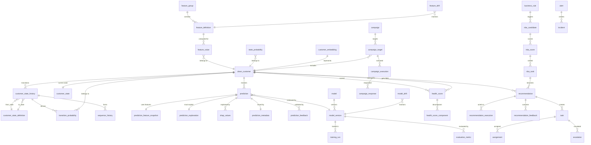

# Database Design Specification — Version 2.1

**Customer Lifecycle Prediction System**
**Date:** 2026-07-16
**Author:** Enterprise Data Architecture Team
**Status:** Updated — ETL Schema Added

---

## Revision Notes (v2.0 → v2.1)

| Change | v2.0 | v2.1 |
|--------|------|------|
| ETL Schema | Not defined | `etl` schema with 11 tables for ETL metadata |
| Staging Schema | Conceptual | `staging` schema with 4 tables (customer, account, transaction, branch) |

## Revision Notes (v1.0 → v2.0)

| Change | v1.0 | v2.0 |
|--------|------|------|
| Architecture | Single PostgreSQL, schema-per-service | Tiered databases: OLTP → Feature Store → Prediction DB → Analytics Warehouse |
| Data Pipeline | Direct to feature store | Raw → Staging → Clean → Feature Store (Data Lake pattern) |
| Feature Store | Flat feature_definition → feature_value | Feature groups (like Feast): group → definition → value |
| Behaviour | 3 tables | 6 AI tables: state, probabilities, sequences, embeddings |
| Explainability | Inside model_registry | Dedicated explainability schema |
| Monitoring | Basic operational_metric | Full MLOps monitoring (drift, latency, quality, alerts, incidents) |
| Events | None | Event schema for async/streaming readiness |
| Workflow | None | Workflow management (tasks, approvals, SLAs) |
| Campaigns | Simple campaign table | Full campaign lifecycle (segments, execution, response, metrics) |
| Prediction | Single prediction table | 6-table prediction schema (batch, snapshot, explanation, metadata, feedback) |
| AI Pipeline | 3-layer | 5-layer: Data Quality → Behaviour → Prediction → Decision → Execution → Learning |
| Health Score | Inside prediction-service | Separate health-engine concept |
| Decision Intel | Rules → Recommendation | Rules → Scoring → Ranking → Prioritization → Recommendation → Execution → Feedback |

---

## 1. Executive Summary

### Purpose

This document defines the complete database architecture for the Customer Lifecycle Prediction System — an enterprise AI platform deployed inside a bank's internal infrastructure.

The database architecture follows a **tiered data platform** model:

```
Bank Core Systems
        │
        ▼
Operational Database (OLTP)  ← Raw banking data
        │
        ▼
Feature Store                ← Engineered features with groups & lineage
        │
        ▼
Prediction Database          ← AI predictions with full traceability
        │
        ▼
Analytics Warehouse          ← Materialized views, dashboards, reporting
```

Each tier is isolated — no service queries across tiers directly. Data flows downstream through well-defined pipelines. This improves speed (each tier optimized for its workload), isolation (no prediction load on OLTP), maintenance (independent scaling), and security (tier-level access control).

### How It Supports the AI Platform

The 5-layer AI pipeline uses this tiered database:

```
Layer 0 (Data Quality): Raw → Staging → Clean → Feature Store
Layer 1 (Behaviour):    Markov Chain → HMM → Customer State → Embeddings
Layer 2 (Prediction):   XGBoost → LightGBM → Health Score Engine
Layer 3 (Decision):     Rules → Scoring → Ranking → Prioritization → NBA
Layer 4 (Execution):    Campaign → RM Dashboard → Notifications → Workflow
Layer 5 (Learning):     Feedback → Retraining → Champion/Challenger → Monitoring
```

---

## 2. Design Principles

### Tiered Architecture
- **Operational Database (OLTP):** Optimized for writes — banking transactions, customer profiles. Short retention.
- **Feature Store:** Optimized for reads — pre-computed features. Medium retention. Versioned.
- **Prediction Database:** Optimized for writes + traceability — every prediction stored with full metadata. Partitioned heavily.
- **Analytics Warehouse:** Optimized for complex reads — materialized views, aggregations. Long retention.

### Data Lake Layering
- **Raw:** Exact copy from source systems. Immutable. Never modified.
- **Staging:** Light transformations — type casting, null handling. Temporary.
- **Clean:** Business-validated data. Deduplicated. Standardized. Foundation for feature engineering.

### Isolation
- Each database tier has its own connection pool, scaling strategy, and backup schedule
- Services never cross tier boundaries with direct queries
- Data flows tier-to-tier via scheduled pipelines (orchestration-service)

### Auditability
- Every tier transition logged
- Raw data preserved immutably
- Feature lineage traceable from clean data through to prediction
- Prediction → explanation → feature snapshot chain for regulatory compliance

### Extensibility
- Event schema designed for future Kafka/RabbitMQ migration
- JSONB for semi-structured data (model configs, rule conditions, feature metadata)
- Additive design — new tiers can be added without redesigning existing ones

---

## 3. Tiered Database Architecture

### 3.1 Operational Database (OLTP)

**Purpose:** Raw banking data ingested from core banking systems.

**Schemas:** `customer_master`, `accounts`, `transactions`, `products`, `loans`, `cards`, `channels`

**Characteristics:**
- Write-heavy workload
- Short retention (3 years for transactions, then archived)
- Monthly partitioning on date columns
- B-tree indexes for customer-centric access patterns
- No materialized views (that's the warehouse's job)

**Owning Service:** `data-ingestion-service`

---

### 3.2 Feature Store

**Purpose:** Engineered features for ML consumption. Organized by feature groups (like Feast).

**Schemas:** `feature_store` (with concept of `feature_group`)

**Characteristics:**
- Read-heavy workload (models read features for inference)
- Write-on-schedule (nightly or intraday recompute)
- Feature versioning for model reproducibility
- Lineage tracking from clean data through transformations

**Owning Service:** `feature-engineering-service`

---

### 3.3 Prediction Database

**Purpose:** All AI predictions, health scores, and explainability results.

**Schemas:** `predictions`, `health_score`, `explainability`

**Characteristics:**
- Write-heavy during batch prediction cycles
- Full traceability: prediction → feature snapshot → model version → explanation
- Heavily partitioned by `predicted_at`
- 2-year retention for active predictions; archived beyond

**Owning Services:** `prediction-service`, `customer-state-service` (behaviour predictions)

---

### 3.4 Analytics Warehouse

**Purpose:** Dashboards, reporting, and business intelligence.

**Schemas:** `dashboard`, `warehouse`

**Characteristics:**
- Read-heavy — dashboards query materialized views
- Refreshed on schedule after prediction batches complete
- Aggregations, KPI summaries, trend analysis
- Long retention (5-7 years for regulatory reporting)

**Owning Service:** `dashboard-service`

---

### 3.5 ETL Metadata

**Purpose:** Operational metadata for the ETL Engine — connector registry, batch tracking, checkpoints, audit trail.

**Schemas:** `etl`

**Tables:**
- `etl_connector_registry` — Registered data source connectors
- `etl_batch_execution_log` — Batch extraction history
- `etl_ingestion_batch` — Ingestion lifecycle tracking
- `etl_ingestion_chunk` — Per-chunk ingestion records
- `etl_landing_file` — Immutable landing zone file tracking
- `etl_validation_run` — Validation execution records
- `etl_validation_error` — Individual validation errors
- `etl_pipeline_run` — Pipeline execution history
- `etl_pipeline_metrics` — Pipeline performance metrics
- `etl_job_status` — Current job status snapshots
- `etl_checkpoint` — Resumable processing checkpoints
- `etl_audit` — Immutable compliance audit trail

**Owning Service:** ETL Engine

---

### 3.6 Staging

**Purpose:** Temporary storage for validated, transformed data before production load.

**Schemas:** `staging`

**Tables:**
- `stg_customer` — Customer master data (truncated after clean load)
- `stg_account` — Account data (truncated after clean load)
- `stg_transaction` — Banking transactions (truncated after clean load)
- `stg_branch` — Branch/channel reference data (truncated after clean load)

**Owning Service:** ETL Engine

---

### 3.7 Tier-Level Access Control

| Tier | Write Access | Read Access |
|------|-------------|-------------|
| Operational DB | data-ingestion-service | feature-engineering-service |
| ETL Metadata | ETL Engine | ETL Engine, monitoring, audit |
| Staging | ETL Engine | ETL Engine (loading) |
| Feature Store | feature-engineering-service | prediction-service, customer-state-service |
| Prediction DB | prediction-service, customer-state-service | decision-intelligence-service, dashboard-service |
| Analytics Warehouse | dashboard-service (refresh) | dashboard-service, gateway (API) |

---

## 4. Data Lake Layering

Instead of ingesting directly into the feature store, banking data flows through three layers:

```
Bank Core Systems
        │
        ▼
┌───────────────────┐
│  raw.*            │  ← Exact copy. Immutable. Partitioned by ingest_date.
│  raw.transactions │     Never updated after insert.
│  raw.customers    │     Retained as source of truth.
└────────┬──────────┘
         │ Light transformations
         ▼
┌───────────────────┐
│  staging.*        │  ← Type casting, null handling, basic validation.
│  staging.customer │     Temporary — truncated after clean load.
└────────┬──────────┘
         │ Business rules, deduplication
         ▼
┌───────────────────┐
│  clean.*          │  ← Validated, standardized, deduplicated.
│  clean.customer   │     Foundation for feature engineering.
│  clean.transaction│     Referenced by feature_lineage.
└────────┬──────────┘
         │ Feature engineering pipelines
         ▼
┌───────────────────┐
│  feature_store.*  │  ← Computed features. Versioned. Grouped.
│  feature_value    │     Ready for ML model consumption.
│  feature_lineage  │
└───────────────────┘
```

### Key Design Decisions

1. **Raw is immutable:** Once ingested, raw data is never modified. Enables full replay and audit.
2. **Staging is transient:** Staging tables are truncated after successful clean load. No long-term storage.
3. **Clean is the foundation:** All feature engineering reads from `clean.*`, never from `raw.*` directly.
4. **Lineage is traceable:** `feature_lineage` references `clean.*` tables and the transformation hash.

---

## 5. Feature Store with Feature Groups

### Concept

Modeled after Feast's feature store architecture. Features are organized into groups by banking domain.

### Entity Map

```
feature_group (logical grouping by domain)
  └── feature_definition (one feature per row)
       └── feature_value (current value per customer)
       └── feature_value_history (time-series)
       └── feature_lineage (provenance)

feature_group_metadata (group-level config: refresh schedule, owner)
feature_refresh_log (computation runs)
feature_drift_log (drift detection)
```

### Feature Groups

| Group | Domain | Example Features | Refresh |
|-------|--------|-----------------|---------|
| `customer_profile` | Customer demographics | age, tenure_months, segment, risk_category | Daily |
| `transaction_behaviour` | Transaction patterns | txn_count_30d, avg_txn_amount_90d, txn_volatility | Daily |
| `loan_behaviour` | Loan repayment | delinquency_days, loan_to_value, repayment_ratio | Daily |
| `card_usage` | Card activity | card_utilization_pct, online_txn_ratio, international_txn_count | Daily |
| `digital_engagement` | Digital banking | login_freq_7d, mobile_app_sessions, feature_adoption_score | Daily |
| `relationship_depth` | Product holdings | product_count, cross_sell_score, relationship_duration | Weekly |
| `behavioural_state` | Customer state | current_state, days_in_state, state_transition_count | Daily |
| `clv_drivers` | Value prediction | revenue_12m, margin_pct, cost_to_serve, nps_score | Monthly |

### Key Design Decisions

1. **Groups as logical boundaries:** Each group has its own refresh schedule, owner, and quality checks.
2. **Feast-compatible:** Schema design aligns with Feast's `FeatureView` → `Feature` → `FeatureStore` model for future migration.
3. **Group-level versioning:** Feature group versions track when a group's computation logic changes — all features in the group share the version.

---

## 6. Customer Behaviour — AI Tables

Expanded beyond basic state tracking to support advanced behavioral modeling (Markov Chains, HMM, representation learning).

### Entity Map

```
customer_state                (current state — cached for fast reads)
customer_state_definition     (configurable state thresholds)
customer_state_history        (immutable state transitions)

state_probability             (P(state) per customer per timestamp)
transition_probability        (P(to_state | from_state) per customer)
emission_probability          (P(observation | state) for HMM — future)

transition_matrix             (aggregate across all customers — Markov model)
sequence_history              (ordered customer state sequences for pattern mining)
journey_pattern               (discovered journey patterns/clusters)
customer_embedding            (learned vector representation of customer behaviour)
```

### Key Design Decisions

1. **Per-customer probabilities, not just aggregates:** `state_probability` and `transition_probability` store individual-level probabilities, enabling personalized predictions.
2. **HMM-ready:** `emission_probability` table prepared for Hidden Markov Model implementation (Phase 4+).
3. **Sequence history for deep learning:** `sequence_history` stores ordered state sequences — input for LSTM/Transformer models.
4. **Embeddings for similarity:** `customer_embedding` stores learned vector representations — enables "customers like this one" queries and clustering.
5. **Aggregate matrix for dashboards:** `transition_matrix` remains the aggregate view for business dashboards.

---

## 7. Explainability Schema

Dedicated schema separate from model management. Required for banking compliance — every prediction must be explainable.

### Entity Map

```
shap_values               (per-feature, per-prediction SHAP values)
lime_results               (LIME explanations — alternative to SHAP)
feature_importance         (aggregated importance across predictions)
prediction_reason          (human-readable explanation: "High churn risk due to 90-day inactivity")
counterfactuals            (what would change the prediction? "If balance > $10K, churn risk drops 40%")
explanation_metadata       (explanation method, version, computation timestamp)
```

### Key Design Decisions

1. **Multiple explanation methods:** SHAP is primary, LIME as alternative, counterfactuals for business users.
2. **Human-readable reasons:** `prediction_reason` translates technical SHAP values into business language RMs can understand.
3. **Counterfactuals for actionability:** "What would change this prediction?" directly informs NBA generation.

---

## 8. Monitoring Schema

Full MLOps monitoring for operational excellence.

### Entity Map

```
prediction_latency       (p50, p95, p99 per model version per hour)
model_drift              (PSI, KS-test results — prediction distribution drift)
feature_drift            (PSI per feature — input distribution drift)
service_health           (API availability, error rates per endpoint)
pipeline_status          (ETL/feature/prediction pipeline execution status)
dataset_quality          (null rates, outlier counts, schema validation results)
data_freshness           (age of latest data per source table)
alert                    (threshold-based alerts: drift > 0.2, latency > 500ms)
incident                 (incident tracking: opened, investigating, resolved)
```

### Key Design Decisions

1. **Drift measured at multiple levels:** Model output drift + feature input drift + data quality drift.
2. **Alerts are data-driven:** Configurable thresholds in `monitoring_threshold` config table.
3. **Incident lifecycle:** Alerts → Incidents → Investigation → Resolution — full operational workflow.

---

## 9. Event Schema

Future-proofing for event-driven architecture. All significant actions emit events stored in this schema.

### Entity Map

```
customer_event           (customer.created, customer.state_changed, customer.churned)
transaction_event        (transaction.created, transaction.flagged)
prediction_event         (prediction.completed, prediction.batch_completed)
recommendation_event     (recommendation.generated, recommendation.executed, recommendation.responded)
audit_event              (any auditable action — normalized event format)
event_metadata           (event schema version, producer service, correlation_id)
```

### Key Design Decisions

1. **Normalized event format:** All event tables share `event_id`, `event_type`, `occurred_at`, `producer`, `payload` (JSONB).
2. **Kafka-ready:** Schema designed so Kafka Connect can stream these tables as topics without transformation.
3. **Correlation ID:** Events in a chain (ingestion → prediction → recommendation) share a `correlation_id` for end-to-end tracing.

---

## 10. Workflow Schema

Decision intelligence evolves into workflow management for Relationship Managers.

### Entity Map

```
task                     (actionable item for RM: "Call Mr. Smith about retention offer")
approval                 (manager approval for high-value actions)
escalation               (overdue tasks escalated to branch manager)
notification             (system → RM notification: "3 customers need attention")
sla                      (service level agreement tracking: response time, resolution time)
assignment               (task → RM assignment with workload balancing)
workflow_definition      (configurable workflow templates)
```

### Key Design Decisions

1. **NBA → Task:** Each NBA recommendation can become a `task` assigned to the RM with a deadline.
2. **SLA tracking:** `sla` table tracks whether RMs are responding to high-risk customers within defined time windows.
3. **Escalation rules:** Configurable — if a HIGH churn risk customer isn't contacted within 24 hours, escalate.

---

## 11. Campaign Schema

Expanded campaign management for marketing and retention teams.

### Entity Map

```
campaign                 (campaign definition: name, type, start/end dates, budget)
campaign_segment         (target segment definition — links to customer_segment)
campaign_target          (campaign ↔ customer junction with status)
campaign_execution       (execution log: when, which channel, which offer)
campaign_response        (customer response: accepted, declined, no response)
campaign_metrics         (aggregated metrics: reach, response rate, conversion, ROI)
campaign_offer           (offer catalog linked to campaigns)
```

### Key Design Decisions

1. **NBA → Campaign:** System-generated NBA recommendations can be grouped into campaigns for coordinated execution.
2. **Closed-loop measurement:** `campaign_response` feeds back into model retraining — which NBAs actually worked?
3. **Offer catalog:** `campaign_offer` standardizes offers across campaigns (retention discount, fee waiver, product upgrade).

---

## 12. Prediction Schema

Split into six specialized tables for richer traceability.

### Entity Map

```
prediction_batch               (groups predictions from a single run — enables rollback)
prediction                     (the prediction itself: churn_prob, CLV, health_score)
prediction_feature_snapshot    (exact feature values used for this prediction — reproducibility)
prediction_explanation         (links to explainability results — compliance)
prediction_metadata            (model version, framework, latency, environment)
prediction_feedback            (was the prediction accurate? RM override? closed-loop feedback)
```

### Key Design Decisions

1. **Feature snapshot per prediction:** `prediction_feature_snapshot` captures the exact feature vector used — critical for debugging and audit.
2. **Feedback loop:** `prediction_feedback` captures ground truth (did the customer actually churn?) for model retraining.
3. **Explanation mandatory:** Every prediction row must link to an explanation row (enforced at application level).

---

## 13. Health Score as Separate Engine

Health Score is elevated from a column in the prediction table to its own service concept.

### Entity Map

```
health_score                  (final 0-100 composite score)
health_score_component        (breakdown: churn_component, clv_component, behaviour_component, custom_component)
health_score_weight           (configurable weights per component)
health_score_history          (time-series of health scores for trend analysis)
health_score_threshold        (configurable thresholds: HEALTHY, MONITOR, AT_RISK, CRITICAL)
```

### Data Flow

```
Customer Features
        │
        ▼
Churn Model ──→ churn_prob (inverted to churn_component)
CLV Model ────→ clv_percentile → clv_component
Behaviour ────→ state_score → behaviour_component
        │
        ▼
Health Engine (weighted fusion)
        │
        ▼
Health Score (0-100)
        │
        ▼
Decision Intelligence
```

### Key Design Decisions

1. **Independent evolution:** Health score weights can be tuned without retraining prediction models.
2. **Custom components:** `health_score_component` supports adding new components (e.g., fraud risk, NPS) without schema changes.
3. **Threshold-driven classification:** `health_score_threshold` maps numeric scores to business-friendly labels.

---

## 14. Decision Intelligence Pipeline

Evolved from simple Rules → Recommendation to a multi-stage pipeline.

```
┌──────────┐    ┌──────────┐    ┌──────────┐    ┌───────────────┐
│  RULES   │───▶│ SCORING  │───▶│ RANKING  │───▶│ PRIORITIZATION│
│ Evaluate │    │ Score    │    │ Rank by  │    │ Consider:     │
│ business │    │ each NBA │    │ expected │    │ urgency,      │
│ rules    │    │ candidate│    │ impact   │    │ RM capacity,  │
└──────────┘    └──────────┘    └──────────┘    │ customer tier │
                                                 └───────┬───────┘
                                                         │
                                                         ▼
┌──────────────┐    ┌──────────────┐    ┌──────────────┐
│  FEEDBACK    │◀───│  EXECUTION   │◀───│RECOMMENDATION│
│ Learn from   │    │ RM acts,     │    │ Final ranked │
│ outcomes     │    │ tracks status│    │ NBA list     │
└──────────────┘    └──────────────┘    └──────────────┘
```

### Entity Map

```
business_rule                (rule definition — triggers NBA candidates)
business_rule_action         (action templates per rule)

nba_candidate                (raw candidate from rule evaluation)
nba_score                    (scored candidate — expected impact, fit score)
nba_rank                     (ranked candidate — position in customer's list)
nba_priority                 (prioritized candidate — urgency-adjusted)

recommendation               (final recommendation presented to RM)
recommendation_execution     (RM action tracking)
recommendation_feedback      (customer response, actual impact)

decision_metadata            (pipeline run ID, scoring model version, rule set version)
```

### Key Design Decisions

1. **Separation of concerns:** Each pipeline stage has its own table — rules don't know about ranking, scoring doesn't know about prioritization.
2. **Configurable at each stage:** Rule sets, scoring weights, ranking algorithms, prioritization rules — all data-driven.
3. **Closed-loop learning:** `recommendation_feedback` flows back to model retraining and rule optimization.

---

## 15. 5-Layer AI Pipeline Architecture

Formalizing the architecture into five distinct layers, each with clear database ownership.

### Layer 0 — Data Quality & Features

**Database:** Operational DB + Feature Store
**Service:** `feature-engineering-service`

```
Bank Core → raw.* → staging.* → clean.* → feature_store.*
                                    │
                              feature_lineage
                              feature_drift_log
```

### Layer 1 — Behaviour Intelligence

**Database:** Prediction DB (behaviour schema)
**Service:** `customer-state-service`

```
feature_store → Markov Chain → customer_state
                            → state_probability
                            → transition_probability
                            → sequence_history
                            → customer_embedding
           → HMM (future) → emission_probability
```

### Layer 2 — Prediction Intelligence

**Database:** Prediction DB (prediction + health_score schema)
**Services:** `prediction-service`, health-score-engine

```
feature_store → XGBoost/LightGBM → prediction
customer_state → Health Engine → health_score
                                 → health_score_component

explainability ← prediction
  ├── shap_values
  ├── prediction_reason
  └── counterfactuals
```

### Layer 3 — Decision Intelligence

**Database:** Prediction DB (decision schema)
**Service:** `decision-intelligence-service`

```
prediction + health_score → Rules → Scoring → Ranking → Prioritization → recommendation
                                                                              │
recommendation_execution ←────────────────────────────────────────────────────┘
recommendation_feedback → feedback loop to Layer 2 retraining
```

### Layer 4 — Execution

**Database:** Analytics Warehouse + Workflow schema
**Services:** `dashboard-service`, workflow-engine

```
recommendation → campaign → campaign_target → campaign_execution
              → task → assignment → notification → RM Dashboard
```

### Layer 5 — Learning

**Database:** Monitoring schema + Model Registry
**Service:** `model-management-service`

```
recommendation_feedback + prediction_feedback → retraining trigger
                                              → champion/challenger evaluation
                                              → model_deployment_log

monitoring:
  model_drift → alert → incident
  feature_drift → alert
  prediction_latency → service_health dashboard
```

---

## 16. Complete Schema Map (v2.0)

| # | Schema | Database Tier | Owning Service | Key Tables |
|---|--------|--------------|----------------|------------|
| 1 | `raw` | Operational | data-ingestion | raw.customers, raw.transactions, raw.accounts, raw.loans, raw.cards |
| 2 | `staging` | Operational (transient) | data-ingestion | staging.customer, staging.transaction (truncated after clean load) |
| 3 | `clean` | Operational | data-ingestion | clean.customer, clean.transaction, clean.account, clean.loan, clean.card |
| 4 | `customer_master` | Operational | data-ingestion | customer, customer_risk_profile, customer_segment, relationship_manager, branch |
| 5 | `accounts` | Operational | data-ingestion | account, account_holder, account_balance_snapshot |
| 6 | `transactions` | Operational | data-ingestion | transaction, transaction_category |
| 7 | `products` | Operational | data-ingestion | product, customer_product_holding |
| 8 | `loans` | Operational | data-ingestion | loan, loan_repayment |
| 9 | `cards` | Operational | data-ingestion | card, card_transaction |
| 10 | `channels` | Operational | data-ingestion | digital_activity, channel_preference |
| 11 | `feature_store` | Feature Store | feature-engineering | feature_group, feature_definition, feature_value, feature_value_history, feature_lineage, feature_refresh_log, feature_drift_log |
| 12 | `customer_behaviour` | Prediction DB | customer-state | customer_state, customer_state_definition, customer_state_history, state_probability, transition_probability, emission_probability, transition_matrix, sequence_history, journey_pattern, customer_embedding |
| 13 | `predictions` | Prediction DB | prediction-service | prediction_batch, prediction, prediction_feature_snapshot, prediction_metadata, prediction_feedback |
| 14 | `health_score` | Prediction DB | prediction-service (health-engine) | health_score, health_score_component, health_score_weight, health_score_history, health_score_threshold |
| 15 | `explainability` | Prediction DB | prediction-service | shap_values, lime_results, feature_importance, prediction_reason, counterfactuals, explanation_metadata |
| 16 | `decisions` | Prediction DB | decision-intelligence | business_rule, business_rule_action, nba_candidate, nba_score, nba_rank, nba_priority, recommendation, recommendation_execution, recommendation_feedback, decision_metadata |
| 17 | `events` | Prediction DB | all services | customer_event, transaction_event, prediction_event, recommendation_event, audit_event, event_metadata |
| 18 | `model_registry` | Prediction DB | model-management | model, model_version, training_run, evaluation_metric, model_deployment_log |
| 19 | `monitoring` | Analytics Warehouse | orchestration-service | prediction_latency, model_drift, feature_drift, service_health, pipeline_status, dataset_quality, data_freshness, alert, incident |
| 20 | `workflow` | Analytics Warehouse | decision-intelligence | task, approval, escalation, notification, sla, assignment, workflow_definition |
| 21 | `campaigns` | Analytics Warehouse | decision-intelligence | campaign, campaign_segment, campaign_target, campaign_execution, campaign_response, campaign_metrics, campaign_offer |
| 22 | `dashboard` | Analytics Warehouse | dashboard-service | mv_executive_summary, mv_rm_portfolio, mv_branch_performance, mv_customer_360, mv_churn_risk_matrix, mv_nba_effectiveness, mv_feature_drift_summary, operational_metric |
| 23 | `warehouse` | Analytics Warehouse | dashboard-service | daily_customer_metrics, monthly_feature_stats, model_performance_summary |
| 24 | `audit` | All tiers | all services | audit_log, prediction_audit, recommendation_audit, configuration_audit, model_audit, user_activity, data_access_log |
| 25 | `configuration` | All tiers | all services | customer_state_definition, business_rule, prediction_threshold, health_score_weight, risk_threshold, model_selection_config, system_setting, feature_refresh_schedule, monitoring_threshold |
| 26 | `security` | All tiers | gateway | database_role, role_permission, encryption_key_metadata, pii_column_registry |

---

## 17. Data Flow — End-to-End (v2.0)

```
┌─────────────────────────────────────────────────────────────────────┐
│                        BANK CORE SYSTEMS                            │
└──────────────────────────────┬──────────────────────────────────────┘
                               │ Batch / CDC
                               ▼
┌─────────────────────────────────────────────────────────────────────┐
│  OPERATIONAL DATABASE (OLTP)                                        │
│                                                                     │
│  raw.customers  →  staging.customer  →  clean.customer             │
│  raw.transactions → staging.transaction → clean.transaction         │
│  raw.accounts  →  staging.account  →  clean.account                │
│  raw.loans     →  staging.loan     →  clean.loan                   │
│  raw.cards     →  staging.card     →  clean.card                   │
│                                                                     │
│  + customer_master.*, accounts.*, products.*, loans.*, cards.*     │
└──────────────────────────────┬──────────────────────────────────────┘
                               │ Feature engineering pipelines
                               ▼
┌─────────────────────────────────────────────────────────────────────┐
│  FEATURE STORE                                                      │
│                                                                     │
│  feature_group ──→ feature_definition ──→ feature_value             │
│                                       ──→ feature_value_history     │
│                                       ──→ feature_lineage           │
└──────────────────────────┬──────────────────────────────────────────┘
                           │ Features ready
                           ▼
┌─────────────────────────────────────────────────────────────────────┐
│  PREDICTION DATABASE                                                │
│                                                                     │
│  ┌─────────────────┐  ┌──────────────────┐  ┌──────────────────┐   │
│  │ Behaviour (L1)  │  │ Prediction (L2)  │  │ Decision (L3)    │   │
│  │                 │  │                  │  │                  │   │
│  │ customer_state  │  │ prediction_batch │  │ business_rule    │   │
│  │ state_prob      │  │ prediction       │  │ nba_candidate    │   │
│  │ transition_prob │  │ feature_snapshot │  │ nba_score        │   │
│  │ transition_     │  │ health_score     │  │ nba_rank         │   │
│  │   matrix        │  │ health_component │  │ recommendation   │   │
│  │ sequence_history│  │ explainability   │  │ execution        │   │
│  │ embedding       │  │                  │  │ feedback         │   │
│  └────────┬────────┘  └────────┬─────────┘  └────────┬─────────┘   │
│           │                    │                      │              │
│           └────────────────────┼──────────────────────┘              │
│                                │                                     │
│  ┌─────────────────────────────┴──────────────────────────────┐     │
│  │                    events.* (event-driven backbone)         │     │
│  │  customer_event | prediction_event | recommendation_event  │     │
│  └────────────────────────────────────────────────────────────┘     │
└──────────────────────────────┬──────────────────────────────────────┘
                               │ Dashboards, workflows, campaigns
                               ▼
┌─────────────────────────────────────────────────────────────────────┐
│  ANALYTICS WAREHOUSE                                                │
│                                                                     │
│  dashboard.* (materialized views)   monitoring.* (MLOps)            │
│  workflow.* (RM task management)    campaigns.* (marketing)         │
│  warehouse.* (aggregations)                                         │
└─────────────────────────────────────────────────────────────────────┘

  ALL TIERS ──────▶ audit.* (append-only, immutable)
                    configuration.* (data-driven settings)
                    security.* (access control)
```

---

## 18. Entity Relationship Diagram (Core v2.0)



---

## 19. Folder Structure

The project's `database/` directory mirrors this architecture for migrations and SQL scripts:

```
database/
├── raw/                    # raw.* schema migrations
├── staging/                # staging.* schema migrations
├── warehouse/              # warehouse.* and dashboard.* migrations
├── feature_store/          # feature_store.* migrations
├── behaviour/              # customer_behaviour.* migrations
├── prediction/             # predictions.* and health_score.* migrations
├── decision/               # decisions.* migrations
├── explainability/         # explainability.* migrations
├── monitoring/             # monitoring.* migrations
├── workflow/               # workflow.* migrations
├── campaigns/              # campaigns.* migrations
├── dashboard/              # dashboard.* (materialized view definitions)
├── audit/                  # audit.* migrations
├── configuration/          # configuration.* migrations (seed data)
├── security/               # security.* migrations (roles, grants, RLS)
└── migrations/             # Alembic root + cross-tier migration orchestration
```

---

## 20. Physical Design Notes

### Partitioning (Unchanged from v1.0, extended with new tables)

| Table | Partition Key | Interval | Retention |
|-------|--------------|----------|-----------|
| `raw.*` | `ingest_date` | Monthly | 12 months (raw is source of truth but large) |
| `clean.transaction` | `transaction_date` | Monthly | 36 months |
| `customer_state_history` | `transition_date` | Yearly | 60 months |
| `sequence_history` | `sequence_start_date` | Yearly | 60 months |
| `prediction` | `predicted_at` | Monthly | 24 months |
| `shap_values` | `predicted_at` | Monthly | 24 months |
| `prediction_feature_snapshot` | `predicted_at` | Monthly | 24 months |
| `health_score` | `scored_at` | Monthly | 24 months |
| `recommendation` | `created_at` | Monthly | 24 months |
| `events.*` | `occurred_at` | Monthly | 12 months |
| `audit_log` | `created_at` | Monthly | 84 months |
| `monitoring.*` | `measured_at` | Monthly | 12 months |

### Index Strategy Additions

| New Query Pattern | Index |
|-------------------|-------|
| "Get feature group definitions" | `feature_definition(feature_group_id)` |
| "Get customer state probability" | `state_probability(customer_id, computed_at)` |
| "Get transition probability per customer" | `transition_probability(customer_id, from_state_id, to_state_id)` |
| "Get prediction with feature snapshot" | `prediction_feature_snapshot(prediction_id)` |
| "Get SHAP values for prediction" | `shap_values(prediction_id)` |
| "Get NBA pipeline for customer" | Composite: `nba_candidate(customer_id, rule_id)` → `nba_score(candidate_id)` → `nba_rank(score_id)` |
| "Get RM tasks" | `task(assigned_rm_id, status, due_date)` |
| "Get active alerts" | `alert(status, created_at)` |
| "Get events by correlation" | `customer_event(correlation_id)` |

---

## 21. Future Expansion

All v1.0 expansion plans remain valid. v2.0 additions:

### Kafka/Event Streaming
- `events.*` schema designed for direct Kafka Connect mirroring
- Each event table maps to a Kafka topic
- `event_metadata` provides schema registry information

### Real-Time Predictions
- `prediction` table supports single-row inserts (not batch-only)
- `events.prediction_event` emits on each prediction for real-time consumers
- Add `streaming_feature_value` for features computed in real-time (vs. batch)

### Graph Analytics
- `customer_embedding` enables cosine similarity queries for "similar customers"
- `transition_probability` (per-customer) enables personalized Markov graphs
- Add `customer_graph` schema for explicit graph storage (neo4j-compatible adjacency lists)

### Multi-Model Explainability
- `explainability` schema supports SHAP, LIME, counterfactuals
- Add `integrated_gradients` table for deep learning models
- Add `attention_weights` table for transformer-based models

---

## Appendix A: v1.0 → v2.0 Migration Notes

For teams implementing from v1.0:

1. **Raw/Staging/Clean:** Add raw and staging schemas. Move existing `customer_master` data to `clean.*`. Existing feature_store lineage updates to reference `clean.*` instead of direct banking tables.

2. **Feature Groups:** Add `feature_group` table. Populate with existing feature domains. Add `feature_group_id` FK to `feature_definition`. Non-breaking — existing features get default group.

3. **Behaviour Tables:** Add `state_probability`, `transition_probability` (per-customer), `sequence_history`, `customer_embedding`. Existing `transition_matrix` (aggregate) remains. No data migration needed — new tables start empty.

4. **Explainability:** Move `shap_result` from `model_registry` to new `explainability` schema. Rename to `shap_values`. Add `prediction_reason`, `counterfactuals`, `explanation_metadata`.

5. **Prediction Split:** `prediction` table split into 6 tables. Migration script extracts `feature_snapshot` and `metadata` from existing JSONB columns into separate tables.

6. **Health Score:** Extract `health_score` logic from `prediction` into `health_score` schema. Existing composite rows become `health_score` + `health_score_component`.

7. **Decision Pipeline:** `recommendation` table becomes `nba_candidate` → `nba_score` → `nba_rank` → `recommendation`. Migration script splits existing recommendations into the pipeline stages.

8. **New Schemas:** `events`, `monitoring`, `workflow`, `campaigns` are additive — no migration needed, start empty.

---

*End of Database Design Specification v2.0*
