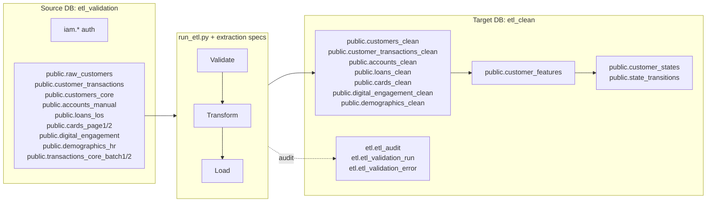

# ABSA Foundry Backend — Pilot Data Onboarding & Configuration Guide

> **Audience:** Data engineers, DBAs, and the pilot deployment team
> **Scope:** Everything needed to connect the backend to a real customer database —
> the raw datasets required, exact table names & columns, clean-table setup, and the
> full `.env` configuration reference.
> **Last updated:** 2026-08-19

---

## 1. Environment Topology

The backend talks to **two PostgreSQL databases** on the same (or a reachable) server:

| Logical name | Env-prefix keys | Role | Holds |
|--------------|-----------------|------|-------|
| **Source DB** | `POSTGRES_*` | Raw / staging data you provide | `iam.*` (auth), `public.<raw tables>` |
| **Target DB** | `POSTGRES_TARGET_*` | Clean / computed data | `etl.*` (audit), `public.*_clean`, `customer_features`, `customer_states` |



Five services run on top of these databases:

| Service | Port | Reads | Writes |
|---------|------|-------|--------|
| API Gateway | `8080` | — (proxies) | — |
| Feature Engineering | `8002` | `*_clean` tables | `customer_features` |
| Customer State (L1) | `8003` | `customer_features` | `customer_states`, `state_transitions` |
| Prediction (L2) | `8004` | `customer_features` | health scores on `customer_states` |
| Decision Intelligence (L3) | `8005` | upstream services (HTTP) | — |

---

## 2. Source Datasets You Must Provide

All source tables live in the **`public` schema of the Source DB** (`etl_validation`).
The table names below are the **default names the ETL extraction specs expect**. If your
real tables have different names, do **not** rename your tables — change the mapping
instead (see §7).

### 2.1 Master source-table list

| # | Table (public) | Purpose | Used by spec |
|---|----------------|---------|--------------|
| 1 | `raw_customers` | Customer master (profile) | `customer_360.yaml`, `customer_360_multi.yaml` |
| 2 | `customer_transactions` | Transaction ledger (main) | `transaction_master.yaml` |
| 3 | `raw_transactions` | Alternate transaction source | `customer_360_multi.yaml` |
| 4 | `raw_interactions` | CRM interaction events | `customer_360_multi.yaml` |
| 5 | `customers_core` | Authoritative customer profile | `customer_profile_master.yaml` |
| 6 | `demographics_hr` | Employment / income / education | `customer_profile_master.yaml` |
| 7 | `digital_engagement` | App/web login activity | `digital_engagement.yaml` |
| 8 | `cards_page1` | Card holdings (page 1) | `card_summary.yaml` |
| 9 | `cards_page2` | Card holdings (page 2) | `cards_page2.yaml` |
| 10 | `accounts_manual` | Account holdings | `account_summary.yaml` |
| 11 | `loans_los` | Loan holdings | `loan_summary.yaml` |
| 12 | `transactions_core_batch1` | Transaction batch 1 | `transactions_batch1.yaml` |
| 13 | `transactions_core_batch2` | Transaction batch 2 | `transactions_batch2.yaml` |

> **Minimum viable set for the churn pilot:** you only strictly need
> `raw_customers` (or `customers_core`) **and one** transaction source
> (`customer_transactions`). The remaining tables enrich relationship/engagement
> features and can be added incrementally.

### 2.2 Required columns per table

> Columns marked **required** are validated by the extraction spec (or `etl_config.yaml`
> mandatory-fields). Columns marked *optional* may be `NULL` or absent.
> Date/timestamp fields may arrive as `TEXT` — the ETL casts them.

#### `raw_customers`

| Column | Type | Required | Notes |
|--------|------|----------|-------|
| `customer_id` | text | ✅ | Format `^C[0-9]{8}$` (see §5) |
| `activation_date` | date/timestamp | ✅ | account open date |
| `branch_code` | text | ✅ | |
| `country` | text | ✅ | default fill `ZM` |
| `customer_type` | text | ✅ | `Retail` / `SME` / `Premium` / `Corporate` |
| `date_of_birth` | date/timestamp | ✅ | |
| `gender` | text | ✅ | `M` / `F` |
| `status` | text | ✅ | `Active` / `Dormant` / `Closed` / `Suspended` |
| `onboarding_channel` | text | optional | default fill `UNKNOWN` |

#### `customer_transactions` (and `raw_transactions`)

| Column | Type | Required | Notes |
|--------|------|----------|-------|
| `id` (or `transaction_id`) | int/text | ✅ | unique per row |
| `customer_id` | text | ✅ | FK → customers |
| `account_id` | text | optional | |
| `branch_code` | text | optional | |
| `transaction_date` | date/timestamp | ✅ | |
| `transaction_type` | text | ✅ | `DEBIT` / `CREDIT` / `TRANSFER` / `PAYMENT` |
| `channel` | text | optional | `BRANCH` / `ATM` / `POS` / `ONLINE` / `MOBILE` / `INTERNET` |
| `currency` | text | optional | default fill `ZMW` |
| `amount` | numeric | ✅ | |
| `data_issue` | text | optional | rows with a value are filtered out |

#### `raw_interactions`

| Column | Type | Required |
|--------|------|----------|
| `interaction_id` | text | ✅ |
| `customer_id` | text | ✅ |

#### `customers_core`

| Column | Type | Required | Notes |
|--------|------|----------|-------|
| `customer_id` | text | ✅ | |
| `full_name` | text | optional | |
| `date_of_birth` | date/timestamp | ✅ | |
| `gender` | text | optional | |
| `branch_code` | text | ✅ | |
| `customer_since_date` | date/timestamp | ✅ | maps to `activation_date` |
| `kyc_tier` | text | optional | `Tier 1/2/3` → `TIER_1/2/3` |
| `nationality` | text | optional | |

#### `demographics_hr` (joined to customers via `cust_ref`)

| Column | Type | Required | Maps to |
|--------|------|----------|---------|
| `cust_ref` | text | ✅ | join key = `customers_core.customer_id` |
| `emp_status` | text | optional | `employment_status` |
| `employer` | text | optional | `employer_name` |
| `income_mth` | text/numeric | optional | `monthly_income_declared` (cast to float) |
| `education` | text | optional | `education_level` |
| `marital` | text | optional | `marital_status` |

#### `digital_engagement`

| Column | Type | Required |
|--------|------|----------|
| `engagement_id` | text | ✅ |
| `customer_id` | text | ✅ |
| `login_date` | date/timestamp | ✅ |
| `platform` | text | optional (`Mobile`/`Web`/`USSD`/`App`) |
| `session_duration_seconds` | numeric | optional |
| `actions_count` | numeric | optional |

#### `cards_page1` and `cards_page2` (identical schema)

| Column | Type | Required |
|--------|------|----------|
| `card_id` | text | ✅ |
| `customer_id` | text | ✅ |
| `card_type` | text | optional (`Debit`/`Credit`/`Prepaid`) |
| `status` | text | optional (`Active`/`Inactive`/`Blocked`/`Expired`) |
| `issued_date` | date/timestamp | optional |
| `expiry_date` | date/timestamp | optional |

#### `accounts_manual`

| Column | Type | Required |
|--------|------|----------|
| `account_id` | text | ✅ |
| `customer_id` | text | ✅ |
| `account_type` | text | optional (`Savings`/`Current`/`Fixed Deposit`/`Loan`) |
| `status` | text | optional (`Active`/`Inactive`/`Dormant`/`Closed`) |
| `opened_date` | date/timestamp | optional |

#### `loans_los`

| Column | Type | Required |
|--------|------|----------|
| `loan_id` | text | ✅ |
| `customer_id` | text | ✅ |
| `loan_type` | text | optional (`Personal`/`Mortgage`/`Auto`/`Business`) |
| `status` | text | optional (`Active`/`Paid Off`/`Default`/`Written Off`) |
| `origination_date` | date/timestamp | optional |

#### `transactions_core_batch1`

| Column | Type | Required | Notes |
|--------|------|----------|-------|
| `transaction_id` | text | ✅ | |
| `customer_id` | text | ✅ | |
| `transaction_date` | date/timestamp | ✅ | |
| `amount` | **text** | ✅ | numeric stored as text — ETL casts |
| `transaction_type` | text | ✅ | |
| `channel` | text | optional | |
| `merchant_category` | text | optional | |
| `currency` | text | optional | default `ZMW` |
| `data_issue` | text | optional | rows with a value are filtered |

#### `transactions_core_batch2`

| Column | Type | Required | Notes |
|--------|------|----------|-------|
| `transaction_id` | text | ✅ | |
| `customer_id` | text | ✅ | |
| `transaction_date` | date/timestamp | ✅ | |
| `txn_amount` | **text** | ✅ | maps to `amount` — ETL casts |
| `transaction_type` | text | ✅ | |
| `channel` | text | optional | |
| `currency_code` | text | optional | maps to `currency` |

---

## 3. Target (Clean) Tables

The Target DB (`etl_clean`) holds the **clean** tables. There are three sources of
target-table DDL:

| Group | Tables | Created by |
|-------|--------|------------|
| **ETL audit/validation** | `etl.etl_audit`, `etl.etl_validation_run`, `etl.etl_validation_error` | `pilot_migrate.py` (auto) |
| **Feature store / state engine** | `public.customer_features`, `public.customer_states`, `public.state_transitions` | `pilot_migrate.py` (auto) |
| **Clean data tables** | `public.customers_clean`, `public.customer_transactions_clean`, `public.accounts_clean`, `public.loans_clean`, `public.cards_clean`, `public.digital_engagement_clean`, `public.demographics_clean` | **YOU must create these** (see below) |

> ⚠️ **Important:** `run_etl.py` only does `INSERT INTO <clean_table>` — it does **not**
> create the clean tables. Before the first ETL run, create the clean tables in
> `etl_clean`. The quickest way is to run the synthetic generator **once** to emit
> their DDL:
>
> ```powershell
> .\.venv\Scripts\python.exe scripts\generate_synthetic_feature_store_data.py --dry-run
> ```
>
> …or create them manually. Required columns (each also needs `loaded_at TIMESTAMPTZ`
> and `batch_id VARCHAR(64)`):

| Clean table | Key | Columns |
|-------------|-----|---------|
| `customers_clean` | `customer_id` PK | `full_name`, `date_of_birth`, `gender`, `branch_code`, `customer_since_date`, `kyc_tier`, `nationality`, `loaded_at`, `batch_id` |
| `customer_transactions_clean` | `transaction_id` PK | `customer_id` FK, `transaction_date`, `amount`, `transaction_type`, `channel`, `merchant_category`, `currency`, `loaded_at`, `batch_id` |
| `accounts_clean` | `account_id` PK | `customer_id` FK, `account_type`, `status`, `opened_date`, `loaded_at`, `batch_id` |
| `loans_clean` | `loan_id` PK | `customer_id` FK, `loan_type`, `status`, `origination_date`, `loaded_at`, `batch_id` |
| `cards_clean` | `card_id` PK | `customer_id` FK, `card_type`, `status`, `issued_date`, `expiry_date`, `activated_date`, `loaded_at`, `batch_id` |
| `digital_engagement_clean` | `engagement_id` PK | `customer_id` FK, `login_date`, `platform`, `session_duration_seconds`, `actions_count`, `loaded_at`, `batch_id` |
| `demographics_clean` | `customer_id` PK | `employment_status`, `employer_name`, `monthly_income_declared`, `education_level`, `marital_status`, `loaded_at`, `batch_id` |

---

## 4. Table Naming Conventions

| Pattern | Meaning | Example |
|---------|---------|---------|
| `raw_*` | Raw source table (Source DB) | `raw_customers` |
| `*_clean` | Clean target table (Target DB) | `customers_clean`, `customer_transactions_clean` |
| `*_page1` / `*_page2` / `*_batch1` / `*_batch2` | Sharded / multi-file source | `cards_page1`, `transactions_core_batch1` |
| `*_los` | Loan-origination-system source | `loans_los` |
| `*_manual` | Manually maintained source | `accounts_manual` |
| `etl.*` | Pipeline audit schema (Target DB) | `etl.etl_audit` |
| `iam.*` | Auth schema (Source DB) | `iam.users` |

**CSV import behaviour:** `scripts/csv_importer.py` derives table names from CSV
filenames by stripping a `_YYYYMMDD` date suffix and lowercasing. Example:
`customers_core_20260727.csv` → `customers_core`. Name your CSVs accordingly if you
use the CSV importer.

---

## 5. Customer ID Format — Decide This First

This is the most common onboarding failure. Two ID formats appear in the codebase:

| Format | Example | Where it appears |
|--------|---------|------------------|
| `C` + 8 digits (9 chars) | `C01000097` | `customer_360.yaml` regex `^C[0-9]{8}$` |
| `CUST` + 7 digits (11 chars) | `CUST00001` | synthetic generator, feature tests |

**Action:** pick one canonical format, make sure **every** source table uses it
consistently, and update these places to match:

1. `etl/config/extraction_specs/customer_360.yaml` → `regex: "^C[0-9]{8}$"` and
   business rule `BR001` (`len(str(customer_id)) == 9`).
2. `shared/config/settings.py` schema mapping (if you override `col_customer_id`).

The `customer_id` must be identical across `customers_clean`,
`customer_transactions_clean`, `accounts_clean`, `loans_clean`, `cards_clean`,
`digital_engagement_clean`, and `demographics_clean` — the feature engine joins on it.

---

## 6. Full `.env` Configuration Reference

Create `.env` at the project root (`customer-lifecycle-ai/.env`). The setup script
copies `.env.example` and rotates placeholder secrets; then edit the values below.

### 6.1 Database connections (REQUIRED)

```dotenv
# --- Source DB (raw data) ---
POSTGRES_HOST=<pilot-db-host>
POSTGRES_PORT=5432
POSTGRES_DB=etl_validation
POSTGRES_USER=<pilot-db-user>
POSTGRES_PASSWORD=<strong-password>

# --- Target DB (clean data) ---
POSTGRES_TARGET_HOST=<pilot-db-host>
POSTGRES_TARGET_PORT=5432
POSTGRES_TARGET_DB=etl_clean
POSTGRES_TARGET_USER=<pilot-db-user>
POSTGRES_TARGET_PASSWORD=<strong-password>
```

### 6.2 Security (REQUIRED — unique per environment)

```dotenv
GATEWAY_SECRET_KEY=<generated-48-char>
JWT_SECRET_KEY=<generated-48-char>
JWT_ALGORITHM=HS256
JWT_ACCESS_TOKEN_EXPIRE_MINUTES=30
```

### 6.3 Service ports (optional — defaults shown)

```dotenv
GATEWAY_PORT=8080
FEATURE_ENGINEERING_SERVICE_PORT=8002
CUSTOMER_STATE_SERVICE_PORT=8003
PREDICTION_SERVICE_PORT=8004
DECISION_INTELLIGENCE_SERVICE_PORT=8005
```

`pilot_start.ps1` reads these ports from `.env`.

### 6.4 Upstream service URLs (Decision Intelligence → other services)

```dotenv
UPSTREAM_HOST=localhost            # single host for all upstreams
# ...or override individually:
FEATURE_SERVICE_URL=http://localhost:8002
STATE_SERVICE_URL=http://localhost:8003
PREDICTION_SERVICE_URL=http://localhost:8004
```

> `UPSTREAM_HOST` is used by `decision-intelligence-service/main.py` only for the
> health page. The HTTP client in `app/upstream/client.py` reads the `*_SERVICE_URL`
> variables individually (defaults to `localhost`).

### 6.5 Schema mapping — point at differently-named real tables

These are the single most useful knobs for onboarding real data. Change **only the
right-hand side** to match your real table/column names:

```dotenv
# Table names (logical → actual)
TABLE_CUSTOMER_FEATURES=customer_features
TABLE_CUSTOMER_STATES=customer_states
TABLE_TRANSACTIONS_CLEAN=customer_transactions_clean
TABLE_ACCOUNTS_CLEAN=accounts_clean
TABLE_CARDS_CLEAN=cards_clean
TABLE_LOANS_CLEAN=loans_clean
TABLE_DIGITAL_ENGAGEMENT=digital_engagement_clean

# Column names (logical → actual)
COL_CUSTOMER_ID=customer_id
COL_AS_OF_DATE=as_of_date
COL_TRANSACTION_DATE=transaction_date
COL_CHANNEL=channel
COL_TRANSACTION_TYPE=transaction_type
COL_CUSTOMER_STATUS=rel_customer_status
COL_ENGAGEMENT_SCORE=engagement_score
COL_TOTAL_AMOUNT_90D=total_amount_90d
COL_TXN_COUNT_90D=txn_count_90d

# Churn label definition
LABEL_CHURN_COLUMN=rel_customer_status
LABEL_CHURN_POSITIVE_VALUE=Closed

# Training pipeline dates
TRAINING_DATES=2026-07-17,2026-07-22
TRAINING_HOLDOUT_DATE=2026-07-27
```

> pydantic-settings maps UPPER_SNAKE env vars to these snake_case fields
> case-insensitively. The `LABEL_*` settings define how the churn model defines
> "churned" — point them at your actual status column/value before retraining.

### 6.6 Feature Engineering thresholds (`FE_` prefix)

```dotenv
FE_ENGAGEMENT_RECENCY_WEIGHT=40.0
FE_ENGAGEMENT_FREQUENCY_WEIGHT=35.0
FE_ENGAGEMENT_DIVERSITY_WEIGHT=25.0
FE_ENGAGEMENT_MAX_RECENCY_DAYS=90
FE_ENGAGEMENT_MAX_FREQUENCY_TXN=30
FE_ENGAGEMENT_FREQUENCY_WINDOW_DAYS=30
FE_ENGAGEMENT_MAX_DIVERSITY_CHANNELS=5
FE_ENGAGEMENT_MAX_DIVERSITY_TYPES=5
FE_ACTIVITY_CONSISTENCY_WINDOW_DAYS=90
FE_INACTIVE_DAYS_WINDOW=90
FE_CHANNEL_MOBILE=MOBILE
FE_CHANNEL_ATM=ATM
FE_CHANNEL_BRANCH=BRANCH
FE_CHANNEL_ONLINE=ONLINE
FE_CHANNEL_INTERNET=INTERNET
FE_RISK_HIGH_VALUE_THRESHOLD=10000.0
FE_RISK_DORMANT_DAYS=90
FE_FINANCIAL_SALARY_MIN_AMOUNT=500.0
FE_FINANCIAL_INCOME_WINDOW_DAYS=90
FE_ENABLE_PHASE2_DERIVED=true
FE_ENABLE_PHASE2B_RATIO=true
```

> **Channel names matter.** The feature engine counts channels with literal matches
> (`FE_CHANNEL_MOBILE`, etc.). Set these to your actual channel taxonomy
> (e.g. `MOBILE_APP`, `INTERNET_BANKING`). The ETL standardisation in the extraction
> specs must map your raw channel values to these exact values.

### 6.7 Customer State thresholds (`CS_` prefix)

```dotenv
CS_CHURNED_DAYS_THRESHOLD=365
CS_DORMANT_DAYS_THRESHOLD=90
CS_ATRISK_DAYS_MIN=30
CS_ATRISK_DAYS_MAX=90
CS_DORMANT_TXN_COUNT_THRESHOLD=0
CS_ENGAGEMENT_DORMANT_THRESHOLD=10.0
CS_ENGAGEMENT_ATRISK_MAX=20.0
CS_NEW_TENURE_DAYS=90
CS_GROWING_BALANCE_GROWTH_PCT=15.0
CS_DORMANT_ZERO_TXN_MIN_DAYS=30
CS_HYSTERESIS_MIN_TXN_30D=2
CS_MARKOV_WINDOW_DAYS=180
CS_MARKOV_MIN_TRANSITIONS=50
CS_JOURNEY_TOP_PATHS=5
```

### 6.8 Prediction thresholds (`PRED_` prefix)

```dotenv
PRED_MODEL_TYPE=xgboost
PRED_CHURN_MODEL_PATH=models/champion/churn/xgboost_churn_v1.json
PRED_CLV_MODEL_PATH=
PRED_CHURN_THRESHOLD=0.5
PRED_HEALTH_CHURN_WEIGHT=0.40
PRED_HEALTH_CLV_WEIGHT=0.30
PRED_HEALTH_BEHAVIOUR_WEIGHT=0.30
PRED_BATCH_CHUNK_SIZE=1000
```

### 6.9 Health-score weights (shared)

```dotenv
HEALTH_SCORE_CHURN_WEIGHT=0.40
HEALTH_SCORE_CLV_WEIGHT=0.30
HEALTH_SCORE_BEHAVIOUR_WEIGHT=0.30
```

### 6.10 ETL engine

```dotenv
ETL_BATCH_SIZE=5000
ETL_LOG_LEVEL=INFO
```

### 6.11 Redis (optional — default off)

```dotenv
REDIS_HOST=localhost
REDIS_PORT=6379
```

### 6.12 LDAP / Active Directory (optional — default off)

```dotenv
LDAP_ENABLED=false
LDAP_SERVER=ldap://ad.absa.co.zm:389
LDAP_BASE_DN=DC=absa,DC=co,DC=zm
LDAP_USER_DN_TEMPLATE=CN={username},OU=Users,DC=absa,DC=co,DC=zm
LDAP_BIND_DN=
LDAP_BIND_PASSWORD=
LDAP_SEARCH_FILTER=(sAMAccountName={username})
```

---

## 7. Pointing ETL Extraction Specs at Real Tables

Extraction specs live in `etl/config/extraction_specs/*.yaml`. Each declares a
`primary_entity.table` (and optional `joins` / `pre_aggregations`). If your real table
names differ from the defaults, **edit the spec's `table:` value** — do not rename
your database tables.

Example — pointing `customer_360.yaml` at a real table called `core_customer`:

```yaml
primary_entity:
  table: "public.core_customer"      # was "public.raw_customers"
```

Run a spec directly:

```powershell
.\.venv\Scripts\python.exe run_etl.py --extraction-spec etl/config/extraction_specs/customer_360.yaml
```

Or trigger from the UI (ETL Manager → Trigger Manual Run).

Available specs and their source tables are listed in §2.1.

---

## 8. Step-by-Step Onboarding Checklist

### Phase A — Database & schemas

1. [ ] Provision PostgreSQL 16 (server-local or reachable over the network).
2. [ ] Create the **Source DB** `etl_validation` and **Target DB** `etl_clean`.
3. [ ] Load raw data into `etl_validation.public` using the names in §2.
4. [ ] Create the `*_clean` tables in `etl_clean.public` (§3).
5. [ ] Run `.\scripts\pilot_setup.ps1` (venv + deps + `.env`).
6. [ ] Edit `.env` (§6) — DB credentials, secrets, ports, schema mapping, channel names.
7. [ ] Run `.\.venv\Scripts\python.exe scripts\pilot_migrate.py --create-databases`.
   This applies `iam.*` (source DB) and `etl.*` + feature/state tables (target DB).

### Phase B — ETL

8. [ ] Pick the customer-ID format and update the extraction spec regex (§5).
9. [ ] Run the customer spec: `run_etl.py --extraction-spec .../customer_360.yaml`.
10. [ ] Run the transaction spec: `run_etl.py --extraction-spec .../transaction_master.yaml`.
11. [ ] (Incremental) Run account / loan / card / engagement specs.
12. [ ] Verify `customers_clean` and `customer_transactions_clean` have rows.

### Phase C — Services

13. [ ] Start services: `.\scripts\pilot_start.ps1`.
14. [ ] Health-check all five (`/health` on ports 8080, 8002, 8003, 8004, 8005).
15. [ ] Compute features: `POST /features/compute-batch`.
16. [ ] Compute states: `POST /states/compute`.
17. [ ] Verify predictions: `GET /predict/{customer_id}/churn` and `/health`.

### Phase D — Model (retrain on real data)

18. [ ] Update `TRAINING_DATES` / `TRAINING_HOLDOUT_DATE` and `LABEL_*` (§6.5).
19. [ ] Run `.\.venv\Scripts\python.exe scripts/train_models.py`.
20. [ ] Confirm `AUC ≥ 0.80` and `calibrator.ece_after < 0.05`.
21. [ ] Deploy the new model + calibrator to `models/champion/churn/`.

---

## 9. Data Volume & Quality Prerequisites

| Item | Minimum | Recommended | Why |
|------|---------|-------------|-----|
| Customers with ≥1 transaction | 1,000 | 5,000+ | Feature stats stability |
| Transactions per customer (180d) | 20 | 40+ | Frequency/recency features |
| Transaction history depth | 90 days | 180+ days | Windows up to 180d |
| Churned customers (label) | ≥ 5% | 8–12% | XGBoost class balance |
| Data quality score | ≥ 70 (error), ≥ 90 (warn) | 100 | ETL quality gate |

> The calibrator (isotonic) needs ≥ 1,000 samples to avoid overfitting; the training
> guide documents Platt vs isotonic selection.

---

## 10. Security & Compliance Notes

- **PII:** `customer_id` / `account_id` are stored in plaintext in the clean tables
  (`run_etl.py` docstring flags this). Review tokenisation/encryption before go-live.
- **Secrets:** `GATEWAY_SECRET_KEY` and `JWT_SECRET_KEY` must be unique per
  environment and never committed.
- **Network:** firewall PostgreSQL to the app host only; expose services only behind
  a reverse proxy (IIS/nginx) with HTTPS if reachable outside the internal network.
- **Air-gap:** if the pilot host has no internet, install all Python dependencies from
  a local wheelhouse before running `pilot_setup.ps1`.

---

## 11. Verification / Smoke Test

```powershell
# Health checks
@(8080,8002,8003,8004,8005) | ForEach-Object {
    try { Invoke-RestMethod "http://localhost:$_/health" -TimeoutSec 5 | Out-Null; ":$($_) OK" }
    catch { ":$($_) DOWN" }
}

# Row counts (source vs clean)
.\.venv\Scripts\python.exe -c "import psycopg2, os; ..."
```

Confirm:
1. `customers_clean` row count ≈ distinct customers in source.
2. `customer_transactions_clean` row count ≈ source transaction count.
3. `customer_features` has one row per `(customer_id, as_of_date)`.
4. `customer_states` populated with valid states (`ACTIVE`/`AT_RISK`/`DORMANT`/`CHURNED`).
5. A churn prediction returns a **calibrated probability** (0–1), not a raw score.

---

## 12. Reference: Related Documents

| Document | Content |
|----------|---------|
| `docs/deployment/PILOT-DEPLOYMENT-GUIDE.md` | Windows Server runbook (setup/start/stop/troubleshooting) |
| `docs/ml/model-training-guide.md` | Churn training, calibration, tuning |
| `docs/ml/feature-catalog.md` | The 21 features and their `FE_` toggles |
| `etl/config/extraction_specs/*.yaml` | Source-table → clean-table mappings |
| `shared/config/settings.py` | Full schema-mapping fields |
