# Enterprise Solution Requirements Document
## Absa Bank Zambia — Customer Lifecycle Prediction System
### 90-Day Proof of Concept

---

| **Document Control** | |
|---|---|
| **Document Reference** | ABSA-CLP-ESRD-001 |
| **Version** | 2.1 — Enterprise Solution Requirements (supersedes SRD v2.0 and SRD v1.1) |
| **Classification** | Confidential — Absa Bank Zambia |
| **Prepared by** | Uniplexity AI — Enterprise Architecture Practice |
| **Date** | 20 July 2026 |
| **Status** | Final — For Architecture Review Board Submission |

---

## Table of Contents

1. [Executive Summary](#1-executive-summary)
2. [Business Context](#2-business-context)
3. [Business Value](#3-business-value)
4. [Business KPIs](#4-business-kpis)
5. [Solution Overview](#5-solution-overview)
6. [Complete Solution Architecture](#6-complete-solution-architecture)
7. [End-to-End Process Flow](#7-end-to-end-process-flow)
8. [Component Architecture](#8-component-architecture)
9. [ETL Architecture](#9-etl-architecture)
10. [Data Architecture](#10-data-architecture)
11. [Feature Engineering](#11-feature-engineering)
12. [AI Architecture](#12-ai-architecture)
13. [AI Governance](#13-ai-governance)
14. [Explainability](#14-explainability)
15. [Infrastructure Design](#15-infrastructure-design)
16. [Infrastructure Justification](#16-infrastructure-justification)
17. [Model Training](#17-model-training)
18. [Frontend Architecture](#18-frontend-architecture)
19. [API Architecture](#19-api-architecture)
20. [Security Architecture](#20-security-architecture)
21. [Deployment Architecture](#21-deployment-architecture)
22. [Operations](#22-operations)
23. [Disaster Recovery](#23-disaster-recovery)
24. [Monitoring](#24-monitoring)
25. [Risk Register](#25-risk-register)
26. [Assumptions](#26-assumptions)
27. [Open Questions](#27-open-questions)
28. [Testing Strategy](#28-testing-strategy)
29. [Roadmap](#29-roadmap)
30. [Future Enhancements](#30-future-enhancements)
31. [Appendices](#31-appendices)

---

## 1. Executive Summary

### 1.1 Purpose

This Enterprise Solution Requirements Document (ESRD) defines the complete technical, infrastructure, governance, and operational requirements for the Absa Bank Zambia Customer Lifecycle Prediction 90-Day Proof of Concept (PoC). It serves as the single authoritative reference for all stakeholders — Architecture Review Board, Infrastructure Team, Information Security, AI Governance Committee, Solution Delivery, Operations, and Executive Sponsors.

### 1.2 Scope

The PoC delivers a production-ready, 3-layer AI system deployed entirely within Absa's on-premise infrastructure. The system ingests banking transaction data, validates it against 10 configurable business rules, computes 16 point-in-time behavioural features per customer, classifies customers into discrete behavioural states (Active, At Risk, Dormant, Churned) using Markov Chain modelling, predicts churn probability and Customer Lifetime Value (CLV) using XGBoost, and generates ranked Next Best Action (NBA) recommendations for Relationship Managers through a Vue 3 dashboard.

### 1.3 Objectives

| Objective | Description |
|---|---|
| **Data Foundation** | Ingest, validate, and prepare banking transaction data for AI consumption |
| **Customer Intelligence** | Classify every customer's behavioural state and predict churn risk |
| **RM Enablement** | Equip Relationship Managers with data-driven prioritisation and action recommendations |
| **Compliance** | Deliver a fully auditable, explainable AI system suitable for banking regulation |
| **Infrastructure Validation** | Demonstrate the solution operates within the provisioned 32 GB RAM / 8-core CPU / 500 GB storage environment |

### 1.4 Current Status

**Month 1 (Data Foundation) — Complete.** The ETL pipeline is production-hardened with 10 verified validation rules passing a ground-truth benchmark of 800/800 dirty rows correctly categorised and 0 rows silently dropped. The Feature Engineering Service delivers 16 point-in-time features via FastAPI with 10/10 regression tests passing. The Vue 3 frontend functional requirements are fully specified across 50+ requirement IDs.

**Month 2 (AI Services) — In Progress.** The Customer State Service (Markov classification), Prediction Service (XGBoost), and Decision Intelligence Service (NBA rule engine) are next in the build queue.

### 1.5 Business Drivers

Absa Bank Zambia Relationship Managers currently lack data-driven tools to systematically identify at-risk customers, prioritise outreach, and measure the effectiveness of retention actions. Customer churn is identified reactively — after the customer has already departed. This PoC addresses three core business drivers:

1. **Proactive retention** — identify at-risk customers before they churn, not after
2. **Data-driven prioritisation** — replace gut-feel customer lists with AI-ranked portfolios
3. **Measurable RM effectiveness** — track which actions lead to retained customers and improved lifetime value

### 1.6 Expected Outcomes

- 5,000 customers classified weekly into behavioural states
- Churn probability produced for every customer, refreshed with each new data batch
- 3-5 ranked NBA recommendations per at-risk customer
- RM dashboard enabling a single Relationship Manager to manage a 250-customer portfolio in under 30 minutes of daily review
- Complete audit trail from source transaction to NBA recommendation

### 1.7 Success Criteria

| ID | Criterion | Measurement |
|---|---|---|
| SC-001 | ETL pipeline produces validated data within 60 seconds for 70K+ rows | Benchmark: 50 seconds (achieved) |
| SC-002 | All 10 validation categories match ground truth | 800/800 verified (achieved) |
| SC-003 | Feature computation completes within 40 seconds for 5,000 customers | Benchmark: 35 seconds (achieved) |
| SC-004 | RM dashboard loads customer portfolio in under 5 seconds | Page load timing |
| SC-005 | NBA recommendations are explainable and auditable | Every NBA references specific rule + customer state |
| SC-006 | System operates within provisioned infrastructure | Memory/CPU/storage monitoring |
| SC-007 | Deployment follows Absa change/release process | Approved change record |
| SC-008 | Security review passed before Production pilot | Security sign-off |

---

## 2. Business Context

### 2.1 Current Challenges

Relationship Managers at Absa Bank Zambia face systemic challenges in managing customer portfolios:

| Challenge | Impact |
|---|---|
| **Reactive churn detection** | Customers identified as churned after account closure — too late for intervention |
| **Manual prioritisation** | RMs sort through spreadsheets or core banking reports with no risk scoring |
| **Inconsistent outreach** | No standardised approach to which customers to contact, when, or with what offer |
| **No feedback loop** | Actions taken are not systematically measured against retention outcomes |
| **Limited visibility** | Branch Managers cannot see aggregated portfolio health across their teams |

### 2.2 Current Manual Processes

The existing workflow is entirely manual:

1. RM reviews periodic core banking reports (monthly statement of accounts, dormancy reports)
2. RM manually identifies customers who appear inactive or have declining balances
3. RM makes ad-hoc phone calls or branch visit requests based on personal judgement
4. Outcomes are not systematically recorded or measured
5. No predictive component exists — the RM is always reacting to what has already happened

### 2.3 Pain Points

- **Time inefficiency:** An RM with 250 customers spends hours manually reviewing accounts each week with no structured prioritisation
- **Missed signals:** Customers who gradually reduce activity over months are invisible until they reach a dormancy threshold
- **No measurement:** The bank cannot quantify how many customers were saved through RM intervention versus organic retention
- **Compliance risk:** Without a systematic audit trail, there is no record of which customers were contacted, why, or what was offered

### 2.4 Business Objectives

| Objective | Description |
|---|---|
| **Reduce churn** | Decrease annual customer attrition through proactive, data-driven intervention |
| **Increase retention** | Convert at-risk customers back to active status through targeted NBA execution |
| **Improve RM productivity** | Reduce time spent on manual account review; increase time spent on high-value customer conversations |
| **Increase CLV** | Extend average customer tenure and deepen product holding through timely engagement |
| **Enable measurement** | Establish a closed-loop system: predict → recommend → act → measure |

### 2.5 Business Opportunities

- **Cross-sell enablement:** Once the system identifies an engaged customer, the RM can use the same platform to recommend additional products
- **Branch performance benchmarking:** Branch Managers can compare retention rates across branches and identify best practices
- **Regulatory demonstration:** A fully auditable, explainable AI system positions Absa favourably with the Bank of Zambia for future AI/ML approvals

### 2.6 Business Assumptions

| ID | Assumption |
|---|---|
| BA-001 | Transaction data will be available as a CSV extract or direct database view from core banking |
| BA-002 | Customer-to-RM assignment mapping exists and is accessible |
| BA-003 | RMs have access to bank-standard Chromium-based desktop browsers |
| BA-004 | The PoC environment will be provisioned as specified in Section 15 |
| BA-005 | LDAP/Active Directory authentication is available for the PoC |

### 2.7 Business Constraints

| ID | Constraint |
|---|---|
| BC-001 | All data must remain within Bank of Zambia jurisdiction — no cloud processing |
| BC-002 | No internet access from the production environment — air-gapped network |
| BC-003 | All ML predictions must be explainable (SHAP or equivalent feature importance) |
| BC-004 | NBA recommendations are advisory only — RMs make the final decision |
| BC-005 | Customer ID and Account ID are stored in plaintext — flagged for at-rest encryption review by BoZ compliance |

---

## 3. Business Value

### 3.1 Customer Retention

The PoC targets a measurable reduction in customer churn through systematic identification and intervention. A Relationship Manager with a 250-customer portfolio, using AI-prioritised daily action lists, can contact at-risk customers within days of a risk signal rather than weeks or months later. Industry benchmarks for similar AI-driven retention programmes in African banking indicate 8-15% churn reduction is achievable in the first year of deployment.

### 3.2 Operational Efficiency

By replacing manual spreadsheet review with an AI-prioritised dashboard, the PoC reduces the time an RM spends on portfolio triage from several hours per week to approximately 30 minutes of focused daily review. This time is redirected to higher-value activities: customer conversations, branch visits, and relationship deepening.

### 3.3 Revenue Growth

Retaining a single mid-value customer (CLV of ZMW 50,000-150,000) generates significantly more value than acquiring a replacement. Customer acquisition cost in Zambian retail banking is estimated at ZMW 2,000-5,000 per customer; retaining 50 customers who would otherwise have churned represents ZMW 100,000-250,000 in avoided acquisition cost alone, plus the preserved CLV of those customers.

### 3.4 Relationship Manager Productivity

| Metric | Current State | PoC Target |
|---|---|---|
| Weekly portfolio review time | 4-6 hours (manual) | <2.5 hours (AI-prioritised) |
| Customers contacted per week | 10-15 (ad-hoc) | 20-30 (systematically prioritised) |
| Contact-to-retention measurement | Not measured | Every action logged and tracked |

### 3.5 Reduced Churn

Conservative estimate: if the PoC reduces churn by 10% across the pilot customer base of 5,000 customers, approximately 50-75 customers who would otherwise have departed are retained through proactive intervention.

### 3.6 Improved Customer Engagement

Customers contacted at the right time with a relevant offer (term deposit renewal, loyalty programme invitation, fee waiver) report higher satisfaction. The NBA engine ensures the recommendation matches the customer's specific situation — a dormant customer receives a different action than a high-value customer whose transaction frequency has declined.

### 3.7 Compliance Value

The immutable audit trail (`etl.etl_audit`) and per-prediction explainability demonstrate to regulators that AI-driven decisions in the bank are traceable, reviewable, and override-able by human judgement. This positions Absa favourably for future regulatory discussions around AI in banking.

### 3.8 Executive Reporting

Branch Managers and executives gain visibility into portfolio health at a level not previously available: churn risk heatmaps, state distribution trends, RM performance comparisons, and forecasted churn counts for the next 30/60/90 days.

---

## 4. Business KPIs

| ID | KPI | Baseline | PoC Target | Measurement Method | Success Criteria |
|---|---|---|---|---|---|
| KPI-001 | Customer churn rate (monthly) | TBD by Absa | 10% reduction | Compare pilot cohort churn vs. control group | Reduction is statistically significant |
| KPI-002 | At-risk customer identification rate | 0% (no systematic identification) | >80% of actual churners flagged as at-risk 30 days prior | Compare state classification vs. actual outcomes | >80% recall |
| KPI-003 | RM daily portfolio review time | 45-90 min (estimated) | <30 min | Time-tracking or dashboard analytics | >30% time reduction |
| KPI-004 | NBA action adoption rate | 0% (no NBA system) | >50% of NBA recommendations acted upon | Action log count / NBA displayed count | >50% |
| KPI-005 | Data quality score | N/A (no systematic measurement) | >90% | ETL quality_score metric per batch | >90% |
| KPI-006 | ETL pipeline success rate | N/A | >99% | Successful runs / total runs | >99% |
| KPI-007 | Dashboard page load time | N/A | <5 seconds | Browser performance timing | <5s at p95 |
| KPI-008 | Model AUC-ROC (churn) | N/A | >0.75 | Hold-out validation set | >0.75 |
| KPI-009 | System availability | N/A | >99% during business hours | Uptime monitoring | >99% |
| KPI-010 | Audit trail completeness | N/A | 100% of batches have audit records | etl.etl_audit row count = batch count | 100% |

---

## 5. Solution Overview

### 5.1 High-Level Capabilities

The Customer Lifecycle Prediction System provides five integrated capabilities:

1. **Data Ingestion & Validation:** CSV or database-sourced transaction data is ingested, validated against 10 configurable business rules, and loaded into a clean analytical database with an immutable compliance audit trail.

2. **Feature Engineering:** 16 behavioural features are computed per customer, per date, using point-in-time SQL aggregation — ensuring no future data leakage in downstream ML training.

3. **AI Classification & Prediction:** A 3-layer AI pipeline classifies customers into behavioural states (Markov Chain), predicts churn probability and CLV (XGBoost), and computes a composite Health Score.

4. **Decision Intelligence:** A configurable rule engine evaluates customer profiles against business rules to generate ranked Next Best Action recommendations.

5. **RM Dashboard:** A Vue 3 single-page application provides Relationship Managers with an AI-prioritised customer portfolio, drill-down customer detail with Health Score and NBA recommendations, and action logging.

### 5.2 Users and Stakeholders

| Role | Responsibilities | System Interaction |
|---|---|---|
| **Relationship Manager** | Primary user — reviews portfolio, drills into customers, executes NBA recommendations, logs actions | Vue 3 Dashboard (daily) |
| **Branch Manager** | Portfolio-level analytics, team performance, churn forecasting | Dashboard (weekly) |
| **Data Scientist** | Model training, evaluation, champion/challenger comparison, feature drift monitoring | API + Python SDK |
| **Operations** | ETL pipeline monitoring, data quality review, system health | Dashboard (Ops view) |
| **Architecture Review Board** | Solution approval, infrastructure sign-off | This document |
| **Information Security** | Security review, penetration testing approval | Security Architecture (Section 20) |
| **AI Governance Committee** | Model approval, fairness review, explainability validation | AI Governance (Section 13) |
| **Executive Sponsors** | Strategic direction, budget approval, go/no-go for production rollout | Executive Summary (Section 1) |

### 5.3 Business Workflow

```
Core Banking System
       │
       │  Daily/Weekly CSV extract or DB view
       ▼
  ETL Engine ──────────────────────────────┐
  │ Extract → Validate → Transform → Load  │ Immutable Audit Trail
  │ (10 rules, 17K rows/sec)               │ (etl.etl_audit)
       │                                    │
       ▼                                    │
  customer_transactions_clean               │
       │                                    │
       ▼                                    │
  Feature Engineering Service               │
  │ 16 features per customer per date       │
  │ Point-in-time SQL aggregation           │
       │                                    │
       ▼                                    │
  customer_features                         │
       │                                    │
  ┌────┴─────────────────┐                  │
  ▼                      ▼                  │
Layer 1 (State)     Layer 2 (Prediction)    │
Markov Chain        XGBoost                 │
Active/At Risk/     Churn + CLV +           │
Dormant/Churned     Health Score            │
  │                      │                  │
  └────────┬─────────────┘                  │
           ▼                                │
       Layer 3 (Decision Intelligence)      │
       │ Rule Engine → NBA Generator        │
       │ Ranked recommendations             │
           │                                │
           ▼                                │
  Vue 3 RM Dashboard                        │
  │ Portfolio view → Customer detail        │
  │ NBA list → Action logging               │
           │                                │
           ▼                                │
  Relationship Manager ─────────────────────┘
  │ Reviews recommendations
  │ Contacts customer
  │ Logs action taken
  │
  ▼
  Customer Action (call, visit, offer)
  │
  ▼
  Outcome measured in next data cycle
  │ (retained / churned / upgraded)
  └── Feedback loop to model retraining
```

---

## 6. Complete Solution Architecture

### 6.1 System Context Diagram
\n\n\n


### 6.2 High-Level Architecture
\n\n\n


### 6.3 Logical Architecture
\n\n\n


### 6.4 Physical Architecture
\n\n\n


### 6.5 Container Diagram
\n\n\n


---

## 7. End-to-End Process Flow
\n\n\n


---

## 8. Component Architecture

### 8.1 ETL Engine

| **Attribute** | **Detail** |
|---|---|
| **Service ID** | ETL-ENGINE-001 |
| **Runtime** | Python CLI (no persistent process) |
| **Responsibilities** | CSV ingestion, schema validation, 10-rule business validation, transformation, bulk database loading, audit trail writing |
| **Inputs** | CSV file path or PostgreSQL connection (via ConnectorConfig) |
| **Outputs** | customer_transactions_clean (69,672 rows), customer_transactions_rejected (800 rows), etl.etl_audit (1 record per batch) |
| **Dependencies** | PostgreSQL (etl_validation for source, etl_clean for target), etl_config.yaml |
| **Interfaces** | CLI (`python run_etl.py`), Python import (`from run_etl import run_etl_pipeline`) |
| **Failure Scenarios** | Missing CSV → clear error + exit code 1; DB connection lost → partial audit record with FAILED status; Schema mismatch → SchemaDriftError with detailed diff |
| **Recovery** | Idempotency guard (SHA-256 file hash) prevents double-load; `--force` flag for intentional re-processing; upsert in feature service handles re-computation |
| **Scaling** | Bulk insert at 17,000 rows/s using psycopg2.extras.execute_values with 5K-row chunks; row-by-row fallback for constraint-violating chunks |
| **Monitoring** | Structured logging (INFO/WARNING/ERROR); audit trail records per-batch metrics; invariant checks (conservation, no-silent-skips) |

### 8.2 Feature Engineering Service

| **Attribute** | **Detail** |
|---|---|
| **Service ID** | FEATURE-ENG-001 |
| **Runtime** | FastAPI (Uvicorn), port 8002 |
| **Responsibilities** | Point-in-time feature computation, feature retrieval, latest-snapshot lookup |
| **Inputs** | customer_transactions_clean (via PostgreSQL) |
| **Outputs** | customer_features (16 columns per customer per as_of_date) |
| **Dependencies** | PostgreSQL (etl_clean) |
| **Interfaces** | REST API: POST /features/compute-batch, GET /features/{id}, GET /features/{id}/latest |
| **Failure Scenarios** | DB unavailable → HTTP 503; Invalid as_of_date → 422; Customer not found → 404 |
| **Recovery** | Upsert pattern (ON CONFLICT DO UPDATE) ensures idempotent re-computation |
| **Scaling** | Single SQL aggregation query per batch — scales linearly with customer count; Redis cache for frequent lookups |
| **Monitoring** | Request latency logging, batch duration tracking |

### 8.3 Customer State Service — Layer 1

| **Attribute** | **Detail** |
|---|---|
| **Service ID** | CUSTOMER-STATE-001 |
| **Runtime** | FastAPI (Uvicorn), port 8003 |
| **Responsibilities** | Markov Chain transition matrix computation, customer state classification, state timeline queries |
| **Inputs** | customer_features (multiple as_of_date snapshots per customer) |
| **Outputs** | customer_states (state label + transition probability per customer per date) |
| **Dependencies** | PostgreSQL (etl_clean), NumPy/SciPy (matrix operations) |
| **States** | Active, At Risk, Dormant, Churned |
| **Failure Scenarios** | Insufficient history (<2 snapshots) → Cannot classify → returns NULL state |
| **Recovery** | Stateless computation — re-run on next feature batch |

### 8.4 Prediction Service — Layer 2

| **Attribute** | **Detail** |
|---|---|
| **Service ID** | PREDICTION-001 |
| **Runtime** | FastAPI (Uvicorn), port 8004 |
| **Responsibilities** | Churn probability prediction, CLV estimation, Health Score computation, SHAP feature importance |
| **Inputs** | customer_features (latest snapshot), customer_state |
| **Outputs** | predictions (churn_probability, clv_estimate, health_score, shap_values) |
| **Dependencies** | PostgreSQL (etl_clean), XGBoost (champion model), SHAP |
| **Model** | XGBoost — tree-based gradient boosting, CPU-only |
| **Health Score Formula** | 0.40 × (1 - churn_prob) + 0.30 × clv_percentile + 0.30 × state_score |
| **Failure Scenarios** | Model not loaded → HTTP 503; Feature missing → HTTP 422 |
| **Recovery** | Fallback to previous model version if champion fails to load |

### 8.5 Decision Intelligence Service — Layer 3

| **Attribute** | **Detail** |
|---|---|
| **Service ID** | DECISION-INTEL-001 |
| **Runtime** | FastAPI (Uvicorn), port 8005 |
| **Responsibilities** | Rule engine evaluation, NBA ranking, action logging, action history |
| **Inputs** | predictions (churn_probability, health_score), customer_features, customer_state |
| **Outputs** | nba_recommendations (ranked list with impact/effort/confidence), action_log |
| **Dependencies** | PostgreSQL (etl_clean) |
| **Rule Engine** | Configurable business rules — no ML, no LLM, fully deterministic and explainable |
| **Failure Scenarios** | No applicable rules → empty NBA list (not an error) |

### 8.6 Model Management Service

| **Attribute** | **Detail** |
|---|---|
| **Service ID** | MODEL-MGMT-001 |
| **Runtime** | FastAPI (Uvicorn), port 8006 |
| **Responsibilities** | Model versioning, champion/challenger tracking, model metadata, promotion workflow |
| **Dependencies** | PostgreSQL (etl_clean), filesystem (model artifacts) |

### 8.7 API Gateway

| **Attribute** | **Detail** |
|---|---|
| **Service ID** | GATEWAY-001 |
| **Runtime** | FastAPI (Uvicorn), port 8080 |
| **Responsibilities** | Request routing, LDAP authentication, rate limiting, request/response logging |
| **Dependencies** | All backend services, LDAP/AD |

### 8.8 Vue 3 Dashboard

| **Attribute** | **Detail** |
|---|---|
| **Service ID** | DASHBOARD-001 |
| **Runtime** | Nginx serving static assets (Vite build output) |
| **Framework** | Vue 3 (Composition API) + TypeScript + Pinia + Vue Router 4 |
| **Charts** | Chart.js via vue-chartjs (vendored) |
| **Responsibilities** | RM portfolio view, customer 360° detail, NBA display + action logging, ETL run history |
| **Dependencies** | API Gateway (all data via REST) |

---

## 9. ETL Architecture

### 9.1 Pipeline Stages
\n\n\n


### 9.2 Validation Rules

| Rule ID | Category | Description | Strategy |
|---|---|---|---|
| DUP-001 | Duplicate | Exact duplicate (8-field composite key) | Reject |
| BUSINESS-CUR-001 | Currency | Currency not in accepted list (ZMW, ZAR, USD, EUR, GBP) | Reject |
| BUSINESS-CHN-001 | Channel | Channel not in accepted list | Reject |
| BUSINESS-DATE-001 | Date Format | Malformed date string | Reject |
| BUSINESS-DATE-002 | Future Date | Date beyond today + 365 days | Reject |
| BUSINESS-AMT-001 | Amount | Amount <= 0 | Reject |
| MANDATORY-CUSTOMER_ID | Mandatory | Null/empty customer_id | Reject |
| MANDATORY-ACCOUNT_ID | Mandatory | Null/empty account_id | Reject |
| MANDATORY-BRANCH_CODE | Mandatory | Null/empty branch_code | Reject |
| MANDATORY-AMOUNT | Mandatory | Null/empty amount | Reject |

### 9.3 Schema Drift Detection

The ETL engine validates the input schema against an expected column list (`etl_config.yaml → schema.expected_columns`) before processing. Three modes are supported:

- **strict** (default for PoC): Any missing, extra, or reordered column raises a `SchemaDriftError` and aborts the pipeline with a detailed diff showing what changed
- **warn**: Logs the drift as a WARNING but continues processing
- **off**: Schema check disabled

### 9.4 Duplicate Detection

- **Exact duplicates (DUP-001):** SHA-256 hash of an 8-field composite key: `customer_id + account_id + branch_code + transaction_date + amount + transaction_type + channel + currency`
- **Near-duplicates (DUP-002):** Fuzzy key matching on a subset of fields with rounded amount — configured to flag rather than reject in the current setup

### 9.5 Constraint Rescue

Rows that pass validation but fail PostgreSQL CHECK/NOT NULL constraints during insert are not silently dropped. They are caught via savepoint rollback and inserted into `customer_transactions_rejected` with a `db_constraint_violation: {error message}` reason. This ensures the audit trail accounts for every input row.

### 9.6 Performance Characteristics

| Metric | Value |
|---|---|
| Row-by-row (original) | ~1,100 rows/s |
| Batch insert (current) | ~17,000 rows/s |
| 70K-row benchmark | ~50 seconds end-to-end |
| Chunk size | 5,000 rows |
| Fallback strategy | Row-by-row with savepoints for failed chunks |

### 9.7 Scheduling

For the PoC, the ETL engine is triggered manually via CLI or API. A daily batch schedule (cron or systemd timer) will be configured in Month 2 for automated processing.

### 9.8 Monitoring

- Structured logging with timestamps, levels, and context (run_id, batch_id)
- Audit trail records: rows_received, rows_valid, rows_rejected, rows_loaded, duplicates_detected, quality_score
- Invariant checks after every batch: conservation (clean + rejected == total), no silent skips, reason coverage

---

## 10. Data Architecture

### 10.1 Database Design
\n\n\n


### 10.2 Schemas and Tables

| Schema | Table | Rows (current) | Purpose |
|---|---|---|---|
| public | customer_transactions_clean | 69,672 | Validated, transformed transactions |
| public | customer_transactions_rejected | 800 | Rows failing validation with per-row reasons |
| public | customer_features | 5,000 per date | Point-in-time feature snapshots |
| etl | etl_audit | 1 per batch | Immutable compliance audit trail |

### 10.3 Data Lineage

```
Core Banking System
  → CSV/DB extract
    → ETL Engine (batch_id: {uuid})
      → etl.etl_audit (batch_traceability)
      → customer_transactions_clean (batch_id FK)
        → Feature Engineering (as_of_date)
          → customer_features (per customer, per date)
            → Customer State Service (customer_states)
            → Prediction Service (predictions)
              → Decision Intelligence (nba_recommendations)
                → RM Dashboard (action_log)
```

### 10.4 Key Design Decisions

- **Single database, multiple schemas:** `etl_clean` holds all PoC tables. Logical separation via schemas (`etl` for audit, `public` for data) rather than separate database instances — keeps operational complexity low for the PoC while maintaining clear ownership boundaries.
- **batch_id as universal traceability key:** Every row in clean, rejected, and audit tables carries a `batch_id` foreign key, enabling full lineage from source file to any downstream output.
- **Point-in-time feature snapshots:** The `UNIQUE(customer_id, as_of_date)` constraint and `ON CONFLICT DO UPDATE` upsert pattern ensure features are never duplicated and can be safely recomputed.

---

## 11. Feature Engineering

### 11.1 Feature Lifecycle
\n\n\n


### 11.2 Point-in-Time Correctness

The defining architectural guarantee of the feature engineering layer is point-in-time correctness: every feature is computed using only transactions where `transaction_date <= as_of_date`. This is enforced at the SQL level:

```sql
WHERE transaction_date::date <= %(as_of_date)s::date
```

This prevents the most common and dangerous form of data leakage in ML — training a model on features that inadvertently include information from after the prediction point. Without this guarantee, a churn model trained on December data might "predict" churn using January transactions, producing unrealistically high accuracy that vanishes in production.

### 11.3 Feature Storage

Features are stored in `customer_features` with a `UNIQUE(customer_id, as_of_date)` constraint. The `INSERT ... ON CONFLICT DO UPDATE` pattern ensures:

- Recomputing the same date is idempotent (no duplicate rows)
- Backfilling an earlier date after a later date already exists does not corrupt the later snapshot
- The `latest` query (`ORDER BY as_of_date DESC LIMIT 1`) always returns the chronologically latest snapshot, not the most-recently-inserted one

### 11.4 Feature Monitoring

| Check | Method | Frequency |
|---|---|---|
| Feature completeness | COUNT(*) per as_of_date | Per batch |
| Feature drift | Population Stability Index (PSI) vs. training distribution | Weekly (Month 2) |
| NULL rate | Percentage of NULL values per feature column | Per batch |
| Value range | Min/max/mean per numeric feature | Per batch |

---

## 12. AI Architecture

### 12.1 3-Layer AI Pipeline
\n\n\n


### 12.2 Markov Chain — Customer State

The Customer State Service classifies each customer into one of four discrete behavioural states by analysing how their feature values change between consecutive `as_of_date` snapshots.

- **Active:** Recent transactions, healthy frequency, stable or growing balances
- **At Risk:** Declining transaction frequency, increasing dormancy periods, balance reduction
- **Dormant:** No transactions in 90+ days, minimal account activity
- **Churned:** Account closed or zero activity for 180+ days

The transition matrix captures the probability of moving from one state to another between observation periods, enabling the system to forecast where a customer is heading — not just where they are.

### 12.3 XGBoost — Churn & CLV

Both models use XGBoost, a gradient-boosted tree ensemble optimised for tabular data:

- **Churn Model:** Binary classification — probability that a customer will churn within the next 90 days
- **CLV Model:** Regression — estimated total future value (ZMW) the customer will generate

XGBoost is selected for this PoC because:
1. It runs efficiently on CPU (no GPU required) — critical for the air-gapped, non-GPU environment
2. It handles the 16-feature, tabular-data problem domain well
3. It provides native feature importance scores for explainability
4. It has strong performance on imbalanced datasets (churn is typically a minority class)

### 12.4 Health Score

The Health Score is a composite 0-100 metric designed to give Relationship Managers a single, intuitive number for prioritisation:

```
Health Score = 0.40 × (1 - churn_probability × 100)
             + 0.30 × CLV_percentile
             + 0.30 × state_score
```

- **Green (70-100):** Customer is active and healthy — standard relationship management
- **Amber (40-69):** Customer shows warning signs — schedule proactive contact
- **Red (0-39):** Customer is at high risk — immediate intervention recommended

### 12.5 Rule Engine — Decision Intelligence

The Decision Intelligence Service uses a configurable rule engine (not ML, not LLM) to generate NBA recommendations. Rules evaluate:

- Customer state (Active/At Risk/Dormant)
- Health Score threshold
- Specific feature values (e.g., `days_since_last_txn > 90`)
- Product holding gaps

Each rule produces one or more recommended actions with:
- **Impact score:** Predicted effect on retention
- **Effort score:** RM time required (Low/Medium/High)
- **Confidence score:** Based on historical success rates of similar actions

### 12.6 Model Lifecycle
\n\n\n


### 12.7 Champion/Challenger Pattern

The Model Management Service supports champion/challenger evaluation for post-PoC deployment. This is partially scaffolded in the current PoC branch and fully specified on the `architecture-target-full` reference branch.

---

## 13. AI Governance

### 13.1 Model Lifecycle Governance

| Stage | Governance Activity | Responsible |
|---|---|---|
| Development | Model design, feature selection, algorithm choice documented | Data Scientist |
| Training | Training dataset, hyperparameters, evaluation metrics logged | Data Scientist |
| Validation | AUC-ROC, precision, recall, fairness metrics reviewed | AI Governance Committee |
| Approval | Formal sign-off before deployment to production | AI Governance Committee |
| Deployment | Champion model promoted to Prediction Service | MLOps / Operations |
| Monitoring | Drift, accuracy decay, fairness monitored continuously | Operations + Data Scientist |
| Retraining | Triggered by drift alert or scheduled cadence | Data Scientist |
| Retirement | Model version archived, audit record retained | Model Management Service |

### 13.2 Bias and Fairness

- Feature selection review: ensure no protected characteristics (gender, age, ethnicity) are included as model inputs — the 16 features are purely behavioural and transactional
- Fairness monitoring: compare model performance (false positive/negative rates) across customer segments (Premium, Mass Market) — if significant disparity detected, flag for review
- Human override: all NBA recommendations are advisory — RM judgement is the final decision point

### 13.3 Explainability

Every prediction must carry:
- Model version and training date
- Top 5 contributing features with direction and magnitude
- Confidence score
- Prediction timestamp

See Section 14 for full explainability architecture.

### 13.4 Approval Workflow

```
Data Scientist submits model → AI Governance Committee reviews
  → Fairness assessment completed
  → Explainability validated
  → Security review (no PII leakage in features)
  → Approval granted → Model promoted to Champion
  → Deployed to Prediction Service
  → Monitoring begins
```

### 13.5 Rollback

If a deployed model exhibits degraded performance or bias:
1. Operations triggers rollback to previous champion version
2. Model Management Service serves previous version
3. Incident logged in audit trail
4. Root cause analysis conducted before next promotion

---

## 14. Explainability

### 14.1 PoC Approach

For the 90-day PoC, explainability is delivered as **feature importance** rather than full SHAP waterfall analysis. The XGBoost model natively provides `feature_importances_` (gain-based importance), which ranks the 16 features by their contribution to the prediction.

Each prediction returned by the API includes:

```json
{
  "customer_id": "CUST-0042",
  "churn_probability": 0.682,
  "health_score": 32,
  "top_drivers": [
    {"feature": "days_since_last_txn", "importance": 0.31, "value": 230},
    {"feature": "txn_count_90d", "importance": 0.24, "value": 0},
    {"feature": "amount_growth_ratio", "importance": 0.18, "value": -0.45},
    {"feature": "distinct_channels_90d", "importance": 0.12, "value": 0},
    {"feature": "avg_days_between_txn", "importance": 0.09, "value": 72.3}
  ],
  "model_version": "champion_v1.0.0",
  "prediction_timestamp": "2026-07-17T10:30:00Z"
}
```

### 14.2 Post-PoC Enhancement: Full SHAP

Full SHAP waterfall analysis is scoped for post-PoC, as it requires additional compute per prediction. The architecture (SHAP library integration in the Prediction Service) is designed and scaffolded; the deferral is purely a resource decision for the 90-day window.

### 14.3 Decision Traceability

Every NBA recommendation displayed to an RM carries:
- The rule ID that triggered it
- The customer state and health score at the time of generation
- The specific feature values that met the rule conditions
- A unique recommendation ID for action logging

This enables a complete audit: "Why was this customer recommended this action?" — answerable from the stored data.

---

## 15. Infrastructure Design

### 15.1 Storage Requirement

**This document resolves an inconsistency in the original infrastructure justification.**

The initial allocation of 256 GB was provisioned based on early sizing estimates. Detailed analysis during PoC implementation has determined that **500 GB** is the appropriate allocation. The increase is driven by:

1. **PostgreSQL growth:** The current test fixture is 70K rows / ~50 MB. Scaling to 100K+ customers with recurring feature snapshots across a 90-day pilot produces approximately 220 GB of database storage including indexes and WAL.
2. **Immutable audit trail:** `etl.etl_audit` is append-only with a 7-year retention policy — it only grows, never shrinks, requiring 60 GB of sustained allocation.
3. **Docker images and vendored dependencies:** The air-gapped network requires all container images, Python wheels, and npm packages to be stored locally rather than pulled on demand — 60 GB combined.
4. **Backup staging:** Local pre-offsite backup staging requires 80 GB ahead of Absa's standard tape/offsite transfer process.

The 500 GB recommendation is a one-time allocation for the 90-day pilot, not a recurring cost. It should be treated as a fixed infrastructure request rather than elastic storage.

### 15.2 RAM Allocation (32 GB)

| Component | RAM | Justification |
|---|---|---|
| PostgreSQL 18 | 6 GB | shared_buffers, work_mem, concurrent connections across two databases |
| ETL Engine (batch) | 3 GB | In-memory validation and bulk-insert buffering for 70K+ row batches |
| Feature Engineering | 2 GB | FastAPI process with concurrent request handling |
| Customer State (L1) | 2 GB | Markov transition matrix computation in memory |
| Prediction Service (L2) | 5 GB | XGBoost training working set + champion model in memory for inference |
| Decision Intelligence (L3) | 1.5 GB | Rule engine — lightweight, rule-based |
| Model Management | 1 GB | Model versioning and metadata |
| API Gateway | 1 GB | Request routing and LDAP session handling |
| Redis Cache | 1 GB | Optional feature/prediction caching |
| Nginx + Static Vue | 0.5 GB | Serving pre-built static assets |
| Docker Engine | 2 GB | Per-container isolation across 8 services |
| Ubuntu OS | 2 GB | System footprint |
| Burst Headroom | 4 GB | Concurrent users + background jobs |

**Total: ~31 GB of 32 GB provisioned (functional safety margin)**

### 15.3 CPU Allocation (8 Cores)

| Component | Cores | Justification |
|---|---|---|
| PostgreSQL | 2 | Concurrent queries from 6+ services |
| Prediction — Training | 2 | XGBoost multi-threaded tree construction |
| ETL Engine | 1.5 | Bursty validation and insert workload |
| All other services | 1.5 | Shared across Feature, State, Decision, Gateway, Dashboard |
| OS/Docker/Burst | 1 | System overhead + pilot-user concurrency |

The 8-core allocation exists specifically so a model retraining run does not degrade the RM dashboard experience during business hours.

---

## 16. Infrastructure Justification

### 16.1 Technology Choices

| Technology | Why Selected | Alternatives Considered |
|---|---|---|
| **PostgreSQL 18** | Single database for operational and analytical workloads; supports JSONB (audit tags), window functions (feature SQL), and ON CONFLICT (upsert). Already approved for Absa infrastructure. | MySQL (weaker analytical functions), SQL Server (licensing cost for PoC) |
| **Docker Compose** | Lightweight orchestration for 8-service monorepo; no Kubernetes complexity needed at PoC scale; single VM deployment | Kubernetes (over-provisioned for PoC), manual process management (error-prone) |
| **FastAPI** | Native async support, automatic OpenAPI docs, Pydantic v2 validation, Python ecosystem alignment with ML libraries | Flask (no async), Django (ORM overhead not needed) |
| **Vue 3** | Composition API for clean component architecture; Pinia for lightweight state; Vite for fast builds; static output served by Nginx | React (heavier ecosystem), Angular (over-provisioned for dashboard) |
| **Redis 7** | Optional caching layer; reduces repeated DB queries for frequently accessed features/predictions | Memcached (fewer data structures) |
| **Nginx** | Industry-standard reverse proxy; serves static Vue build; terminates TLS; lightweight (<500 MB RAM) | Apache (heavier), Traefik (newer, less bank- standard) |
| **XGBoost** | CPU-only gradient boosting; strong on tabular data; native feature importance; no GPU required | LightGBM (also viable — scaffolded as backup), neural networks (GPU-dependent, overkill for 16 features) |

### 16.2 Why Not GPU

No GPU is provisioned or requested for this PoC. The ML workload (XGBoost on 16 tabular features for thousands of customers) is CPU-efficient by design. GPU acceleration would be warranted only for:
- Deep learning models (not in scope)
- LLM inference (explicitly deferred — see Section 30)
- Training on millions of rows (not at PoC scale)

This is a deliberate architectural decision that keeps infrastructure costs aligned with PoC scope.

---

## 17. Model Training

### 17.1 Training Schedule

| Phase | Frequency | Trigger |
|---|---|---|
| Initial training | Once at PoC start | Historical labelled data |
| Retraining | Monthly (proposed) | Scheduled + feature drift alert |
| Emergency retraining | On-demand | Significant data quality drop or model degradation |

### 17.2 Training Pipeline
\n\n\n


### 17.3 Hyperparameter Search

| Parameter | Search Range | Method |
|---|---|---|
| max_depth | 3-10 | Grid search |
| learning_rate | 0.01-0.3 | Grid search |
| n_estimators | 100-500 | Early stopping |
| subsample | 0.6-1.0 | Random search |
| colsample_bytree | 0.6-1.0 | Random search |
| reg_alpha / reg_lambda | 0-10 | Random search |

All search runs on CPU (2 dedicated cores, Section 15.3). Typical search completes in under 30 minutes for the PoC data scale.

### 17.4 Validation Strategy

- **Temporal split:** Training on earlier dates, testing on later dates — simulates real-world deployment where the model predicts future outcomes from past data
- **Stratified sampling:** Ensures churn class representation in both train and test sets
- **Cross-validation:** 5-fold time-series cross-validation

### 17.5 Promotion Criteria

| Metric | Threshold |
|---|---|
| AUC-ROC | >0.75 |
| Precision (churn) | >0.60 |
| Recall (churn) | >0.70 |
| F1 Score | >0.65 |
| Fairness disparity | <10% between segments |

---

## 18. Frontend Architecture

### 18.1 Technology Stack
\n\n\n


### 18.2 State Management (Pinia)

| Store | Purpose | Data Source |
|---|---|---|
| authStore | User session, LDAP token, role | POST /api/auth/login |
| customerStore | Customer list, filters, pagination | GET /api/customers/{rm_id} |
| detailStore | Selected customer full detail, features, predictions, NBA | GET /api/customers/{id} |
| actionStore | Action log, NBA execution status | GET/POST /api/customers/{id}/actions |
| opsStore | ETL run history, system health | GET /api/etl/runs |

### 18.3 Performance Optimisation

- Static asset build via Vite — no server-side rendering, no runtime compilation
- Chart.js lazy-loaded per route
- API responses cached in Pinia stores with 5-minute TTL
- Customer table virtualised for portfolios >100 customers
- Nginx gzip compression for API responses

---

## 19. API Architecture

### 19.1 REST API Contract

| Method | Endpoint | Service | Purpose |
|---|---|---|---|
| POST | /api/auth/login | Gateway | LDAP authentication |
| GET | /api/customers/{rm_id} | Feature | List RM customers with latest features |
| GET | /api/customers/{customer_id} | Gateway → Feature + State + Prediction | Full customer 360° detail |
| GET | /api/customers/{customer_id}/history | Feature | Feature snapshots over time |
| GET | /api/customers/{customer_id}/nba | Decision Intel | NBA recommendations |
| GET | /api/customers/{customer_id}/actions | Decision Intel | Action history |
| POST | /api/customers/{customer_id}/actions | Decision Intel | Log new action |
| POST | /api/features/compute-batch | Feature | Compute features for date |
| POST | /api/predictions/compute-batch | Prediction | Compute predictions for date |
| GET | /api/etl/runs | ETL Audit | Pipeline run history |
| GET | /api/health | Gateway | System health check |

### 19.2 Authentication Flow
\n\n\n


### 19.3 Error Handling

All API errors follow a consistent envelope:

```json
{
  "error": true,
  "code": "CUSTOMER_NOT_FOUND",
  "message": "No features for customer 'CUST-99999' as of 2026-07-17",
  "status": 404
}
```

| Status | Meaning |
|---|---|
| 200 | Success |
| 400 | Bad request — invalid parameters |
| 401 | Unauthenticated — missing/invalid JWT |
| 403 | Forbidden — insufficient role |
| 404 | Resource not found — customer, snapshot, or date |
| 422 | Validation error — invalid as_of_date format |
| 500 | Internal server error — logged, not exposed to client |
| 503 | Service unavailable — downstream service down |

---

## 20. Security Architecture

### 20.1 Security Controls Matrix

| ID | Control | Implementation | Status |
|---|---|---|---|
| SEC-001 | Authentication | LDAP/AD bind via API Gateway | Specified |
| SEC-002 | Authorisation | Role-based (RM, Branch Mgr, DS, Ops) — enforced at Gateway | Specified |
| SEC-003 | Least Privilege | Service accounts have minimum required DB permissions (read/write own tables only) | Implemented |
| SEC-004 | Encryption in Transit | TLS 1.2+ on all HTTP connections (Nginx termination) | Specified |
| SEC-005 | Encryption at Rest | Flagged: customer_id/account_id plaintext — requires BoZ compliance review | Flagged |
| SEC-006 | Audit Logging | etl.etl_audit (immutable) + frontend action audit log | Implemented |
| SEC-007 | Sensitive Data | Masked/synthetic data only in development and UAT | Implemented |
| SEC-008 | Secrets Management | Credentials via environment variables + .env file (PoC); Absa-approved vault for Production | PoC pattern |
| SEC-009 | Network Segmentation | All services on internal Docker network; only Nginx exposed on :443 | Implemented |
| SEC-010 | Dependency Security | All packages vendored; SBOM generated; CVE scanning recommended pre-deployment | Partially |
| SEC-011 | Air-Gapped Deployment | No internet access from production; all dependencies pre-vendored | Implemented |

### 20.2 PII Handling

customer_id and account_id are currently stored in plaintext in `customer_transactions_clean`, `customer_transactions_rejected`, and `customer_features`. This has been flagged for review by the Bank of Zambia compliance team. Mitigation options:

1. **Application-level encryption:** Encrypt these fields at the application layer before database insert (AES-256)
2. **Tokenisation:** Replace with irreversible tokens, maintaining a secure mapping table
3. **Accept plaintext for PoC:** Document as a known risk with a committed remediation timeline post-PoC

### 20.3 OWASP Top 10 Coverage

| OWASP Risk | Mitigation |
|---|---|
| Broken Access Control | RBAC at Gateway; JWT validation on every request |
| Cryptographic Failures | TLS 1.2+; secrets via env vars (PoC) → vault (Production) |
| Injection | Parameterised SQL queries (psycopg2); Pydantic input validation |
| Insecure Design | Architecture reviewed via this document; threat modelling recommended pre-Production |
| Security Misconfiguration | Docker Compose with explicit port mappings; Nginx as single entry point |
| Vulnerable Components | SBOM generation; vendored dependencies with pinned versions |
| Identification Failures | LDAP/AD integration; session timeout (30 min) |
| Software Integrity Failures | Vendored dependencies; no CDN; no runtime package installs |
| Logging Failures | Structured logging across all services; immutable audit trail |
| SSRF | No outbound requests from services — air-gapped environment eliminates this vector |

---

## 21. Deployment Architecture

### 21.1 Environment Strategy
\n\n\n


| Environment | Purpose | Data | Access |
|---|---|---|---|
| Development | Active development and unit testing | Synthetic/masked test data | Development team |
| UAT | Integration testing, UAT, security validation | Masked production-like data | Testers, Security |
| Production | Controlled pilot deployment | Live bank data (approved scope) | Authorised bank users |
| Disaster Recovery | Business continuity | Replicated from Production | Operations (recovery only) |

### 21.2 Docker Compose Topology

```yaml
# Services deployed on a single Ubuntu VM
services:
  postgres      # PostgreSQL 18 — 6 GB RAM, 2 cores
  redis         # Redis 7 — 1 GB RAM
  gateway       # API Gateway :8080 — 1 GB RAM
  feature-svc   # Feature Engineering :8002 — 2 GB RAM
  state-svc     # Customer State :8003 — 2 GB RAM
  prediction    # Prediction Service :8004 — 5 GB RAM, 2 cores
  decision      # Decision Intelligence :8005 — 1.5 GB RAM
  model-mgmt    # Model Management :8006 — 1 GB RAM
  nginx         # Reverse Proxy :443 → :8080 — 0.5 GB RAM
```

### 21.3 Release Process

1. Code merged to `poc-90day` branch
2. Docker images built and tagged with commit SHA
3. Images + vendored dependencies packaged for air-gapped transfer
4. Deployed to UAT via bank-approved change request
5. UAT sign-off (functional + security)
6. Production deployment via bank-approved change request
7. Rollback plan: previous Docker image tags retained; database migrations are additive (no destructive changes)

---

## 22. Operations

### 22.1 Operational Runbooks

| Runbook | Trigger | Response |
|---|---|---|
| ETL Pipeline Failure | Exit code != 0 or audit status = FAILED | Check logs; identify failed stage (extract/validate/transform/load); fix data issue or config; re-run with --force |
| Database Connection Loss | psycopg2.OperationalError | Verify PostgreSQL container health; restart if needed; ETL will write partial audit record on failure |
| High Memory Usage | >90% RAM utilisation | Identify high-consumption container (likely Prediction during training); throttle or reschedule training outside business hours |
| Disk Space Low | <20 GB free | Archive old logs; clean Docker dangling images; expand storage allocation |
| Model Degradation | AUC-ROC drop >5% or PSI >0.25 | Trigger retraining; promote challenger if available; log incident |

### 22.2 Backup Strategy

| Target | Frequency | Retention | Method |
|---|---|---|---|
| PostgreSQL (full) | Daily | 30 days | pg_dump → compressed archive → offsite |
| PostgreSQL (WAL) | Continuous | 7 days | WAL archiving |
| Docker configs | Weekly | 90 days | Git repository (already version-controlled) |
| Model artifacts | Per training run | All versions | Filesystem + Git LFS |
| Application logs | Daily rotation | 30 days | logrotate |

---

## 23. Disaster Recovery

### 23.1 Recovery Objectives

| Metric | Target | Justification |
|---|---|---|
| RTO (Recovery Time Objective) | <4 hours | PoC is not a customer-facing transactional system; a half-day outage is acceptable within pilot scope |
| RPO (Recovery Point Objective) | <24 hours | Daily backups mean at most one day of batch data could be lost — acceptable for a batch-processing analytics system |

### 23.2 Restore Workflow
\n\n\n


---

## 24. Monitoring

### 24.1 Monitoring Architecture
\n\n\n


### 24.2 Key Metrics

| Category | Metric | Alert Threshold |
|---|---|---|
| System | CPU utilisation | >85% sustained for 5 min |
| System | RAM utilisation | >90% |
| System | Disk usage | >85% |
| Database | Connection count | >80% of max_connections |
| ETL | quality_score | <90% |
| ETL | duration_seconds | >120s (2x baseline) |
| Feature | compute_batch duration | >60s |
| API | Response time p95 | >3s |
| Model | AUC-ROC (latest) | <0.70 |
| Business | Rows silently dropped | >0 |

---

## 25. Risk Register

| ID | Risk | Category | Likelihood | Impact | Mitigation | Owner |
|---|---|---|---|---|---|---|
| R-001 | Production data volume exceeds PoC assumptions (100K+ customers) | Technical | Medium | Medium | PostgreSQL partitioning ready; monitor storage weekly | Infrastructure |
| R-002 | Model accuracy degrades over pilot period (feature drift) | AI | Medium | High | Scheduled monthly retraining; PSI monitoring; champion/challenger ready | Data Scientist |
| R-003 | Air-gapped dependency transfer process blocks sprint delivery | Operational | Medium | High | Pre-vendor all Month 2 dependencies; confirm Absa intake process early | Delivery Lead |
| R-004 | LDAP integration not available in PoC environment | Technical | Low | Medium | Fallback: local auth with hashed passwords for PoC only | Security |
| R-005 | customer_id/account_id plaintext flagged by BoZ compliance | Compliance | Medium | Medium | Documented risk; application-level encryption ready as mitigation | Security |
| R-006 | Single VM becomes performance bottleneck with concurrent users + training | Infrastructure | Low | Medium | Training scheduled outside business hours; Redis caching reduces DB load | Infrastructure |
| R-007 | NBA recommendations not adopted by RMs (behavioural risk) | Business | Medium | High | RM training session; dashboard UX designed for simplicity; adoption tracked as KPI | Business Sponsor |
| R-008 | PostgreSQL data corruption or disk failure | Infrastructure | Low | High | Daily backups; WAL archiving; documented restore procedure | Operations |
| R-009 | Security review delays Production deployment past PoC window | Security | Medium | High | Engage Security team early with this document; pre-submit architecture for review | Delivery Lead |
| R-010 | Core banking system changes data format mid-PoC | Data | Low | Medium | Schema drift detection catches changes; ETL fails loudly rather than silently corrupting | Data Team |

---

## 26. Assumptions

| ID | Category | Assumption |
|---|---|---|
| AS-001 | Infrastructure | The provisioned 32 GB RAM / 8-core CPU / 500 GB storage environment will be available for the full 90-day PoC duration |
| AS-002 | Infrastructure | Docker and Docker Compose are approved for use in Absa's PoC environment |
| AS-003 | Infrastructure | PostgreSQL 18 is an approved database platform for Absa pilot applications |
| AS-004 | Network | The PoC environment is air-gapped with no internet access — all dependencies must be vendored |
| AS-005 | Network | Internal network connectivity exists between the PoC VM and Absa's LDAP/AD server |
| AS-006 | Data | Transaction data will be provided as CSV extracts or direct database views from core banking |
| AS-007 | Data | A customer-to-RM assignment mapping exists and can be loaded into the system |
| AS-008 | Users | RMs have access to bank-standard Chromium-based desktop browsers at 1920×1080 resolution |
| AS-009 | Users | 5-10 pilot users (RMs + Branch Manager) will participate in the PoC |
| AS-010 | Security | LDAP/AD authentication is available for PoC integration |
| AS-011 | Security | Absa has an established process for vetting and admitting open-source packages into the air-gapped network |
| AS-012 | Compliance | Bank of Zambia data residency requirements are satisfied by on-premise deployment |
| AS-013 | Operations | Absa will provide a change/release management process for UAT and Production deployments |
| AS-014 | Operations | Absa will confirm RTO/RPO targets and backup tooling for the PoC environment |

---

## 27. Open Questions

| ID | Category | Question |
|---|---|---|
| Q-001 | Infrastructure | Will a separate Development environment be provided, or should development occur in the Uniplexity environment using synthetic data? |
| Q-002 | Infrastructure | Is the 500 GB storage allocation (up from the initially provisioned 256 GB) approved? |
| Q-003 | Infrastructure | What is the confirmed operating system version and patching model for the PoC VM? |
| Q-004 | Infrastructure | Does Absa have an existing internal artifact mirror/proxy for open-source packages, or will one need to be established? |
| Q-005 | Security | What specific security review artefacts are required before UAT deployment? |
| Q-006 | Security | Is application-level encryption required for customer_id/account_id, or is plaintext acceptable for the PoC with a documented remediation plan? |
| Q-007 | Security | What is the approved secrets management approach for production credentials? |
| Q-008 | Authentication | What specific LDAP/AD endpoint and schema should the API Gateway integrate with? |
| Q-009 | AI Governance | Is there an existing AI Governance Committee approval process for ML models in Absa? |
| Q-010 | AI Governance | Are there approved model lists or frameworks that constrain model selection (XGBoost, SHAP)? |
| Q-011 | Data | What is the expected production transaction data volume (rows, customers, history period)? |
| Q-012 | Data | What data classification (Confidential, Internal, Public) applies to the transaction dataset? |
| Q-013 | Operations | What monitoring/logging tools should the PoC integrate with (if any)? |
| Q-014 | Operations | What are the confirmed RTO and RPO targets for the PoC? |
| Q-015 | LLM (Optional) | Does Absa already have a sanctioned local LLM/inference platform that could be used for the optional advisory layer? |
| Q-016 | LLM (Optional) | Should the optional CPU-based LLM add-on be submitted as a separate infrastructure change request? |

---

## 28. Testing Strategy

### 28.1 Test Pyramid

| Layer | Type | Count | Runtime | Framework |
|---|---|---|---|---|
| Unit | Repository methods, validation rules | 10+ | Seconds | pytest |
| Integration | API endpoints, DB interactions | In progress | Minutes | pytest + FastAPI TestClient |
| System | ETL end-to-end fixture test | 6 assertions | ~25s | pytest + subprocess |
| Regression | Feature engineering correctness | 10 tests | ~9s | pytest |
| Performance | Bulk insert throughput | 1 benchmark | ~50s | Manual timing |
| Security | Dependency scanning, secret detection | TBD | TBD | Trivy / Bandit |
| UAT | Business workflow validation | TBD | TBD | Manual |

### 28.2 ETL Fixture Regression

The `tests/test_validation_ground_truth.py` suite serves as a permanent canary for validation logic. It runs the complete ETL pipeline against a fixed, never-changing fixture CSV (70,472 rows with 800 known-dirty rows) and asserts:

- Total rejected = 800
- Each of 10 rejection categories matches expected count exactly
- Total clean = 69,672
- Clean + rejected = total input (conservation)
- No co-flagged rows
- Audit rows_skipped = 0

### 28.3 Feature Engineering Regression

The `services/feature-engineering-service/tests/` suite uses a hand-crafted 9-transaction fixture with exact expected values:

- Point-in-time correctness (2 tests — different dates, different windows)
- Upsert idempotency (2 tests — count and values unchanged)
- Division-by-zero guard (amount_growth_ratio returns NULL)
- Single-transaction customer (avg_days_between_txn = NULL)
- Zero-history customer (excluded entirely)
- Non-existent snapshot (returns None)
- Latest endpoint ordering (max as_of_date, not last-inserted)

### 28.4 Model Validation

For the prediction models (Month 2):

- Hold-out validation set (20% temporal split)
- AUC-ROC, Precision, Recall, F1, Confusion Matrix
- Fairness assessment across customer segments
- Feature importance stability check

---

## 29. Roadmap

### 29.1 Month 1 — Data Foundation (Complete)

| Week | Deliverable | Status |
|---|---|---|
| 1-2 | ETL pipeline: CSV ingestion, 10 validation rules, immutable audit trail | ✅ |
| 2-3 | Schema drift detection, idempotency guard, constraint rescue, structured logging | ✅ |
| 3-4 | Feature Engineering Service: 16 features, point-in-time SQL, FastAPI + tests | ✅ |
| 4 | Frontend requirements specification (Vue 3, 50+ FR-IDs) | ✅ |
| 4 | Infrastructure sizing analysis and ESRD production | ✅ |

### 29.2 Month 2 — AI Services (Current)

| Week | Deliverable |
|---|---|
| 5-6 | Customer State Service: Markov Chain engine, state classification (Active/At Risk/Dormant/Churned) |
| 6-7 | Prediction Service: XGBoost churn + CLV models, Health Score computation, feature importance |
| 7-8 | Decision Intelligence Service: rule engine, NBA generator, action logging |
| 8 | Vue 3 Dashboard: RM portfolio view, customer detail, NBA display + action logging |

### 29.3 Month 3 — Integration & Go-Live

| Week | Deliverable |
|---|---|
| 9 | End-to-end integration testing, performance benchmarking |
| 10 | UAT: RM workflow validation, dashboard usability, data accuracy |
| 11 | Security review, penetration testing, compliance sign-off |
| 12 | Production deployment, RM training, go-live, hyper-care support |

### 29.4 Post-PoC Roadmap

| Phase | Capability |
|---|---|
| Phase 3 | Champion/challenger model evaluation, full SHAP explainability, feature drift monitoring |
| Phase 4 | Branch Manager dashboard, automated retraining pipeline, LLM advisory layer (optional) |
| Phase 5 | Real-time streaming (Kafka), online inference API, RL-based NBA optimisation |
| Enterprise | Multi-branch deployment, GPU infrastructure for LLM, full MLOps platform |

---

## 30. Future Enhancements

### 30.1 Optional CPU-Based LLM Advisory Layer

A separately-scoped, optional add-on that generates narrative text summaries from structured outputs. Not part of the core 32 GB / 8-core PoC sizing.

| Model Class | RAM Required | Latency | Example |
|---|---|---|---|
| Small (3B params) | 4-6 GB | 2-5 sec/response | Phi-3-mini, Llama 3.2 3B |
| Mid (7-8B params) | 8-12 GB | 5-15 sec/response | Mistral 7B, Llama 3.1 8B |

Additional resources needed: +12-16 GB RAM, +2-4 CPU cores, +15-20 GB storage. Must be submitted as a separate infrastructure change request.

### 30.2 Other Enhancements (Post-PoC)

| Enhancement | Prerequisites |
|---|---|
| GPU infrastructure for LLM inference | Bank hardware procurement |
| Real-time streaming (Kafka) | Event streaming platform approval |
| Online inference API | Model serving infrastructure |
| Vector search for customer similarity | Embedding model + vector DB |
| Reinforcement Learning NBA optimisation | Historical action-outcome data (6+ months) |
| Full MLOps platform (MLflow/Kubeflow) | Kubernetes infrastructure |
| AutoML for feature selection | Labelled training data at scale |

---

## 31. Appendices

### Appendix A — Glossary

| Term | Definition |
|---|---|
| CLV | Customer Lifetime Value — predicted total future revenue |
| NBA | Next Best Action — ranked recommendation for RM |
| Health Score | Composite 0-100 metric: churn probability + CLV percentile + behavioural state |
| Markov Chain | Probabilistic state transition model |
| Point-in-Time | Feature computation using only data available as of a specific date |
| SHAP | SHapley Additive exPlanations — ML model explainability |
| PSI | Population Stability Index — feature drift metric |
| BoZ | Bank of Zambia |
| RM | Relationship Manager |
| SBOM | Software Bill of Materials |
| WAL | Write-Ahead Log (PostgreSQL) |
| RTO | Recovery Time Objective |
| RPO | Recovery Point Objective |

### Appendix B — Version History

| Version | Description | Date |
|---|---|---|
| 0.1 | Initial SRD for environment and tooling review | 02 Jul 2026 |
| 1.1 | Infrastructure sizing and resource justification | Jul 2026 |
| 2.0 | Detailed PoC requirements — 3-layer AI, ETL, features, frontend | 20 Jul 2026 |
| 2.1 | Enterprise Solution Requirements Document — consolidated, professional, board-ready | 20 Jul 2026 |

### Appendix C — Acronyms

| Acronym | Expansion |
|---|---|
| AUC-ROC | Area Under the Receiver Operating Characteristic Curve |
| CVE | Common Vulnerabilities and Exposures |
| ESRD | Enterprise Solution Requirements Document |
| ETL | Extract, Transform, Load |
| JWT | JSON Web Token |
| LDAP | Lightweight Directory Access Protocol |
| MLOps | Machine Learning Operations |
| OWASP | Open Web Application Security Project |
| PII | Personally Identifiable Information |
| PoC | Proof of Concept |
| RBAC | Role-Based Access Control |
| SRD | System Requirements Document |
| TLS | Transport Layer Security |
| UAT | User Acceptance Testing |

### Appendix D — Technology Stack

| Layer | Technology | Version |
|---|---|---|
| Backend Framework | FastAPI | 0.115+ |
| ML Framework | XGBoost | 2.1+ |
| ML Explainability | SHAP | 0.46+ |
| Database | PostgreSQL | 18 |
| ORM | SQLAlchemy | 2.0+ |
| Data Validation | Pydantic | 2.0+ |
| Cache | Redis | 7 |
| Frontend Framework | Vue | 3 |
| Frontend Language | TypeScript | 5.x |
| State Management | Pinia | 2.x |
| Charts | Chart.js + vue-chartjs | 4.x |
| Reverse Proxy | Nginx | Latest stable |
| Container Runtime | Docker | Latest stable |
| Orchestration | Docker Compose | v3.9 |
| Operating System | Ubuntu | 22.04 LTS or 24.04 LTS |

### Appendix E — Key Project Files

| File | Purpose |
|---|---|
| run_etl.py | ETL engine CLI |
| verify.py | Ground-truth comparison |
| services/feature-engineering-service/ | Feature computation + API |
| tests/test_validation_ground_truth.py | ETL canary (6 tests) |
| services/feature-engineering-service/tests/ | Feature regression (10 tests) |
| FRONTEND-REQUIREMENTS.md | Vue 3 specifications |
| PROGRESS.md | Implementation progress |
| ARCHITECTURE.md | Branch strategy |
| .ai/ | Development guide, sprint status |
---

## Appendix F — Diagram Source Code

Editable Mermaid source for all diagrams. Copy into [Mermaid Live Editor](https://mermaid.live) to edit.

### Diagram 1: C4Context

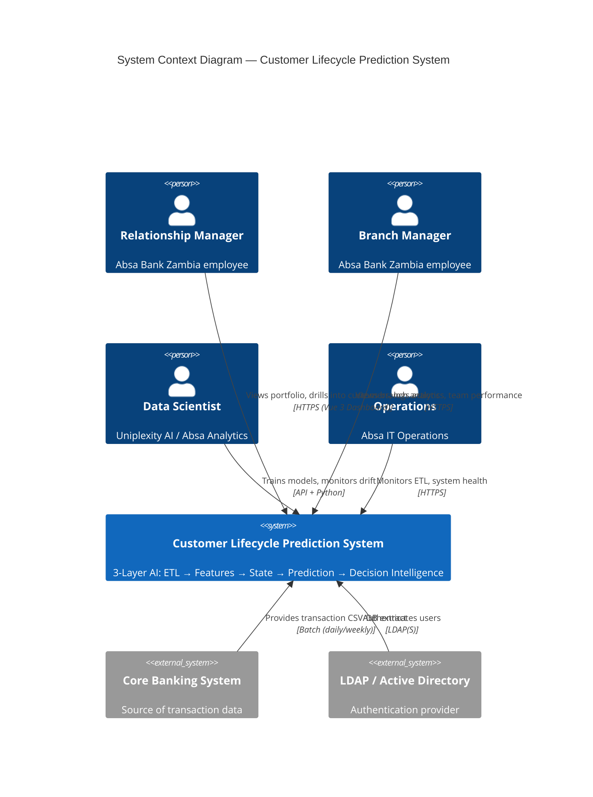

### Diagram 2: graph TD

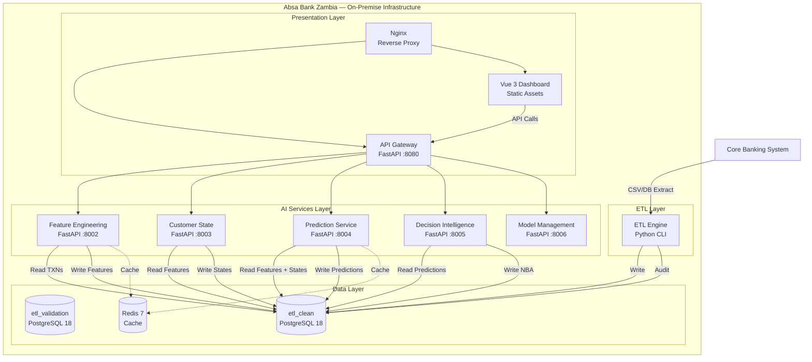

### Diagram 3: graph TD

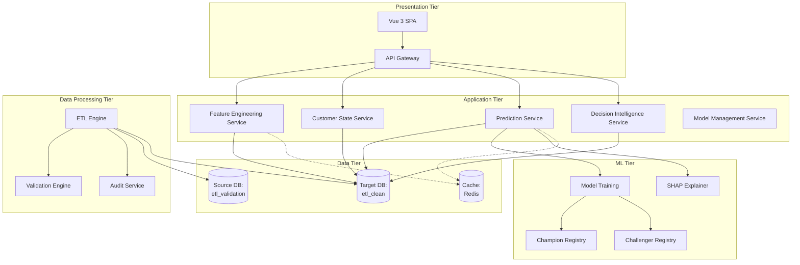

### Diagram 4: graph TD

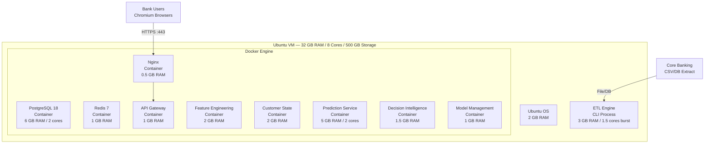

### Diagram 5: C4Container

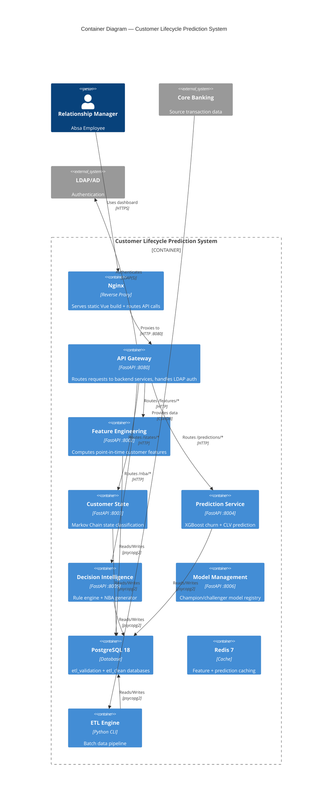

### Diagram 6: sequenceDiagram

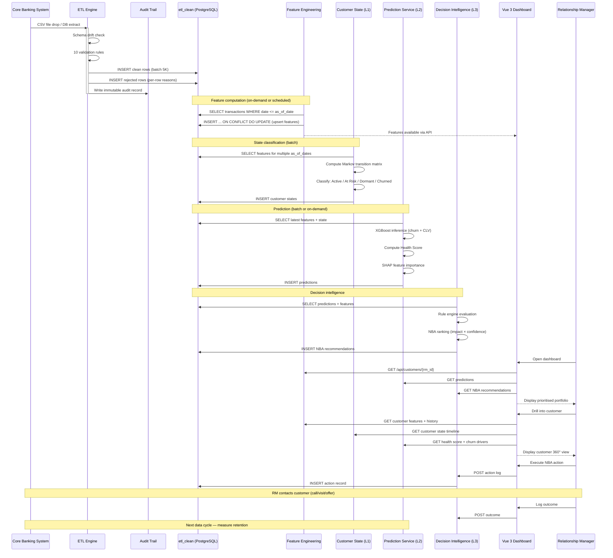

### Diagram 7: graph LR

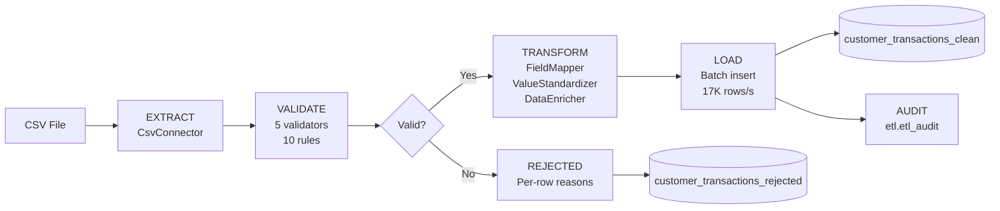

### Diagram 8: erDiagram

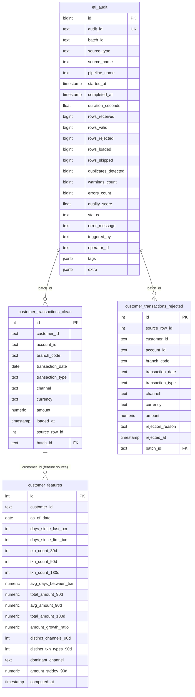

### Diagram 9: graph LR

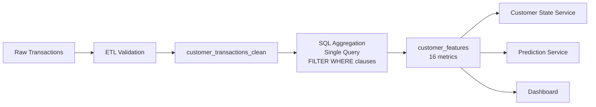

### Diagram 10: graph TD

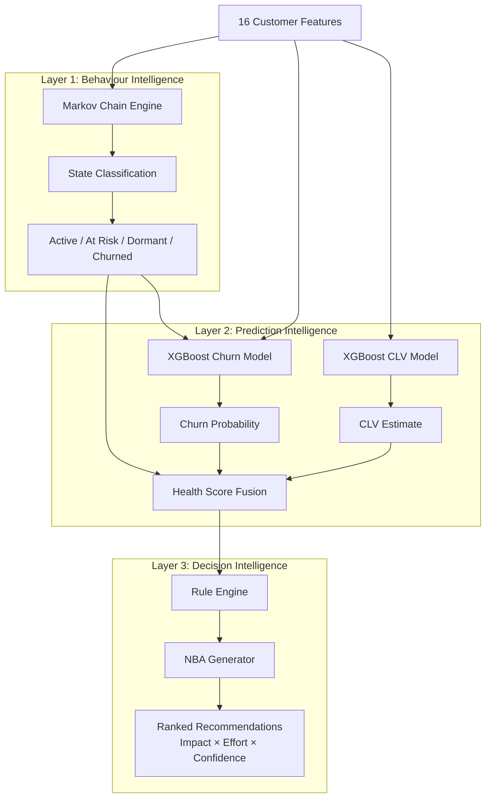

### Diagram 11: graph LR

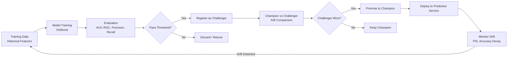

### Diagram 12: graph LR

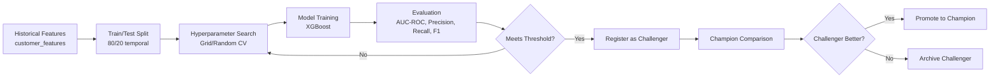

### Diagram 13: graph TD

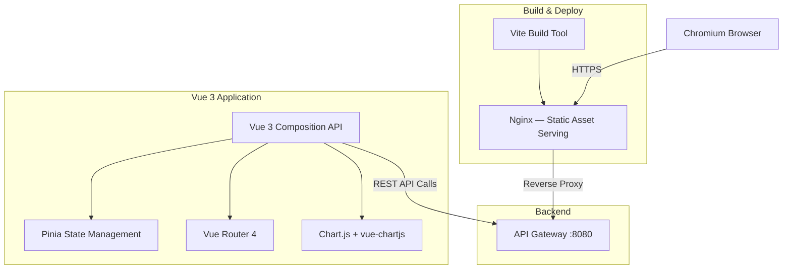

### Diagram 14: sequenceDiagram

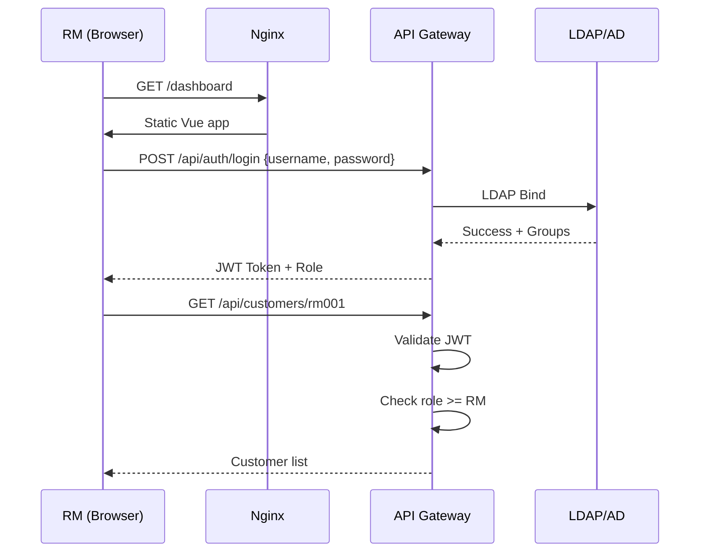

### Diagram 15: graph LR

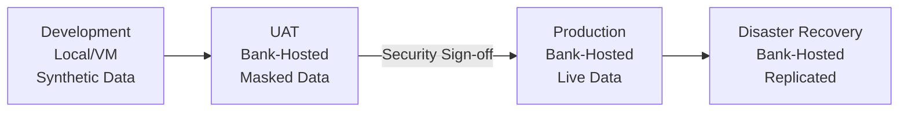

### Diagram 16: graph LR


### Diagram 17: graph TD

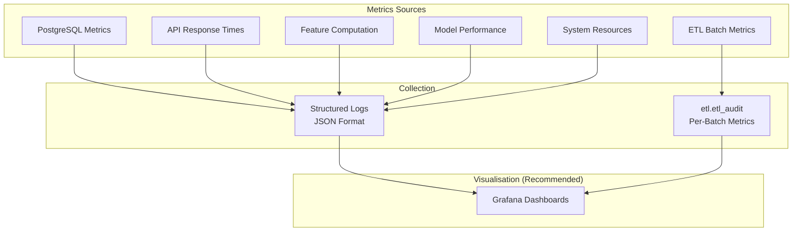
