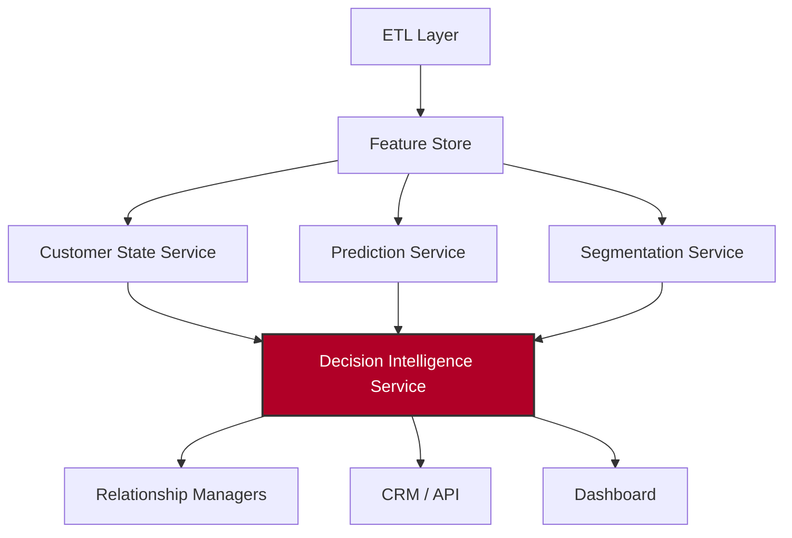
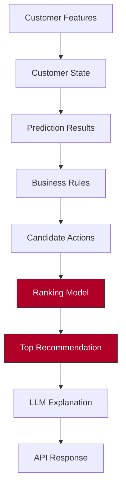
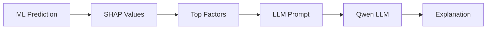

# Decision Intelligence Service v1.0
## Technical Design Document

This document outlines the architecture, pipeline, interfaces, and design principles of the **Decision Intelligence Service v1.0**.

> [!NOTE]
> The editable Microsoft Word version of this document has been generated at [Decision_Intelligence_Service_v1.0_TDD.docx](file:///c:/Users/ADMIN/Desktop/uniplexity-ai/ABSA/absa-foundry-backend/Decision_Intelligence_Service_v1.0_TDD.docx) in the workspace directory. It has been styled professionally using custom ABSA-themed color palettes, table layouts, page boundaries, and formatting.

---

# 1. Overview

## Purpose
The Decision Intelligence Service is responsible for transforming predictive analytics into actionable business decisions.

It consumes outputs from the Customer Lifecycle AI platform, evaluates business policies, prioritizes competing actions, and produces explainable recommendations that relationship managers, marketing systems, CRM platforms, and digital banking channels can execute.

Unlike the Prediction Service, which estimates future outcomes, the Decision Intelligence Service determines the optimal action the bank should take for each customer.

---

# 2. Objectives

The service must support the following business objectives:
* **Reduce customer churn**
* **Increase customer retention**
* **Increase product conversion**
* **Increase customer engagement**
* **Maximize customer lifetime value**
* **Improve campaign effectiveness**
* **Improve relationship manager productivity**
* **Deliver explainable AI recommendations**

---

# 3. Position within the Architecture



---

# 4. Core Responsibilities

### What the Service Does NOT Do
* Train ML models
* Engineer features
* Predict churn
* Calculate CLV

### What the Service DOES Do
* Evaluates predictions
* Evaluates business rules
* Ranks competing actions
* Selects the Next Best Action (NBA)
* Explains recommendations
* Estimates business impact
* Prioritizes customers

---

# 5. Technology Stack

| Component | Technology |
| :--- | :--- |
| **Language** | Python 3.12 |
| **API** | FastAPI |
| **ML Models** | XGBoost |
| **Ranking Models** | LightGBM |
| **Rule Engine** | Python Rule Engine |
| **LLM** | Qwen3 8B / DeepSeek-R1 Distill 8B |
| **Runtime** | Ollama |
| **Database** | PostgreSQL |
| **Cache** | Redis |
| **Explainability** | SHAP + LLM |
| **Monitoring** | Prometheus |
| **Logging** | OpenTelemetry |

---

# 6. High-Level Pipeline



---

# 7. Service Inputs

The service consumes outputs from upstream services:

### Customer Profile
* `customer_id`
* `segment`
* `age`
* `income_band`
* `branch`
* `preferred_channel`
* `customer_since`

### Customer State
* `customer_state`
* `health_score`
* `state_probability`
* `state_duration`
* `state_confidence`

### Predictions
* `churn_probability`
* `predicted_clv`
* `predicted_revenue`
* `expected_retention`
* `offer_acceptance_probability`

### Product Holdings
* `Savings`
* `Current`
* `Credit Card`
* `Loan`
* `Mortgage`
* `Insurance`

### Behaviour
* `engagement_score`
* `recency`
* `frequency`
* `monetary`
* `digital_usage`
* `branch_visits`

### Campaign History
* `campaign_response`
* `last_offer`
* `offer_result`
* `days_since_last_offer`

---

# 8. Service Outputs

* `Next Best Action`
* `Priority Score`
* `Confidence`
* `Estimated Revenue`
* `Estimated Churn Reduction`
* `Reason Codes`
* `Channel`
* `Campaign`
* `Expiry Date`
* `Alternative Actions`
* `Risk Flags`

---

# 9. Internal Modules

```
decision-intelligence-service/
├── api/
├── schemas/
├── services/
├── recommendation_engine/
├── rules_engine/
├── ranking_engine/
├── retention_engine/
├── opportunity_engine/
├── explanation_engine/
├── campaign_engine/
├── models/
├── prompts/
├── llm/
├── config/
└── tests/
```

---

# 10. Recommendation Engine

Responsible for generating all possible actions (candidates). It does **not** rank them.

**Example Candidates:**
* Offer Loan
* Offer Mortgage
* Offer Savings Upgrade
* Relationship Manager Call
* Retention Call
* No Action
* Digital Campaign
* Branch Visit

---

# 11. Rules Engine

Evaluates deterministic banking logic and regulatory constraints. The Rules Engine filters and validates candidate actions before they are ranked.

### Example Rules

```python
# Rule 1: Age Check
IF Age < 18 THEN Reject Loan

# Rule 2: Duplicate Check
IF Already owns Credit Card THEN Remove Credit Card Offer

# Rule 3: Dormancy Check
IF Dormant > 180 days THEN Only Reactivation Campaign

# Rule 4: Segment Routing
IF Premium Customer THEN Assign Relationship Manager
```

---

# 12. Ranking Engine

Ranks the remaining candidate actions utilizing LightGBM.

* **Inputs**: Candidate Actions + Customer Features + Predictions
* **Model**: LightGBM Classifier / Ranker
* **Output Example**:
  ```text
  Loan         0.91
  Investment   0.74
  Insurance    0.43
  ```
* *Highest score is selected.*

---

# 13. Retention Engine

Only activated for customers with elevated churn risk.

**Possible Strategies:**
* Call Customer
* Fee Waiver
* Loyalty Reward
* Relationship Manager Call
* Branch Visit
* Targeted Campaign
* Interest Incentive

---

# 14. Opportunity Engine

Discovers revenue opportunities.

```text
High Savings Balance     →   Investment Product
Salary Account Deposits  →   Credit Card Offer
Business Account         →   Working Capital Loan
Frequent Forex Activity  →   Forex Product
```

---

# 15. Campaign Engine

Maps recommended decisions to active marketing campaigns.

```text
Recommendation: Offer Personal Loan  →  Campaign: PL_JULY_2026
```

---

# 16. Explanation Engine

Combines SHAP feature importances with an LLM to generate transparent natural language reasoning.



**Example Explanation:**
> Recommend a personal loan because the customer maintains stable salary inflows, has no existing lending products, demonstrates strong repayment behavior, and belongs to a high-value customer segment. The predicted acceptance probability is high while the estimated churn risk remains low.

---

# 17. Priority Engine

Calculates which customers should receive outreach attention first.

$$\text{Priority} = \text{Business Value} \times \text{Urgency} \times \text{Acceptance Probability} \times \text{Retention Impact}$$

* **Output**: Score ranging from 0 to 100.

---

# 18. API Response

```json
{
  "customer_id": "CUST00123",
  "next_best_action": "Offer Personal Loan",
  "priority_score": 91,
  "confidence": 0.94,
  "estimated_revenue": 2800,
  "estimated_churn_reduction": 0.17,
  "channel": "Relationship Manager",
  "campaign": "PL_JULY_2026",
  "reason_codes": [
    "Stable salary inflow",
    "High savings balance",
    "No active loan"
  ],
  "explanation": "The customer demonstrates strong financial stability with regular salary deposits and substantial savings while not currently holding any lending products. A personal loan is therefore expected to have a high acceptance probability and positive revenue impact."
}
```

---

# 19. Future Evolution

| Version | Enhancement |
| :--- | :--- |
| **v1.0** | Rule-based recommendations with ML ranking and LLM explanations |
| **v1.1** | Reinforcement learning for adaptive action selection |
| **v1.2** | Contextual multi-armed bandits for offer optimization |
| **v1.3** | Real-time streaming decision engine using Kafka |
| **v2.0** | Customer journey optimization across multiple interactions |
| **v3.0** | Autonomous AI decision orchestration with human approval workflows |

---

# Architectural Principles

* **Separation of Concerns:** Prediction services estimate outcomes; the Decision Intelligence Service selects actions.
* **Deterministic Governance:** Business rules and regulatory constraints always take precedence over ML recommendations.
* **Explainable AI:** Every recommendation should be accompanied by SHAP-derived factors and a human-readable explanation generated by the LLM.
* **Model Independence:** XGBoost, LightGBM, or future models can be swapped without changing the service interface.
* **LLM as an Advisor, Not a Decision-Maker:** The LLM explains and contextualizes recommendations but does not override validated business rules or ranking models.
* **Production Readiness:** Design for CPU-only deployment using FastAPI, PostgreSQL, Redis, and Ollama, ensuring the PoC transitions seamlessly from synthetic data to real banking data with minimal architectural changes.
